# SoCa — Benchmarks

Measured results for SoCa, a Vietnamese voice assistant with local audio,
retrieval, and memory plus an optional local or remote LLM in [`soca/`](soca/).
This file records **what is currently true about the shipped system** and the
evidence behind each release decision. Superseded runs are compressed into
[Appendix A](#appendix-a--superseded-results) rather than deleted, so every decision
can be traced back to the measurement that caused it.

> **Last verified:** 2026-08-14 · **Source commit for the newest gates:** `40c5b38`
> Raw predictions, private transcripts, audio, and per-run logs stay under ignored
> local paths (`eval/results/`, `benchmarks/raw/`). Only sanitized aggregates,
> hashes, and manifests are committed.

**Contents** — [1 Protocol](#1-measurement-protocol) ·
[2 Datasets](#2-datasets-and-corpora) ·
[3 Speech recognition](#3-speech-recognition) ·
[4 Text to speech](#4-text-to-speech) ·
[5 Conversational robustness](#5-conversational-robustness) ·
[6 Knowledge retrieval](#6-knowledge-retrieval) ·
[7 Working memory](#7-working-memory-summarization) ·
[8 Capability routing](#8-capability-routing) ·
[9 Platform gates](#9-platform-provider-and-audio-gates) ·
[10 Open blockers](#10-open-blockers) ·
[11 Reproduction](#11-reproduction)

---

## 1. Measurement protocol

### 1.1 How to read a result

Every gate carries one of four statuses, and a missing entry is never read as a
skipped success:

| Status | Meaning |
| --- | --- |
| `pass` | Evidence exists, is hashed, and meets the declared threshold |
| `fail` | Evidence exists and demonstrates a release failure |
| `blocked` | The gate could not run: missing artifact, provider, private corpus, or prerequisite |
| `unsupported` | This platform or device has not been exercised at all |

Two further distinctions matter throughout this document:

- **Release evidence vs characterization.** A run qualifies as release evidence
  only when the source tree is clean and every model, dataset, and config revision
  is immutable and recorded. Runs against provider-hosted models have no immutable
  revision, so they are labelled characterization and are never used for a
  model-selection or quality claim.
- **Wiring vs quality.** A run that proves a provider was called and a terminal
  state was reached proves wiring. It is not evidence of answer quality, and a
  green unit test is never promoted to a hardware claim.

### 1.2 Metric definitions

| Metric | Definition |
| --- | --- |
| WER / CER | `jiwer` word / character error rate after normalization |
| Text normalization | `lower().strip()` applied to both reference and hypothesis; ASR punctuation is not scored |
| RTF | Processing wall time ÷ audio duration. Lower is faster; < 1.0 is faster than realtime |
| Hallucination rate | Non-empty ASR output on a non-speech clip ÷ total non-speech clips |
| False reject | Real speech rejected by `RobustASR` ÷ total real speech |
| Recall@k, MRR@10, nDCG@10 | Standard retrieval metrics against labelled gold passages |
| TTFA | Time to first audio, measured either at `tts_ready` (buffer filled) or `audible` (device output) |
| Cut-in rate | Endpoint fires while the user is still speaking ÷ scenarios |
| Premature close | Turn closed before the user finished ÷ scenarios |
| False interrupt | Playback stopped when the user was not actually barging in ÷ scenarios |

Latency is reported as p50 and p95 rather than a mean, because every distribution
in this file has a long right tail and a mean would hide it.

### 1.3 Hardware and runtime

Unless a section says otherwise:

| Field | Value |
| --- | --- |
| Machine | MacBook Pro `Mac16,8` · Apple M4 Pro · 12 cores · 48 GB · macOS 15.7.4 arm64 |
| Python | 3.11.14, `uv`-managed |
| ASR (ONNX) | ONNX Runtime, CoreML with per-node CPU fallback |
| ASR (Qwen) | Transformers in an isolated worker process, MPS / float16 |
| LLM (local) | `llama-cpp-python` with Apple Metal (`-DGGML_METAL=on`) |
| TTS | Valtec ONNX fp32, four graphs, single warm process |

These are development-machine numbers. **No result in this file was measured on a
Raspberry Pi or any ARM single-board computer**, and none should be quoted as an
embedded-device figure.

---

## 2. Datasets and corpora

Every measured claim in this file traces to one of the rows below. Datasets marked
non-commercial are **benchmark-only and are never shipped as product data**.
Nothing private is committed; private sets are referenced by manifest hash only.

### 2.1 Speech

| Dataset | Size used | Used for | License |
| --- | --- | --- | --- |
| [FLEURS](https://huggingface.co/datasets/google/fleurs) `vi_vn` test | 30 utterances (production paired run) | Production ASR WER/CER, [§3.1](#31-production-asr--phowhisper-small) | CC BY 4.0 |
| FLEURS `vi_vn` test | 200 utterances | Heuristic threshold calibration and the tiny-model ablation, [A.1](#a1--anti-hallucination-ablation-phowhisper-tiny) | CC BY 4.0 |
| FLEURS `vi_vn` test | pinned manifest `81de44e0…` | Qwen release WER, [§3.2](#32-qwen3-asr-release-qualification--decision-blocked) | CC BY 4.0 |
| FLEURS `vi_vn` | 60 utterances → 120 timelines | Turn-taking scenarios, [§5.2](#52-turn-taking-120-scenarios-800-ms-within-turn-pause) | CC BY 4.0 |
| Smart Turn v3.2 test | 1,004 `vie` + 7,820 `eng` rows | Production ONNX per-language accuracy, [§5.2](#52-turn-taking-120-scenarios-800-ms-within-turn-pause) | no dataset-level license declared; benchmark-only |
| [ESC-50](https://github.com/karolpiczak/ESC-50) + synthetic | 800 built (500 ESC-50 after voice-contaminated class exclusion, 100 silence, 100 white, 100 pink); 50 evaluated | Non-speech hallucination, BoH construction | CC BY-NC — benchmark only |
| Non-speech release manifest | pinned `48b01f48…` | Qwen hard-negative rejection | derived from the above |
| [AEC-Challenge](https://github.com/microsoft/AEC-Challenge) `real/` | 13,626 pairs available; 150 per condition, 300 used (seed 42) | Barge-in under real echo, [§5.1](#51-barge-in-false-interrupt--full-duplex-bench-takeover-rate) | Microsoft AEC-Challenge terms |
| MIT IR Survey RIR | 270 real 16 kHz impulse responses | Synthetic echo generation for the cross-validation set | MIT IR Survey terms |
| Private Vietnamese–English code-switch | sealed; manifest `aed1ccd9…` | Code-switch WER and term recall, [§3.2](#32-qwen3-asr-release-qualification--decision-blocked) | private, never committed |
| Recorded private voice samples | 8 per profile | Real-voice trajectories, [§3.3](#33-real-voice-trajectories) | private, never committed |

The ESC-50 exclusion list removes classes that contain human vocalisation
(`crying_baby`, `sneezing`, `clapping`, `breathing`, `coughing`, `footsteps`,
`laughing`, `brushing_teeth`, `snoring`, `drinking_sipping`, `crying`, `speaking`)
so that "non-speech" means what it says.

### 2.2 Text, retrieval, and memory

| Dataset | Size used | Used for | License |
| --- | --- | --- | --- |
| TVPL | 10,576 docs / 13,230 chunks, 1,000 queries | Embedding and fusion selection, [§6.2](#62-embedding-and-fusion-selection) | see `data/benchmarks/retrieval/sources.lock.json` |
| ViRe EduCoQA | 262 docs / 341 chunks, 50 queries | Cross-domain and reranker, [§6.3](#63-reranking-measured-and-rejected) | ibid. |
| ViRe ALQAC | 304 docs / 355 chunks, 50 queries | Cross-domain and reranker, [§6.3](#63-reranking-measured-and-rejected) | ibid. |
| XQuAD Vietnamese | 48 Wikipedia articles, 1,193 questions | Historical hybrid-retrieval baseline, [A.2](#a2--decision-history) | CC BY-SA 4.0 |
| XQuAD grounding split | 12 answerable + 8 unanswerable | Evidence-floor calibration, [§6.5](#65-evidence-floor-recalibration) | CC BY-SA 4.0 |
| Synthetic vectors | 250,000 × 1,024 dims, 1,000 queries, 3 seeds | Vector-backend gate, [§6.4](#64-vector-backend-exact-numpy-beats-approximate) | generated |
| Capability routing corpus | 66 rows in 22 families; SHA-256 `4249290a…` | Semantic router, [§8](#8-capability-routing) | authored for this repo |
| Remediation baseline | 14 cases (10 capability + 4 regression) | Runtime trajectory baseline | authored + XQuAD |
| Summary fixtures v2 | 200 unique inputs / 151 expected states; 40 four-generation sessions | Summary quality gate, [§7](#7-working-memory-summarization) | authored synthetic, committed |
| VSoLSCSum-VI · SEAHORSE-VI · WikiLingua-VI · XL-Sum-VI · DialogSum-EN | 141 / 64 / 64 / 64 / 64 rows; 8 per candidate probed | Summary public probe | per-dataset, pinned in the registry |
| TTS prompt set | 12 bench + 12 loopback; 5 voices × 30 prompts = 450 WAV | TTS parity and chunk joining, [§4](#4-text-to-speech) | authored, committed |
| Real and fixture vaults | 6 docs / 23 chunks; 35 docs / 446 chunks; 24 docs / 24 chunks | Index lifecycle, [§6.7](#67-real-index-lifecycle) | authored |

**Split discipline.** The capability corpus and the summary fixtures use
*family-grouped* splits: paraphrases of one another are pinned to the same split so
a near-duplicate cannot leak from train into test. Runtime prompt examples load
train and validation rows only.

---

## 3. Speech recognition

### 3.1 Production ASR — PhoWhisper-small

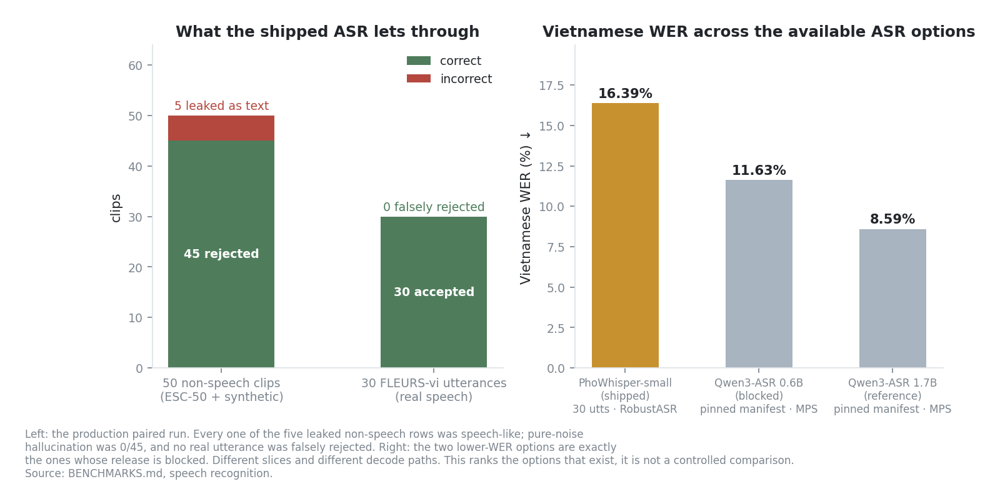

*Figure 1 — What the shipped ASR admits and rejects, and how its WER compares to
the two Qwen options. The slices differ, so the right panel ranks availability, not
a controlled comparison.*

The shipped `baseline` profile. Paired run of 2026-07-30: production `RobustASR`
executes once, and the research-only Bag-of-Hallucinations (BoH) stage is applied
to the identical output, which removes decode variance from the comparison.

| Variant | WER | CER | False reject | Hallucination | Catch rate | p50 / p95 |
| --- | ---: | ---: | ---: | ---: | ---: | ---: |
| production, no BoH | 16.39% | 7.34% | 0.0% | 10.0% | 90.0% | 31 / 9,292 ms |
| production + experimental BoH | 16.39% | 7.34% | 0.0% | 10.0% | 90.0% | 31 / 9,292 ms |

**Finding.** BoH matched 0 of 80 items and changed 0 predictions. All five leaked
noise rows were `speech_like`; pure-noise hallucination was 0/45. **Production
ships without BoH.** The remaining speech-like errors are a job for calibrated
signal and ASR policy, not for a hidden phrase-deletion fallback. The ablation that
established the technique is in [Appendix A.1](#a1--anti-hallucination-ablation-phowhisper-tiny).

The p50 of 31 ms against a p95 of 9,292 ms is not a typo: VAD rejects most
non-speech clips before the decoder runs at all, so half the rows never pay for
inference.

This run exercises VAD → ASR. It does **not** exercise acoustic echo cancellation:
clean FLEURS and ESC-50 files contain no far-end reference. AEC belongs to the
duplex boundary measured in [section 5](#5-conversational-robustness).

**Readiness is fail-closed.** PhoWhisper is as strict as Qwen in production —
missing confidence calibration blocks readiness *before* the model is loaded,
rather than silently disabling the guard.

Raw artifact: `eval/results/asr_boh_ablation/20260730-phowhisper-small-paired/report.json`.

### 3.2 Qwen3-ASR release qualification — decision: `blocked`

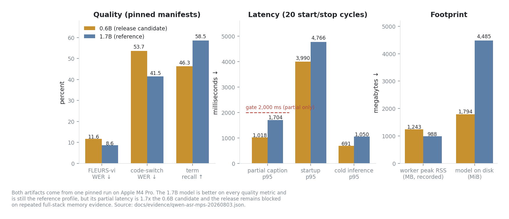

*Figure 2 — Quality, latency, and footprint for both Qwen artifacts from one pinned
run. The partial-latency gate governs only the partial-caption group.*

Two explicit profiles exist, `qwen-release` (0.6B) and `qwen-reference` (1.7B).
Neither is a fallback for the other or for PhoWhisper: there is **no automatic
model downgrade anywhere in the runtime**. Run of 2026-08-03 on MPS / float16
against pinned private code-switch, FLEURS-vi, and non-speech manifests.

| Metric | `qwen3_asr_0_6b` (release) | `qwen3_asr_1_7b` (reference) |
| --- | ---: | ---: |
| FLEURS-vi WER, production catalog | 11.63% | **8.59%** |
| FLEURS-vi WER, empty context | 11.16% | — |
| Private code-switch WER | 53.66% | **41.46%** |
| Private term recall | 46.34% | **58.54%** |
| Hard-negative false-accept rate | 1.50% | — |
| Context-echo false accept / false reject | 0.0% / 0.0% | 0.0% / 0.0% |
| Final RTF p95 | 0.129 | — |
| Startup p95 | **3,990 ms** | 4,766 ms |
| Cold inference p95 | **691 ms** | 1,050 ms |
| Partial caption p95 (gate 2,000 ms) | **1,018 ms** | 1,704 ms |
| IPC overhead p95 | 2.1 ms | 2.2 ms |
| Worker peak RSS | 1,243 MB | **988 MB** |
| Model on disk | **1,794 MiB** | 4,485 MiB |
| 20× start/stop failures · orphans · fallbacks | 0 · 0 · 0 | 0 · 0 · 0 |

**Decision: `blocked`, and this is not a quality rejection.** Every automatic and
manual quality gate passes for the 0.6B candidate. Rollout is held on three
outstanding items:

1. Repeated full-stack memory-pressure evidence with summary-worker overlap is
   still missing. Single trajectories measured 2,877 MB (0.6B) and 2,770 MB (1.7B)
   full-stack RSS with a remote LLM; a two-sample local smoke reached 5,859 MB.
   Those are trajectories, not a pressure matrix.
2. The 1.7B operational run emitted one Python `resource_tracker` leaked-semaphore
   warning at shutdown. It is retained as a blocker rather than suppressed.
3. A remote tool-router generation failure was observed and logged fail-closed
   during the release trajectory; the user-facing telemetry path needs an audit.

The production default is **unchanged** until that gate is explicitly closed.

**Why MPS matters.** The earlier CPU Transformers path re-decoded the growing
prefix and reported partial p95 of `11,619 ms` against the 2,000 ms ceiling. MPS
resolved that specific failure (1,018 ms), which is the difference between "partial
captions are unsafe on this machine" and "partial captions meet their budget". The
failed CPU benchmark was not re-labelled as a pass.

**Decode budget.** A final decode budget of 128 is selected for realtime. Larger
budgets improve some joined-turn transcripts but exceed the 30-second production
deadline. When the model reaches the cap the typed telemetry is surfaced and the
transcript is **rejected**, not forwarded downstream as if complete.

Evidence: [`qwen-asr-mps-20260803.json`](docs/evidence/qwen-asr-mps-20260803.json),
[`qwen-asr-release-20260803.json`](docs/evidence/qwen-asr-release-20260803.json).
Decision record: [ADR 0010](docs/adr/0010-qwen-asr-release-decision.md).

### 3.3 Real-voice trajectories

Eight recorded private samples per profile through ASR → OpenRouter
`google/gemini-3.5-flash-lite` → Valtec TTS.

| Profile | Samples | Normal terminal | LLM called | Reject rate | TTFA p95 | Peak full-stack RSS |
| --- | ---: | ---: | ---: | ---: | ---: | ---: |
| `qwen-release` | 8 | 8 | 7 | 12.5% | 5,790 ms | 2,877 MB |
| `qwen-reference` | 8 | 8 | 6 | 12.5% | 4,558 ms | 2,770 MB |

Both reached eight normal terminal rows including typed uncertain-input abstention
and blocked-action paths. **This proves wiring and provider execution. It is not a
release memory gate and not an answer-quality result.**

---

## 4. Text to speech

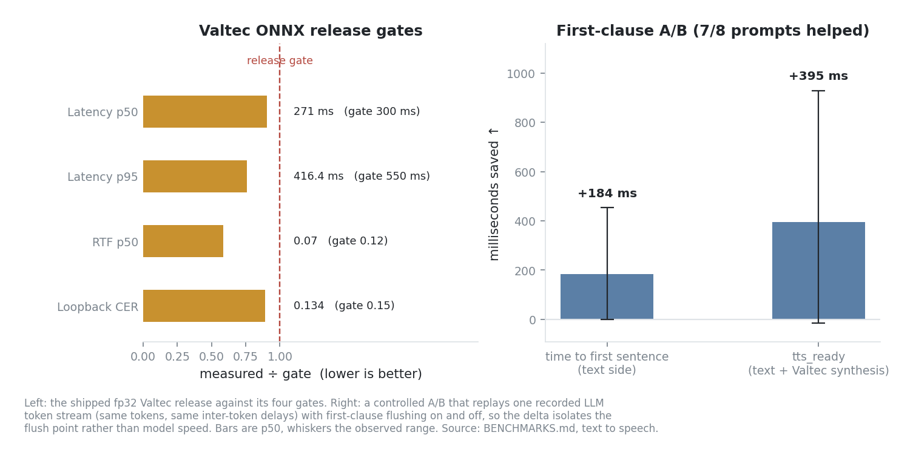

*Figure 3 — Left: the shipped fp32 Valtec release against its four gates, each bar
normalized by its own gate. Right: the controlled first-clause A/B.*

### 4.1 Valtec ONNX release

SoCa ships **one** self-built, checksum-pinned Valtec release with no model
selector. Active release `soca-valtec-20260724-50fd400`; rollback point
`soca-valtec-20260722-a1b2c3d`. Checkpoint `valtecAI-team/valtec-tts-pretrained`
rev `d58e991…`. Five voices NF · SF · NM1 · SM · NM2. Fail-closed acceptance
requires a named listening and license reviewer.

| Metric | Measured | Gate | |
| --- | ---: | ---: | :-: |
| Parity across 5 voices | all pass | 5/5 | ✅ |
| Latency p50 | 271.0 ms | ≤ 300 ms | ✅ |
| Latency p95 | 416.4 ms | ≤ 550 ms | ✅ |
| RTF p50 (primary gate) | 0.070 | ≤ 0.12 | ✅ |
| ASR loopback CER | 0.134 | ≤ 0.15 | ✅ |

**fp32 is active; int8 is built but not selected.** Dynamic int8 quantization is
**27% slower** on M4 arm64 — dynamic quant has no arm64 kernel win here — while
being spectrally near-identical (parity cosine 0.99999, waveform MAE 0.021).
Slower with no quality gain is not a trade worth making.

*Caveat:* loopback CER uses 12 prompts, so a single ASR mis-hear moves it
noticeably. It passed alongside the subjective listening review, but deserves a
larger slice if pronunciation regressions surface.

### 4.2 Streaming latency and playback continuity

Three independent changes, measured by three different gates. **The numbers are not
conflated.**

**(a) Offline A/B waveform** — 5 voices × 30 prompts → 450 WAV built from
*identical* synthesized chunks.

| Metric | Value |
| --- | --- |
| `peak_abs` max | 0.9633 (gate ≤ 1.0 ✅) |
| `hard_boundary_jump` | median 0.0, p95 0.0002 |
| Multi-chunk rows | 125 / 150 |

At these clause boundaries the hard-join sample jump is already ≈ 0, because Valtec
chunks begin and end near silence. Cross-fade therefore **introduces no artifact but
also shows no measurable offline win**, and the listening review found no audible
difference between hard / 8 ms / 12 ms. The 12 ms default is kept because that same
switch keeps the gap-free playback session on.

**(b) Real device playback** — `SoundDevicePlayer` on the default output, 5 turns /
7 boundaries, with ASR and LLM bypassed so the TTS → pump → session → speaker path
is isolated.

| Metric | Value | Gate | |
| --- | --- | --- | :-: |
| `audible_ttfa_ms` | p50 239, p95 310 | improves | ✅ |
| `tts_ready_ttfa_ms` | p50 211 | reported separately | ✅ |
| ready → audible delta | ~28 ms | device cost | ✅ |
| `synthesis_slack_ms` | p50 2,829, p05 2,137 | p50 ≥ 100, p05 ≥ 40 | ✅ |
| `crossfade_ms` | 12.0 on 7/7 boundaries | overlap is real | ✅ |
| `output_underflow_count` | 0 | = 0 | ✅ |
| `crossfade_fallback` | 0 (0.0%) | < 1% | ✅ |

**(c) Controlled first-clause A/B** — one real LLM token stream is captured per
prompt *with per-token arrival times*, then replayed through the runtime with
first-clause flushing on and off. Same tokens, same delays, ASR excluded, so the
delta isolates the flush point rather than model speed. 8 conversational
transcripts.

| Δ (positive = first-clause faster) | p50 | range | Prompts helped |
| --- | ---: | --- | ---: |
| time to first sentence (text side) | +184 ms | −0 … +453 ms | 7 / 8 |
| `tts_ready` (text + Valtec synthesis) | +395 ms | −14 … +928 ms | 7 / 8 |

The 1/8 no-benefit case is a response with no clause boundary before the first
period, where on and off are identical by construction. This is the LLM →
first-chunk delta attributable to first-clause flushing, **not** an absolute
end-to-end TTFA figure.

**(d) End-to-end loop** — `output_underflow_count` is 0 on every row, confirming
continuity holds through the full loop. The E2E TTFA p50 of 3,071 ms in that run is
**ASR-bound** (per-row ASR ≈ 1.7–2.6 s on deliberately long fixtures) and is not a
valid comparison against any first-clause number.

**Not measured:** voice quality, prosody, and naturalness. Those remain a listening
judgement.

---

## 5. Conversational robustness

Method: **frame-stepped offline replay**. The decision arithmetic is lifted out of
the `sounddevice` loops and driven from `(far, near)` buffers, so time is a frame
index — deterministic and machine-independent. AEC and VAD are injected for unit
tests, then the production WebRTC AEC3 and Silero are fed for the real runs.

Barge-in gate: sustained 400 ms, Silero threshold 0.7 (production `DuplexAecSink`
defaults). Endpoint policies: `fixed` (700 ms) versus `p_based` (floor 1,800 +
span·P, ceiling 3,000; Smart Turn v3.2). Vocabulary follows Full-Duplex-Bench so
the numbers are comparable to published spoken-dialogue work.

### 5.1 Barge-in (false interrupt ≈ Full-Duplex-Bench takeover rate)

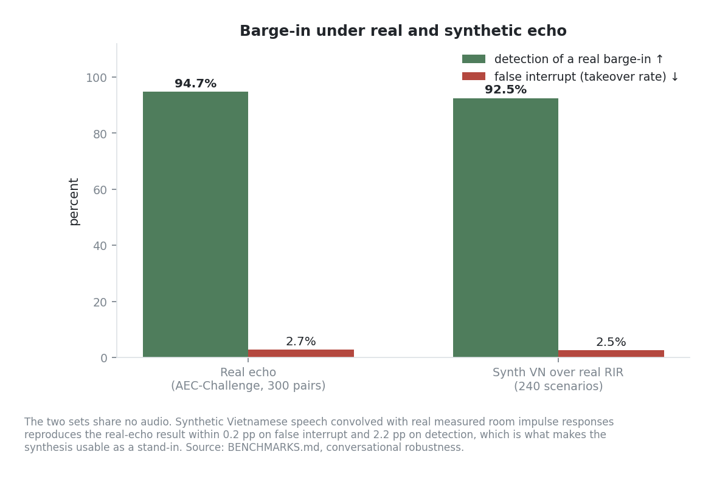

*Figure 4 — Real recorded echo and synthesized Vietnamese over measured room
impulse responses, on disjoint audio.*

| Run | Pairs / scenarios | False interrupt | Detection | Notes |
| --- | ---: | ---: | ---: | --- |
| Real echo, AEC-Challenge | 300 | 2.7% | 94.7% | static 96.0% / moving 93.3% |
| Synthetic VN over real RIR | 240 | 2.5% | 92.5% | backchannel-fire 3.8% |

The synthetic set cross-validates the real one on **disjoint audio** (2.5 vs 2.7%
false interrupt, 92.5 vs 94.7% detection), so the RIR synthesis is realistic and
barge-in survives real echo. Synthetic median stop latency 2,344 ms / p90 5,336 ms
— gated by the 400 ms sustained floor plus read-speech VAD, and it grows under
stronger echo.

### 5.2 Turn-taking (120 scenarios, 800 ms within-turn pause)

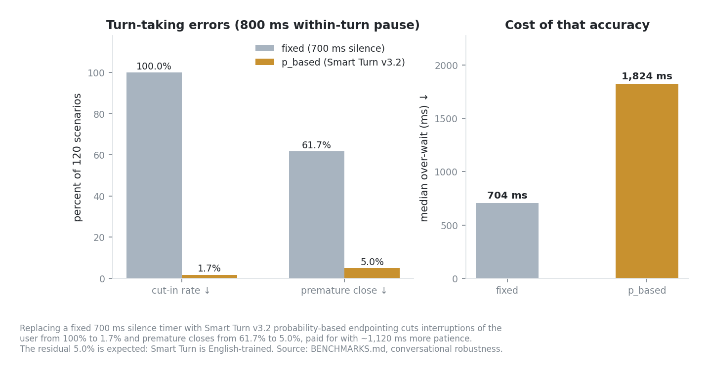

*Figure 5 — Fixed-timer versus probability-based endpointing, and what the accuracy
costs in patience.*

Canonical operating point: seed 42, endpoint floor 1,800 ms. The current sweep and
per-language run used clean source `40c5b38`. Evidence:
[`smart-turn-calibration-20260814.json`](docs/evidence/smart-turn-calibration-20260814.json).

| Policy | Cut-in rate | Premature close | Median over-wait |
| --- | ---: | ---: | ---: |
| `fixed` | 100.0% | 61.7% | 704 ms |
| **`p_based`** | **1.7%** | **5.0%** | 1,824 ms |

Adaptive endpointing drops cut-in **100% → 1.7%** and premature close
**61.7% → 5.0%** — 60× and 12× — for about 1,120 ms more patience. That is the
takeover-rate versus response-latency trade-off, measured for Vietnamese.

The planned floor sweep does **not** find a cheaper passing operating point:

| `floor_silence_ms` | Cut-in | Premature close | Median over-wait | Disposition |
| ---: | ---: | ---: | ---: | --- |
| 1,000 | 13.3% | 26.7% | 1,056 ms | fail |
| 1,200 | 6.7% | 15.0% | 1,248 ms | fail |
| 1,400 | 3.3% | 11.7% | 1,440 ms | fail |
| 1,600 | 1.7% | 6.7% | 1,632 ms | fail |
| **1,800** | **1.7%** | **5.0%** | **1,824 ms** | **keep current** |

The predeclared gate requires both cut-in and premature close at or below 5%. Only
1,800 ms passes, so production config stays unchanged and blocker #7 is **not**
closed by tuning.

**Superseded numbers.** Until 2026-08-05 this section reported 3.3% cut-in and
18.3% premature close at 1,312 ms over-wait. Commit `587a93a` raised
`floor_silence_ms` from 1,000 to 1,800 ms and fixed the window handed to Smart
Turn: `_voiced_window` stripped the trailing silence before inference, which
removed the very cue an end-of-turn classifier is trained on. The 1,000 ms-floor
numbers were correct for the code of the day and are kept in
[A.2](#a2--decision-history); the endpoint constants are now stamped into the
result file so the next tuning commit shows up as a diff rather than as drift.

**The model supports Vietnamese, but the gap is real.** A full pinned run of the
exact production ONNX measured English accuracy **94.21%** (7,820 rows) versus
Vietnamese **79.08%** (1,004 rows), a **15.12-point gap**. Calling the model
"English-trained" was wrong; the accurate statement is that v3.2 includes
Vietnamese training data but performs substantially worse on its Vietnamese test
slice. Model fine-tuning/export is explicitly deferred by product-owner scope, so
this result remains a blocker diagnosis rather than a model-remediation claim.

**Blocker #8 is separate.** The 400 ms sustained acoustic gate filters 400 ms
backchannels only because it actually needs 416 ms (13 × 32 ms frames) — a 500 ms
"vâng ạ" would leak through. A backchannel classifier, not a longer endpoint timer
or a Smart Turn floor change, is the fix.

*Caveats:* latency here is a system number (sustained floor + VAD on read speech),
not a pure front-end reaction time. The backchannel is a synthetic 400 ms FLEURS
head, not recorded speech. Tier 1 synthesis uses one echo level (alpha 0.5) and MIT
RIRs only.

---

## 6. Knowledge retrieval

### 6.1 Dataset policy

The model and fusion release decision deliberately does **not** use SoCa's showcase
or demo vault. The harness records a `dataset_class` per run and excludes
`demo_smoke` from release evidence. Sizes are in [section 2.2](#22-text-retrieval-and-memory).

| Class | Meaning |
| --- | --- |
| `public_screening` | Public corpus, used for model and fusion selection |
| `private_release` | Sealed private regression gate |
| `sanitized_benchmark` | Sanitized, reproducible release gate |
| `demo_smoke` | Showcase content, **excluded** from every release claim |

### 6.2 Embedding and fusion selection

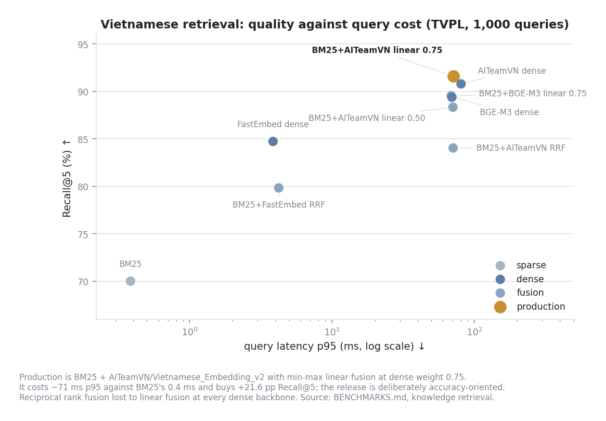

*Figure 6 — Nine candidates on 1,000 TVPL queries. Production is the gold point.*

Canonical run `20260730-tvpl-fusion-final`.

| Candidate | Recall@5 | MRR@10 | nDCG@10 | p95/query |
| --- | ---: | ---: | ---: | ---: |
| BM25 | 0.7002 | 0.5970 | 0.6278 | 0.383 ms |
| FastEmbed dense | 0.8472 | 0.7509 | 0.7746 | 3.845 ms |
| BM25 + FastEmbed, RRF | 0.7983 | 0.7066 | 0.7343 | 4.216 ms |
| BM25 + BGE-M3, linear 0.75 | 0.8953 | 0.8020 | 0.8244 | 68.821 ms |
| BGE-M3 dense | 0.8939 | 0.8041 | 0.8272 | 69.557 ms |
| BM25 + AITeamVN, RRF | 0.8404 | 0.7476 | 0.7771 | 70.920 ms |
| BM25 + AITeamVN, linear 0.50 | 0.8833 | 0.7966 | 0.8206 | 70.788 ms |
| **BM25 + AITeamVN, linear 0.75** | **0.9161** | **0.8275** | **0.8487** | **71.019 ms** |
| AITeamVN dense | 0.9079 | 0.8146 | 0.8378 | 80.682 ms |

**Decision:** BM25 Lucene + `AITeamVN/Vietnamese_Embedding_v2` + min-max linear
fusion at dense weight `0.75`. Reciprocal rank fusion lost to linear fusion at every
dense backbone. The release is accuracy-oriented: +21.6 pp Recall@5 over BM25
justifies ~71 ms p95. Resource run `20260730-resource-aiteamvn-v2`: ~2.1 GB on
disk, ~3.08 GiB isolated peak RSS, 10.55 document passages/s.

### 6.3 Reranking: measured and rejected

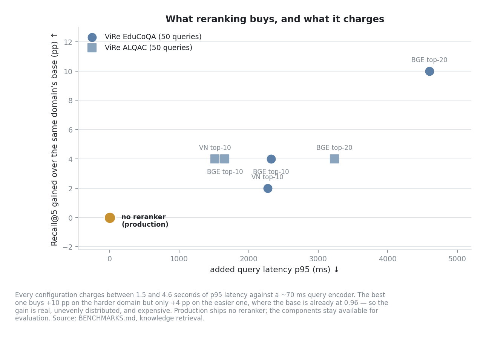

*Figure 7 — Recall gained over each domain's own base, against the latency added.
The origin is production.*

| Dataset / candidate | Recall@5 | MRR@10 | nDCG@10 | p95/query |
| --- | ---: | ---: | ---: | ---: |
| EduCoQA base | 0.46 | 0.3039 | 0.3612 | 80 ms |
| + Vietnamese reranker top-10 | 0.48 | 0.3331 | 0.3830 | 2,351 ms |
| + BGE reranker top-10 | 0.50 | 0.3073 | 0.3648 | 2,401 ms |
| + BGE reranker top-20 | 0.56 | 0.3438 | 0.4155 | 4,679 ms |
| ALQAC base | 0.96 | 0.9433 | 0.9569 | 90 ms |
| + Vietnamese reranker top-10 | 1.00 | 0.9567 | 0.9679 | 1,604 ms |
| + BGE reranker top-10 | 1.00 | 0.9767 | 0.9826 | 1,747 ms |
| + BGE reranker top-20 | 1.00 | 0.9767 | 0.9826 | 3,324 ms |

Reranking improves some slices but adds 1.5–4.6 s p95 and the gain is not stable
across domains. **Production uses no reranker.**

### 6.4 Vector backend: exact NumPy beats approximate

Workload 250,000 normalized vectors × 1,024 dimensions, 1,000 queries, k=10.

| Seed | NumPy exact p95 | FAISS Flat p95 | Recall@10 | Ordered top-k | Max score error |
| ---: | ---: | ---: | ---: | ---: | ---: |
| 6 | 8.150 ms | 5.504 ms | 1.0 | 1.0 | 7.45e-8 |
| 7 | 8.077 ms | 5.266 ms | 1.0 | 1.0 | 7.45e-8 |
| 8 | 8.001 ms | 5.128 ms | 1.0 | 1.0 | 7.45e-8 |

FAISS saves 2.6–2.9 ms against a ~70 ms query encoder — it misses the 2×
meaningful-speedup release gate. **Exact deterministic NumPy is the sole production
backend.** FAISS and HNSW stay evaluation-only.

### 6.5 Evidence-floor recalibration

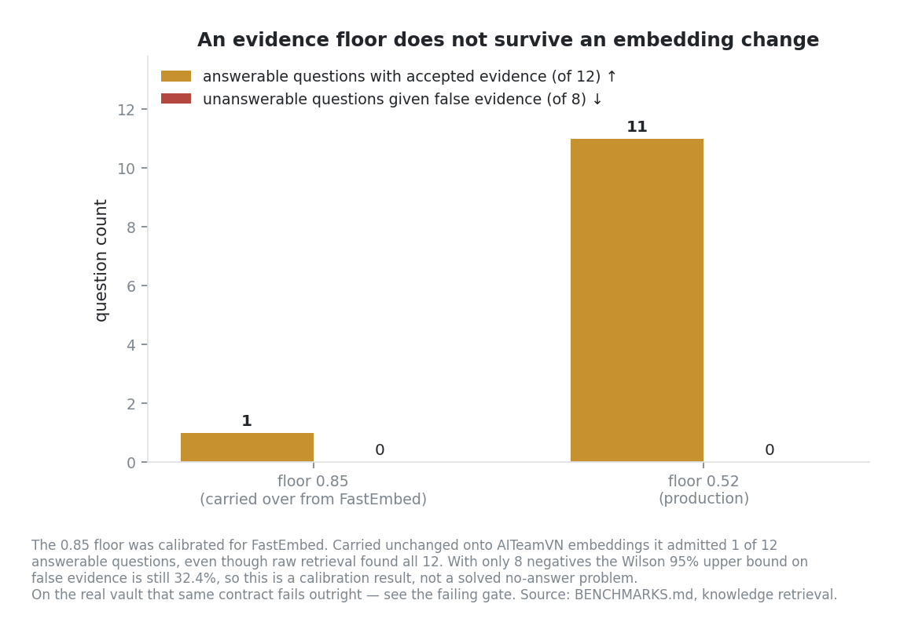

*Figure 8 — The same numeric floor means two different things in two embedding score
spaces.*

Corpus: 12 answerable, 8 deliberately unanswerable XQuAD questions.

| Dense floor | Accepted answerable Recall@5 | False evidence | Warm p95 |
| --- | ---: | ---: | ---: |
| 0.85 (invalid, carried from FastEmbed) | 1/12 (8.3%) | 0/8 | 95.4 ms |
| **0.52 (production)** | **11/12 (91.7%)** | **0/8** | 95.2 ms |

Raw AITeamVN retrieval found 12/12 answerable paths. Keeping the previous model's
0.85 floor admitted only 1 of them — **a threshold cannot be carried across
embedding score spaces.** On this held-out split the strongest unsupported top dense
score was `0.5042`, the weakest retained answerable score `0.5377`, and the one
unrecovered answerable case `0.4629`. The 0.52 operating point deliberately prefers
zero unsupported evidence over forcing 12/12.

**With only 8 negatives the Wilson 95% upper bound is 32.44%.** This is a
transparent calibration limitation, not a claim that no-answer detection is solved
— and on the real vault the same contract fails outright, see
[section 9.1](#91-the-failing-gate).

### 6.6 Production invariants

Enforced and tested: pinned AITeamVN revision plus model and tokenizer SHA-256;
normalized immutable `.npy` generation is canonical; schema-v3 active/previous
pointer swap is atomic; add/edit/delete/rename reconcile incrementally and unchanged
passage vectors are reused; a missing model or an absent, stale, failed, or corrupt
generation raises visibly; **no silent model, sparse, fusion, stale-generation, or
vector-backend fallback**; an empty corpus or zero hits stays a valid empty result;
rollback is an explicit operator command that accepts only a generation compatible
with the current revision and digest; active and previous are protected from GC
while other artifacts get a seven-day grace period; catalog, vector, and report
permissions are private (`0600`, directories `0700`).

Decision record: [ADR 0004](docs/adr/0004-production-knowledge-retrieval.md).

### 6.7 Real index lifecycle

| Vault | Documents | Chunks | Dense rows | Verify |
| --- | ---: | ---: | ---: | --- |
| repository-root `Knowledge` snapshot | 6 | 23 | 23 | clean |
| sanitized rich fixture | 35 | 446 | 446 | clean |

These are fixed lifecycle-run snapshots, not a claim about the current contents of
the operator's vault. The runtime canonical path is `./Knowledge`; the user must
initialize it and explicitly copy notes before indexing.

The rich fixture exposed two production-path defects that unit metrics did not
show: flat Markdown sections emitted 37 heading-only chunks, and duplicate chunks
from one document could consume all three context slots. `chunker-v2` removes
heading-only sections and persists the changed fingerprint; the rebuild reused all
446 surviving vectors and embedded zero unchanged rows. Context selection now
retrieves a 4× candidate pool and keeps one best chunk per document.

---

## 7. Working-memory summarization

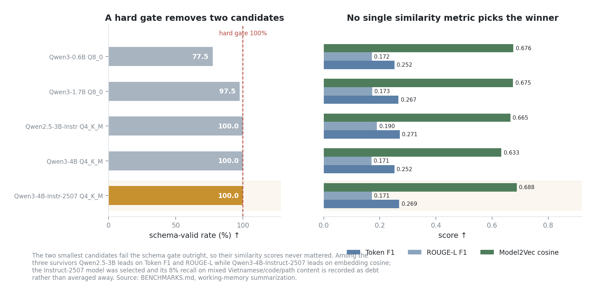

*Figure 9 — A hard schema gate removes two candidates before quality matters; no
single similarity metric picks among the survivors.*

Production model `Qwen3-4B-Instruct-2507 Q4_K_M`, selected after a five-candidate
bake-off. Protocol: zero-shot constrained JSON generation, `n_ctx=4096`,
`temperature=0`, `max_tokens=384`, final prompt fingerprint `aa317641bb249d5b`.

| Gate | Threshold | Measured | |
| --- | --- | ---: | :-: |
| Schema valid | 100% | 100% | ✅ |
| Single annotated fact recall | ≥ 80% | 80.0% | ✅ |
| Rolling annotated fact recall | ≥ 70% | 72.5% | ✅ |
| Negative-state clean | 100% | 100% | ✅ |
| Forbidden surface | 0% | 0% | ✅ |
| Child clean exit / stopped worker | 100% | 100% | ✅ |
| Peak summary-child RSS | ≤ 8,192 MiB | 6,030 MiB | ✅ |

Real 15K production smoke: auto-trigger at 15,288 approximate tokens, allocated
llama.cpp context 20,480, load 466 ms, generation 44.78 s, publish / private `0600`
checkpoint / reload / render all pass, and no summary process remained.

**Documented technical debt, not hidden:** decision recall 84%, correction recall
92%, and Vietnamese/code/path mixed placement recall **8%**. Wiring:
`working_v2_16k` target/high/hard at 12,000 / 15,000 / 16,384 tokens; one
coordinator serves chat, voice, and UI; the runtime never downloads the weight and
falls back to `trim_only` if it is missing, malformed, non-private, or the worker
fails.

Design and provenance: [docs/12-local-summary-model-selection.md](docs/12-local-summary-model-selection.md),
[ADR 0001](docs/adr/0001-local-summary-model.md).

---

## 8. Capability routing

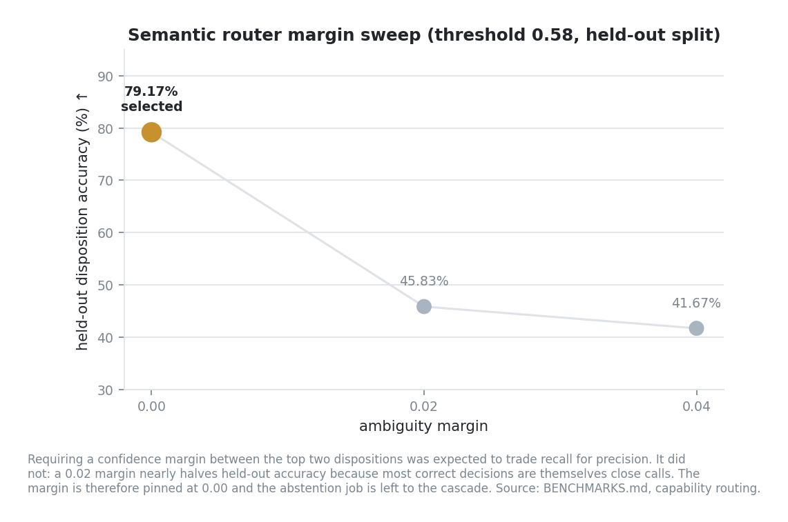

*Figure 10 — Requiring a confidence margin was expected to trade recall for
precision. It did the opposite.*

The production cascade is deterministic → shared semantic → bounded LLM. Held-out
test run with FastEmbed `intfloat/multilingual-e5-small`, threshold 0.58:

| Margin | Disposition accuracy | Source-set accuracy | Direct tool exact | Unsupported → tool |
| --- | ---: | ---: | ---: | ---: |
| **0.00** | **79.17%** | **83.33%** | 9/9 | 0/15 |
| 0.02 | 45.83% | — | — | — |
| 0.04 | 41.67% | — | — | — |

Real OpenRouter blocking and streaming runs on `google/gemini-3.5-flash-lite`
produced **18/18 route and terminal parity** with zero provider errors. Their
goal-level pass rate was **1/14**, because several answer and citation goals still
fail. That is retained as a failure and is not promoted to a retrieval-quality pass.
Both remote runs are characterization-only: the provider model has no immutable
revision.

Evidence: [`capability-router-20260730.json`](docs/evidence/capability-router-20260730.json).

### 8.1 Workflow contract

`AssistantRuntime` runs the bounded controlled workflow by default; the shadow
selector exists only for offline characterization and is never a hidden production
downgrade. The runtime synthesizes an answer only after scheduled actions finish,
and the facade returns it only when the controller terminal is `achieved`. A failed
verification, exhausted evidence budget, or typed backend failure surfaces as a
blocked result and is **never converted into a successful answer**. Terminal
taxonomy: `achieved`, `needs_clarification`, `insufficient_evidence`,
`safe_failure`, `budget_exhausted`, `cancelled`, `system_failure`.

Decision record: [ADR 0003](docs/adr/0003-controlled-workflow-shadow.md).

---

## 9. Platform, provider, and audio gates

Run of 2026-08-03, source commit `894f615`. Overall decision: **`blocked`**.

| Gate | Status | Evidence |
| --- | --- | --- |
| Watcher and process resume | `pass` | |
| Index lifecycle | `pass` | 24 docs / 24 chunks, 1 edit-embedded row, 24 rename-reused rows, warm dense ready |
| Memory lifecycle | `pass` | episode round-trip, proposal approved |
| Remote provider transcript | `pass` | OpenRouter `gemini-2.5-flash-lite`, chat + voice_transcript, terminal `achieved` |
| Remote knowledge workflow | `pass` | 1 tool call, 1 executed action, 1 structured repair, 2 evidence items |
| Summary cold process | `pass` | trigger 15,288 tokens, peak RSS 6,292 MB, generation 49.5 s, worker stopped |
| Qwen remote voice transcript | `pass` | 3 samples, error rate 0.0, `NullAudioPlayer` — **not a microphone test** |
| **Real RAG grounding** | **`fail`** | see below |
| PTY / IME matrix (iTerm2, Terminal.app) | `unsupported` | manual run not performed |
| Microphone / speaker barge-in | `unsupported` | real-device run not performed |
| Qwen release as default | `blocked` | by the [section 3.2](#32-qwen3-asr-release-qualification--decision-blocked) decision |

### 9.1 The failing gate

On the **real** vault, groundedness does not hold:

| Metric | Value | Release threshold |
| --- | ---: | ---: |
| Answerable raw Recall@5 | 1.00 | — |
| Answerable accepted-evidence Recall@5 | 1.00 | — |
| **Unanswerable false-evidence rate** | **0.50** | **≤ 0.05** |

Retrieval finds everything it should, and then accepts evidence for half of the
questions that have no answer in the vault. **Groundedness enforcement must not be
enabled and no release-quality claim may be made** until this is fixed. Note the
contrast with [section 6.5](#65-evidence-floor-recalibration): 0/8 false evidence on
the small XQuAD split versus 50% here. The XQuAD result was never strong enough to
generalize, and this gate is exactly what that Wilson bound was warning about.

### 9.2 Provider reliability

Eight real receipts across Gemini, Groq, OpenAI-compatible, and OpenRouter
surfaces, plus a mandatory-reasoning probe. Configuration: `max_attempts=3`,
`sdk_max_retries=0`, `openrouter_allow_fallbacks=false`. Example receipt: Gemini
`gemini-3.5-flash-lite`, chat, terminal `achieved`, 1 attempt, 0 retries, 311
prompt / 46 completion tokens, 1,057 ms.

**Explicitly excluded from quality, latency, and model-selection decisions** — this
is a wiring and reliability gate only.

Evidence: [`platform-audio-release-20260803.json`](docs/evidence/platform-audio-release-20260803.json),
[`provider-runtime-20260802.json`](docs/evidence/provider-runtime-20260802.json).

---

## 10. Open blockers

Consolidated from every section above. Nothing here is scheduled away or softened.

| # | Blocker | Section |
| --- | --- | --- |
| 1 | Unanswerable false-evidence rate 0.50 against a 0.05 threshold on the real vault | [9.1](#91-the-failing-gate) |
| 2 | Repeated full-stack memory-pressure evidence with summary-worker overlap missing | [3.2](#32-qwen3-asr-release-qualification--decision-blocked) |
| 3 | `resource_tracker` leaked-semaphore warning on the 1.7B worker, root cause unknown | [3.2](#32-qwen3-asr-release-qualification--decision-blocked) |
| 4 | Remote tool-router generation failure telemetry path unaudited | [3.2](#32-qwen3-asr-release-qualification--decision-blocked) |
| 5 | No microphone, speaker, or live barge-in device run | [9](#9-platform-provider-and-audio-gates) |
| 6 | No PTY / IME matrix on iTerm2 or Terminal.app | [9](#9-platform-provider-and-audio-gates) |
| 7 | Vietnamese turn-taking costs 1,824 ms median over-wait to hold premature close at 5.0% | [5.2](#52-turn-taking-120-scenarios-800-ms-within-turn-pause) |
| 8 | Backchannels longer than ~416 ms leak through the sustained gate | [5.2](#52-turn-taking-120-scenarios-800-ms-within-turn-pause) |
| 9 | Summary mixed Vietnamese/code/path placement recall 8% | [7](#7-working-memory-summarization) |
| 10 | Router goal-level pass rate 1/14 on the remediation baseline | [8](#8-capability-routing) |
| 11 | No ARM single-board measurement of any kind | [1.3](#13-hardware-and-runtime) |
| 12 | TTS voice quality, prosody, and naturalness are unmeasured | [4.2](#42-streaming-latency-and-playback-continuity) |

---

## 11. Reproduction

Figures are rendered from committed values, never redrawn by hand:

```bash
uv run python scripts/plot_benchmarks.py            # -> docs/assets/benchmarks/*.png
uv run python scripts/plot_benchmarks.py --only retrieval-pareto
```

The plotted numbers live in
[`docs/assets/benchmarks/figure_data.json`](docs/assets/benchmarks/figure_data.json),
each entry carrying the section it was copied from, so a figure cannot silently
drift from its source. Figure captions are derived from those values rather than
typed, because a hand-written caption already survived a retune once and
contradicted the bars above it.

Conversation harnesses stamp the revision they ran from, whether the tree was
dirty, and the endpoint constants in force into the result file. A later tuning
commit then appears as a diff in the artifact instead of as a stale number here.

Selected harnesses:

```bash
# ASR robustness and confidence calibration
uv run soca benchmark-asr
uv run soca calibrate-asr

# Qwen3-ASR release matrix and its analysis
uv run python eval/run_qwen_asr_release.py
uv run python eval/analyze_qwen_asr_release.py

# Conversational robustness
uv run python -m eval.eval_conversation
uv run python -m eval.eval_barge_in_synth
uv run python -m eval.eval_turn_taking
uv run python -m eval.eval_smart_turn_languages --language vie --language eng

# TTS: parity, chunk joining, device playback, first-clause A/B
uv run python eval/eval_valtec_parity.py
uv run python eval/eval_valtec_chunk_join.py
uv run python eval/measure_device_playback.py
uv run python eval/measure_first_clause_ttfa.py

# Retrieval bake-off and grounding
uv run python scripts/run_benchmark.py
uv run python eval/eval_grounding.py

# Release gates
uv run python scripts/run_release_gates.py
```

Runs that need private corpora, provisioned model artifacts, or a provider key
report `blocked` rather than silently degrading.

---

## Appendix A — Superseded results

These runs produced decisions that are still in force, or record why a path was
abandoned. They are **not** current measurements of the shipped system.

### A.1 — Anti-hallucination ablation (PhoWhisper-tiny)

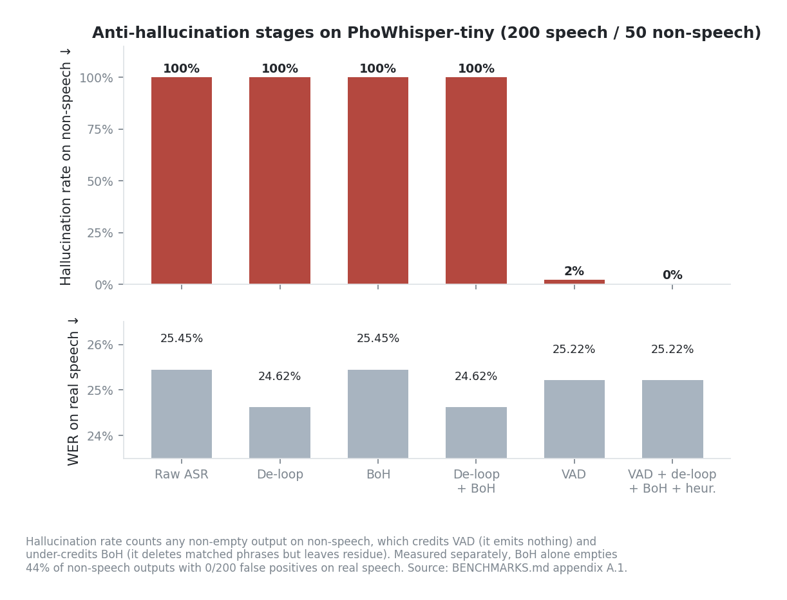

*Figure 11 — The ablation that established the pipeline, on the 39M tiny model.*

Adapted from Barański et al., ICASSP 2025. Run 2026-05-21 on 200 FLEURS `vi_vn`
speech samples and 50 non-speech samples.

| Config | WER | CER | Hallucination | p50 | p95 |
| --- | ---: | ---: | ---: | ---: | ---: |
| (1) Raw ASR | 25.45% | 12.52% | 100% | 1,235 ms | 2,562 ms |
| (2) De-loop only | 24.62% | 12.03% | 100% | 1,233 ms | 2,701 ms |
| (3) Silero VAD only | 25.22% | 12.40% | 2% | 1,260 ms | 2,417 ms |
| (4) BoH only | 25.45% | 12.52% | 100% | 1,256 ms | 2,730 ms |
| (5) De-loop + BoH | 24.62% | 12.03% | 100% | 1,213 ms | 2,724 ms |
| **(6) VAD + de-loop + BoH + heuristics** | 25.22% | 12.40% | **0%** | 1,235 ms | 2,471 ms |

**The headline metric is unfair to BoH.** "Hallucination rate" counts any non-empty
output on non-speech, which rewards VAD (it emits nothing) and punishes BoH (it
deletes matched phrases but leaves punctuation and residue). Measured directly on
the same set: BoH modified 27/50 noise samples, fully emptied 22/50, and produced
**0/200 false positives on real speech**.

Two findings worth keeping:

- **PhoWhisper-tiny hallucinates on 100% of non-speech**, against ~40% for
  Whisper-large-v3 in the source paper — the model is ~40× smaller. Mitigation is
  not optional at this tier.
- **The BoH artifact leaked YouTube captions.** Over 30 of 74 phrases matched a
  `"các em nhá thấy…"` teacher-addressing pattern — the Vietnamese analogue of the
  known WhisperX `"La La School"` leak. `các em` had to be rejected in a second
  review pass after causing 2/200 false positives on real speech, since it is also
  legitimate Vietnamese.

Heuristic thresholds were derived from **ground-truth transcripts** of 200 FLEURS
samples, with no ASR involved, using `recommended = p99 × (1 + margin)`:
`unigram_repetition` 0.35, `3gram_repetition` 0.12, `chars_per_100ms` 2.50. At
n=200 the p99 estimate is borderline; ≥500 is recommended and values may shift ~5%.
Confidence guard: `min_avg_logprob` −0.725 (speech p01 −0.250 versus noise max
−1.200), `max_compression_ratio` 2.400.

**Current status:** the VAD, de-loop, confidence-guard, and heuristic stages ship.
BoH does **not** — see [section 3.1](#31-production-asr--phowhisper-small), where it
matched 0/80 on the production model.

### A.2 — Decision history

| Result | Date | Why it is superseded |
| --- | --- | --- |
| PhoWhisper-tiny FLEURS baseline: 23.60% WER, 12.44% CER, ~20× realtime | 2026-05-14 | Origin of the robustness work; production moved to `phowhisper_small` |
| PhoWhisper size bake-off (tiny 15.58% / base 11.78% / small 10.33% WER on 20 samples) | 2026-05-27 | 20-sample slice with a greedy no-KV-cache decoder; production picked `small` for accuracy |
| BoH artifacts built for `phowhisper_base` and `phowhisper_small` | 2026-06-03 | BoH is research-only; production ships without it |
| PhoGPT-4B-Chat Q4_K_M baseline: ~61 ms TTFT, 62.8 tok/s | 2026-05-19 | Product LLM is Arcee-VyLinh 3B; PhoGPT remains an explicit diagnostic override |
| Multi-engine Vietnamese TTS bake-off | 2026-06-01 | Replaced by the single pinned Valtec ONNX release ([§4.1](#41-valtec-onnx-release)) |
| E2E voice-loop benchmark, TTFA p50 1,331 ms | 2026-06-01 | Multi-engine profiles and commands no longer exist; superseded by [§4.2](#42-streaming-latency-and-playback-continuity) |
| Hybrid RAG on XQuAD-vi: hybrid Recall@5 0.994 vs chunk_sparse 0.979 | 2026-07-27 | Small 48-article fixture; replaced by the 10,576-document TVPL selection in [§6.2](#62-embedding-and-fusion-selection) |
| Tool router v2 offline: accuracy 0.610, false-trigger 0.000, coverage 1.000 | 2026-07-27 | Deterministic-only baseline; replaced by the cascade in [§8](#8-capability-routing) |
| Retrieved memory: recall 0.629, forbidden leakage 0.0 | 2026-07-27 | 2-file fixture, kept for CI reproducibility rather than as a tuned benchmark |
| Summary bake-off v1 fixtures (200 rows, 8 unique payloads) | 2026-07-28 | Invalidated for model selection: too few distinct expected states; v2 replaced them |
| Summary decision `trim_only` | 2026-07-28 | Superseded by explicit product-owner acceptance in [§7](#7-working-memory-summarization); the measurements remain valid |
| Voice/knowledge phases P0–P5 | 2026-07-29 | Consolidated into [§6](#6-knowledge-retrieval) and [§8](#8-capability-routing) |
| Qwen3-ASR release matrix on CPU: partial p95 11,619 ms | 2026-08-02 | Re-run on MPS ([§3.2](#32-qwen3-asr-release-qualification--decision-blocked)); the CPU failure is retained, not overwritten |
| Turn-taking `p_based` at a 1,000 ms floor: cut-in 3.3%, premature close 18.3%, over-wait 1,312 ms | 2026-08-03 | Correct for the code of the day; `587a93a` raised the floor to 1,800 ms and stopped stripping the trailing silence before Smart Turn inference, giving the 1.7% / 5.0% / 1,824 ms in [§5.2](#52-turn-taking-120-scenarios-800-ms-within-turn-pause) |

Model licenses are listed in [README.md](README.md#licenses-and-attribution).
