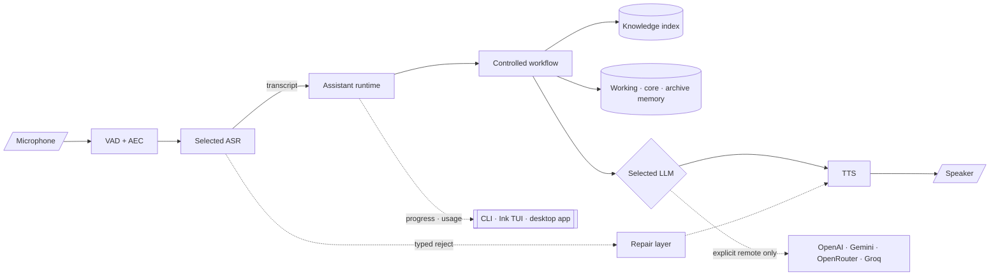

<pre align="center"><code>   .-.
 .(o/)>
 ///_/
  //'

 SoCa</code></pre>

<h1 align="center">🦜 SoCa</h1>

<p align="center">
  <strong>Vietnamese voice assistant · offline-first by default</strong><br>
  Local audio, ASR, TTS, knowledge and memory · optional local or remote LLM
</p>

<p align="center">
  <a href="https://github.com/finalflash159/soca/actions/workflows/quality.yml">
    
  </a>
  <a href="LICENSE">
    
  </a>
</p>

<p align="center">
  <a href="https://soca-page.vercel.app/">Project page</a>
</p>

SoCa is a Vietnamese voice assistant that runs on your machine. Audio capture,
VAD/AEC, ASR, TTS, knowledge retrieval, memory, indexing and session state stay
local. The LLM is local by default. If you explicitly select OpenAI, Gemini,
OpenRouter or Groq, that provider is used by both chat and voice and receives the
transcript plus assembled prompt context.

> **Status: working system, not a finished product.** The text runtime, voice
> loop, TUI, retrieval and memory run end to end. Current release blockers and
> negative measurements are recorded in [BENCHMARKS.md](BENCHMARKS.md); they are
> not hidden behind a green summary.

## What's new — 2026-08-17

**A third surface: a Tauri desktop app.** It speaks the same NDJSON engine
boundary as the CLI and the Ink TUI — no Python is reimplemented — and adds what
a terminal cannot draw: a live microphone level, a spoken transcript, rendered
markdown answers and a retrieval inspector.

- **Desktop app**, light and dark. Sidebar navigation over Chat, Voice,
  Knowledge, Session and Settings. Builds to `.app` and `.dmg`; the engine
  remains an external dependency — see
  [`docs/19-desktop-packaging.md`](docs/19-desktop-packaging.md) for exactly
  what is and is not bundled, and why.
- **Answers render as markdown** on the chat surface: headings, lists, tables,
  highlighted code and KaTeX. Chat and voice now use separate system prompts,
  because the voice prompt forbids markdown — TTS would read `**` aloud — and
  chat had been sharing it.
- **A spoken turn is a real turn.** Voice and chat produce one transcript
  instead of voice reducing into live-signal state that vanished at turn end.
- **Local LLM weights load on first use**, never at startup, on every surface.

Fixes worth naming, each found by measurement rather than by reading:

- Chat chunks are markdown blocks, not speech sentences. The TTS chunker inserts
  commas as audible pauses and strips the newlines a list depends on, so
  structured answers arrived corrupted.
- The Knowledge screen dropped everything `status` reported — vault path,
  `initialized`, index size, and per-step build progress — so it offered to
  create a vault that existed and an index build looked frozen.
- A macOS GUI app does not inherit the shell's `PATH`, so a bundled app could
  not start an engine installed in a virtualenv.
- `st_dev` is no longer part of artifact identity: it names the mount, and APFS
  reassigns it across reboots, which made every model file look tampered with.

Barge-in accuracy holds (94.7 % detection, 2.7 % false interrupt on real device
echo) but fires at a 3.0 s median. That, and the gap between headset and
loudspeaker use, are open and analysed rather than closed.

## Project page and demo

The [SoCa project page](https://soca-page.vercel.app/) is the public visual
companion to this repository. It presents the full demo recording, a short
teaser, reviewed benchmark evidence, architecture diagrams and links to the
source documentation. The page is intentionally separate from the runtime
repository so the public presentation can remain concise while this repository
keeps the implementation, release gates and detailed evidence authoritative.

<p align="center">
  
</p>

## What SoCa does

- **Voice loop:** microphone → VAD/AEC → selected ASR → assistant runtime →
  streaming TTS → speaker.
- **Turn-taking:** Smart Turn endpointing, WebRTC AEC3 and barge-in for duplex
  audio.
- **Robust ASR:** VAD, confidence/compression guards, de-looping and typed
  rejection reasons. Rejected speech becomes a Vietnamese repair prompt instead
  of an invented transcript.
- **Controlled assistant runtime:** goal resolution, typed capability routing,
  bounded tool/workflow steps, evidence verification and one terminal outcome.
- **Hybrid Vietnamese RAG:** BM25 plus `AITeamVN/Vietnamese_Embedding_v2` over a
  local Markdown vault, with revisioned indexes and explicit evidence gates.
- **Layered memory:** working session memory, approved core memory and
  query-selected archive memory. Working memory compacts at the configured
  high-water mark through an isolated local summary worker.
- **Three surfaces:** `soca ask`/`soca chat` for text, `soca ui` for the Ink
  terminal UI, and a Tauri desktop app — all over the same headless NDJSON
  engine ([`docs/18-engine-protocol.md`](docs/18-engine-protocol.md)).

The production stack has no silent provider, model, router, retrieval-backend or
ASR fallback. Retries are bounded and observable; an exhausted production
failure is typed and visible. Changing the selected component is an explicit
operator action.

## Architecture



Every UI is a presentation layer. `SocaEngine` owns the NDJSON process boundary;
`soca/core` owns orchestration and contracts; backend packages own models,
indexes, memory and tools. The UI never loads model weights or reconstructs
routing logic.


Read the [architecture diagram register](docs/diagrams.md) for the reviewed
Lucid sources and focused subsystem diagrams. The canonical implementation map
is [`docs/00-system-map.md`](docs/00-system-map.md).

## Quickstart

Requirements: **Python 3.11** and [`uv`](https://docs.astral.sh/uv/).

```bash
# Install the application and development/evaluation dependencies.
uv sync --extra dev --extra eval --extra rag

# Optional: build llama.cpp with Apple Metal support.
CMAKE_ARGS="-DGGML_METAL=on" FORCE_CMAKE=1 \
  uv pip install --force-reinstall --no-cache-dir llama-cpp-python

# Provision the default local runtime.
uv run python scripts/download_phowhisper.py --model phowhisper_small
uv run python scripts/download_llm.py --model arcee_vylinh_3b_q4_k_m
uv run python scripts/download_valtec_onnx.py
uv run python scripts/download_smart_turn.py
uv run soca knowledge model install aiteamvn-v2

# Create and index a local Markdown vault.
uv run python scripts/init_knowledge_vault.py ./Knowledge
uv run soca knowledge index build --vault ./Knowledge

# Run one of the application surfaces.
uv run soca voice
uv run soca ask "ghi chú của tôi nói gì về attention" --trace
uv run soca ui voice
```

Build the UI once before the first TUI run:

```bash
cd ui && npm install && npm run build
```

Check configuration and registered artifacts without loading every model:

```bash
uv run soca status
uv run soca profiles
uv run soca asr-models
uv run soca llm-models
```

### Optional remote LLM

Local remains the default. To use a remote provider explicitly:

```bash
uv sync --extra llm-remote
uv run soca ui
# type /settings → choose provider → paste key → choose model
```

Keys are stored in the OS keyring when available and masked in the UI. The
selected provider/model persists in `~/.config/soca/llm.json`; the key is never
written to that file or echoed through NDJSON. Remote mode sends the transcript
and assembled prompt to the selected third party. Details:
[LLM providers and settings](docs/16-llm-providers.md).

## Runtime profiles

A profile binds one explicit ASR, LLM and TTS configuration. The `baseline`
profile is the only production default; Qwen profiles are explicit selections,
not automatic fallbacks.

| Profile | ASR | LLM | Use |
| --- | --- | --- | --- |
| `baseline` | `phowhisper_small` | `arcee_vylinh_3b_q4_k_m` | Production default |
| `qwen-release` | `qwen3_asr_0_6b` service | `arcee_vylinh_3b_q4_k_m` | Explicit release candidate; currently blocked |
| `qwen-reference` | `qwen3_asr_1_7b` service | `arcee_vylinh_3b_q4_k_m` | Explicit quality/reference profile |

```bash
uv run soca voice baseline
uv run soca voice --no-memory
uv run soca voice --asr-model phowhisper_base
```

Profile validation, artifact readiness and override precedence are documented
in [registries, profiles and CLI](docs/08-registries-profiles-cli.md).

## Commands at a glance

| Command | Purpose |
| --- | --- |
| `soca voice [profile]` | Microphone voice loop |
| `soca ask <text>` | One text turn with tools, knowledge, memory and LLM |
| `soca chat` | Multi-turn text session |
| `soca ui [mode]` | Ink UI: main UI, status, chat, voice or settings |
| `soca engine` | Headless NDJSON engine for external UIs |
| `soca status` | Readiness and selected runtime configuration |
| `soca profiles` | Registered runtime profiles |
| `soca knowledge index ...` | Build, verify, inspect, migrate, rollback or GC an index |
| `soca knowledge model ...` | Install, verify or inspect the embedding model |
| `soca asr-models` / `soca llm-models` | Registry and local artifact status |
| `soca benchmark-asr` / `soca calibrate-asr` | ASR research/evaluation commands |

Useful routing checks without microphone or TTS:

```bash
uv run soca ask "wiki: attention và Transformer là gì?" --trace
uv run soca ask "memory: tôi đã chọn TTS nào?" --trace
uv run soca ask "đọc private/secrets.md" --no-llm --trace
```

The production tool catalog is intentionally small: `knowledge.search`,
`knowledge.read`, `knowledge.inspect` and `memory.search`. There is no weather,
device, alarm or timer stub. Unsupported requests remain visible as ordinary
chat rather than pretending that an absent tool succeeded.

## Data, memory and indexes

The source vault is user-owned Markdown under `./Knowledge/wiki/`. Approved
always-on memory lives in `./Knowledge/memory/core.json`; archive memory is
retrieved from `./Knowledge/memory/` only when the query requires it. Generated
SQLite catalogs and dense vector generations live privately under
`./Knowledge/.soca/knowledge_index/`.

Indexing is explicit and incremental. New, changed or deleted Markdown is
reconciled against the source digest; unchanged passage embeddings are reused;
new generations are verified and published atomically. A stale, missing or
corrupt production generation is an explicit failure, not a silent sparse-mode
fallback. See [index lifecycle](docs/11-index-lifecycle.md) and
[hybrid RAG and memory](docs/09-hybrid-rag-memory.md).

## Evidence and current release state

SoCa separates a smoke test, a real provider invocation, a public benchmark, a
private-vault trajectory and a platform/device gate. Each release claim needs a
pinned code/model/data revision, configuration, hardware, metrics, failures and
decision. Raw transcripts, private vaults, audio and provider logs stay local.

Selected evidence and open blockers are maintained in
[`BENCHMARKS.md`](BENCHMARKS.md). The evaluation protocol and status vocabulary
are in [evaluation and release gates](docs/17-evaluation-and-release.md).

## Documentation and repository map

Start with [`docs/README.md`](docs/README.md), then:

- [system map](docs/00-system-map.md) — boundaries, modules, state and one turn;
- [voice pipeline](docs/03-voice-pipeline.md) — ASR, streaming, TTS, playback and barge-in;
- [assistant runtime](docs/05-assistant-runtime.md) — routing, tools, evidence and verification;
- [conversation repair](docs/06-conversation-repair.md) — typed repair events and handover;
- [TUI and engine](docs/07-tui.md) — Ink, NDJSON, slash commands and progress;
- [engine protocol](docs/18-engine-protocol.md) — the NDJSON contract every surface speaks;
- [desktop packaging](docs/19-desktop-packaging.md) — what the bundle contains, and what signing still needs;
- [retrieval and memory](docs/09-hybrid-rag-memory.md) — catalog, hybrid RAG and memory layers;
- [context budget](docs/14-model-aware-context-budget.md) — prompt admission and `/context`;
- [provider reliability](docs/provider-runtime-reliability.md) — retries, cancellation and typed failures.

```text
soca/      production Python packages: app, core, asr, llm, tts, knowledge, memory and tools
ui/        Ink/React terminal UI
desktop/   Tauri desktop app over the same NDJSON engine
eval/      datasets, harnesses and local results
docs/      current system docs, ADRs, diagrams and sanitized evidence
scripts/   provisioning, smoke tests, release gates and figure generation
local/     experimental ASR robustness workflow; not production runtime
```

## Development

```bash
uv run ruff check soca tests
uv run pytest -q
cd ui && npm test && npm run typecheck
```

Model weights, datasets, generated audio and evaluation results are local
artifacts and are not committed (`models/`, `data/`, `eval/results/`,
`benchmarks/raw/`, `*.wav`).

## Licensing

SoCa source code is [MIT licensed](LICENSE). Models and datasets retain their
own licenses and model-card restrictions. The default Valtec TTS artifacts are
**CC BY-NC 2.0**, so commercial voice deployment requires a separate license
from the authors or a different TTS engine. Review the complete attribution and
dependency notes in [BENCHMARKS.md](BENCHMARKS.md#2-datasets-and-corpora) and
the model registries before redistribution.
