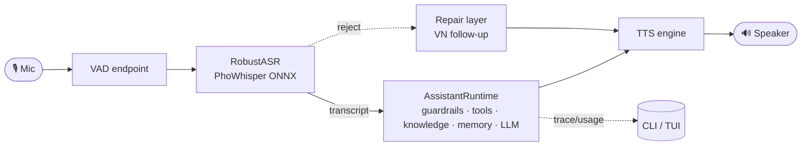

# SoCa (Sơn Ca)

**Offline-first Vietnamese voice assistant.** Microphone → VAD endpoint →
robust ASR (PhoWhisper ONNX) → assistant runtime (guardrails · tools · knowledge ·
memory · local LLM) → TTS → speaker. No cloud in the hot path.

The project is research-heavy: every model choice is backed by a small local
bake-off before it becomes a default (see [BENCHMARKS.md](BENCHMARKS.md)).

> **Detailed system design lives in [`docs/`](docs/README.md)** — architecture,
> voice pipeline, ASR robustness, runtime routing, repair layer, and the TUI.

## What works today

- **Voice loop** (CLI + TUI): mic → VAD → RobustASR → AssistantRuntime → TTS → speaker.
- **Text runtime**: `soca ask` / `soca chat` — same runtime, no mic/TTS.
- **Ink TUI**: `soca ui` with status / chat / voice / settings modes, a live voice
  status bar, and shared session memory across modes.
- **Remote LLM providers (opt-in)**: swap the core LLM for a third-party API
  (OpenAI / Groq / OpenRouter / Gemini) from the TUI settings screen. Local stays the
  default and the only thing in the voice hot path. See
  [notes/llm_providers.md](notes/llm_providers.md).
- **RobustASR**: VAD, de-looping, confidence guard, model-specific BoH matching,
  and hallucination heuristics — turns flaky Whisper output into trusted text or a
  clean reject with a reason.
- **AssistantRuntime**: staged guardrails, deterministic → semantic → LLM tool
  routing, knowledge + memory prompt assembly, citations, trace output, and
  end-to-end streaming.
- **Tool catalog**: five real local tools only — knowledge search/read, local
  time, memory search, and approval-gated memory proposals. Weather/device/alarm
  requests stay in free chat; no fake backend or capability classifier is registered.
- **Conversation-repair layer**: natural Vietnamese follow-ups with variants,
  no-repeat, and escalation instead of raw ASR rejects, with handover to chat.
- **Registries + profiles** for ASR/LLM/TTS, plus eval harnesses and benchmark reports.

In progress: deeper runtime eval (tool selection / citations / guardrails), ASR
recalibration for larger PhoWhisper models, and ARM-board validation (current
numbers are local Mac measurements).

## Architecture



Dependency rule: `app` (CLI/TUI) → `soca.core` (facade) → backends
(`asr/llm/tts/knowledge/memory/tools`). See [docs/02-architecture.md](docs/02-architecture.md).

## Quickstart

SoCa uses **Python 3.11** and **`uv`**.

```bash
# 1) Environment
uv sync --extra dev --extra eval
# Optional: rebuild llama-cpp-python with Apple Metal
CMAKE_ARGS="-DGGML_METAL=on" FORCE_CMAKE=1 \
  uv pip install --force-reinstall --no-cache-dir llama-cpp-python

# 2) Download local models for the default (baseline) profile
uv run python scripts/download_phowhisper.py --model phowhisper_small
uv run python scripts/download_llm.py --model arcee_vylinh_3b_q4_k_m

# 3) Initialize a local Markdown knowledge vault (default: ~/KnowledgeVault)
uv run python scripts/init_knowledge_vault.py ~/KnowledgeVault

# 4) Run
uv run soca voice                 # CLI voice loop (baseline profile)
uv run soca ui voice              # Ink terminal UI, voice mode (build: cd ui && npm i && npm run build)
uv run soca ask "mấy giờ rồi?" --trace   # one text turn (no mic/TTS)
```

Inspect what is registered without loading models:

```bash
uv run soca profiles
uv run soca asr-models
uv run soca llm-models
```

**Optional — remote LLM providers** (OpenAI / Groq / OpenRouter / Gemini). Local is
the default and stays in the voice hot path; remote is opt-in and text-first:

```bash
uv sync --extra llm-remote        # openai client + keyring for secure key storage
uv run soca ui                    # open Settings, pick a provider, paste key, choose model
```

Keys are stored in the OS keyring (never auto-written to `.env`) and masked in the UI;
the chosen backend persists in `~/.config/soca/llm.json`. Remote sends the transcript
to a third party — details and the read/precedence rules are in
[notes/llm_providers.md](notes/llm_providers.md).

The runtime reads local Markdown only (notes under `~/KnowledgeVault/wiki/`,
curated profile memory in `~/KnowledgeVault/memory/profile.md`); it never
auto-writes long-term memory, and vault contents are not committed.

The active local vault is `~/KnowledgeVault`. Its `wiki/` tree contains the
learning notes, project decisions, synthetic food ledger, and health safety
boundaries used by the current runtime. The separate `memory/` tree remains
the reviewed long-term memory namespace; vault contents are not committed.

## Runtime profiles

A single public runtime profile keeps the product path deterministic. Its name is `baseline`, and
TTS is always Valtec.

| Profile    | ASR              | LLM             | TTS / voice | Mục đích                  |
| ---------- | ---------------- | --------------- | ----------- | ------------------------- |
| `baseline` | phowhisper_small | arcee_vylinh_3b | valtec / NF | Runtime mặc định duy nhất |

```bash
uv run soca voice baseline
uv run soca voice --no-memory        # disable memory
uv run soca voice --asr-model phowhisper_base   # explicit diagnostic override
```

Profiles drive both voice and text; `--llm-model` overrides both. Details:
[docs/08-registries-profiles-cli.md](docs/08-registries-profiles-cli.md).

## CLI at a glance

| Command                                             | What it does                                                                                           |
| --------------------------------------------------- | ------------------------------------------------------------------------------------------------------ |
| `soca voice [profile]`                              | Microphone voice loop (CLI)                                                                            |
| `soca ui [status\|chat\|voice\|settings] [profile]` | Ink terminal UI over `soca engine`; `/settings` picks the LLM backend (needs `cd ui && npm run build`) |
| `soca ask <text>`                                   | One text turn (guardrails / tools / knowledge / memory / LLM)                                          |
| `soca chat`                                         | Multi-turn text session (RAM session memory)                                                           |
| `soca profiles`                                     | List runtime profiles                                                                                  |
| `soca asr-models` / `llm-models`                    | List registered models + local file status                                                             |
| `soca asr-smoke` / `llm-smoke`                      | Smoke-test a single model                                                                              |
| `soca benchmark-asr` / `calibrate-asr`              | ASR robustness benchmark / threshold calibration                                                       |

`soca ask` is the fastest way to exercise routing without mic/TTS:

```bash
uv run soca ask "mấy giờ rồi?" --trace             # truthful out-of-scope response; no time tool is installed
uv run soca ask "wiki: chất đạm là gì?" --trace     # knowledge search
uv run soca ask "memory: lựa chọn TTS của tôi" --trace # private memory search
uv run soca ask "đọc private/secrets.md" --no-llm --trace   # guardrail block
```

## Repository layout

```text
soca/
  cli.py       Click CLI (voice / ask / chat / ui / ...-models / ...-smoke)
  core/        FACADE: AssistantRuntime, VoicePipeline, guardrails, repair,
               profiles, streaming, endpointing, metrics, usage
  asr/         PhoWhisper ONNX, VAD, RobustASR (de-loop, BoH, heuristics)
  llm/         llama.cpp runner, prompt styles, registry, memory wrapper
  tts/         Valtec ONNX Vietnamese TTS runtime, config, and factory
  knowledge/   Markdown vault search and context packing
  memory/      long-term profile memory + RAM session memory
  tools/       ToolRuntime, tool specs, knowledge/memory tools
  app/         presentation: CLI helpers + engine (UI itself lives in ui/, Ink)

docs/          system design (start at docs/README.md)
scripts/       local utilities, smoke tests, model download helpers
eval/          ASR / LLM / TTS / voice-loop / knowledge eval harnesses
zplan/         local planning docs
```

## Benchmarks (short version)

Full notes in [BENCHMARKS.md](BENCHMARKS.md). Highlights:

- PhoWhisper-tiny ONNX on FLEURS-vi: 23.60% WER / 12.44% CER, ~20× real-time (D1).
- Historical ASR bake-offs favored `phowhisper_base`; the current product baseline uses
  `phowhisper_small` for higher accuracy.
- PhoGPT-4B Q4_K_M via llama.cpp/Metal: ~61 ms TTFT, 62.8 tok/s (D2). Product
  runtime uses Arcee-VyLinh; other LLM entries remain explicit diagnostic/eval overrides.
- Product TTS supports only Valtec. Older multi-engine measurements remain historical records in
  `BENCHMARKS.md`.

Caveats: numbers are local Mac measurements (not Raspberry Pi); LLM behavioral
rates are heuristic screeners; RobustASR confidence/BoH artifacts are
model-specific (calibrated for `phowhisper_tiny`).

## Development

```bash
uv run ruff check soca tests --fix
uv run pytest -q
```

Model files, datasets, generated audio, and eval results are **local artifacts**
and are not committed (`models/`, `data/`, `eval/results/`, `*.wav`, ...).

## License

SoCa code is MIT licensed. Third-party models, datasets, and vendored source
packages keep their own licenses and model-card restrictions.
