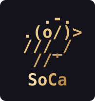
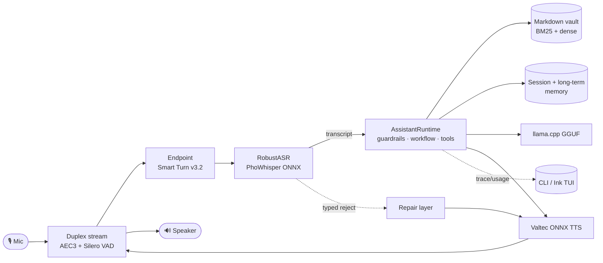

# SoCa (Sơn Ca)



**An offline-first Vietnamese voice assistant that runs on your own machine.**
Microphone → VAD → robust ASR → assistant runtime (guardrails · tools · knowledge ·
memory · local or remote LLM) → TTS → speaker. Audio capture, ASR, TTS, knowledge,
and memory stay local. The LLM is local by default, or can be explicitly configured
as a remote provider for both chat and voice; remote selection sends transcript and
prompt context to that provider.

SoCa is a research-heavy personal project. Every model in the product path had to
win a local bake-off before it became a default, and every release decision is
backed by a recorded, hashed run — including the ones that came out **negative**.
Those live in [BENCHMARKS.md](BENCHMARKS.md) alongside the good results.

> **Status: working system, not a finished product.** The voice loop, text runtime,
> TUI, retrieval, and memory all run end to end. Three release gates are currently
> **open**: groundedness on the real vault fails its threshold, the Qwen3-ASR
> upgrade is blocked on memory evidence, and no measurement has ever been taken on
> real microphone hardware or on an ARM single-board computer. See
> [open blockers](BENCHMARKS.md#10-open-blockers) — they are listed, not buried.

---

## What works today

- **Voice loop** (CLI and TUI): mic → VAD → `RobustASR` → `AssistantRuntime` → TTS
  → speaker, continuously.
- **Barge-in and turn-taking**: a single duplex audio stream with WebRTC AEC3 lets
  you interrupt the assistant mid-sentence. Endpointing uses Smart Turn v3.2, which
  cut interruptions of the *user* from 100% to 3.3% against a fixed silence timer
  ([measured](BENCHMARKS.md#52-turn-taking-120-scenarios-800-ms-within-turn-pause)).
- **`RobustASR`**: VAD, de-looping, a calibrated confidence guard, and hallucination
  heuristics turn flaky Whisper output into either trusted text or a clean reject
  with a typed reason. On the production model it rejects 45 of 50 non-speech clips
  while falsely rejecting **zero** real utterances.
- **Assistant runtime**: a bounded controlled workflow with staged guardrails,
  deterministic → semantic → LLM tool routing, hybrid retrieval, citations, and one
  typed terminal state per run. A failed verification is surfaced as blocked — it is
  never converted into a confident-sounding answer.
- **Hybrid Vietnamese RAG**: BM25 + `AITeamVN/Vietnamese_Embedding_v2` with linear
  fusion, over a local Markdown vault, with a transactional index (atomic generation
  swap, incremental reconcile, explicit rollback).
- **Working memory**: session memory with automatic compaction at 15K tokens via a
  local summary model in an isolated worker process.
- **Text runtime**: `soca ask` / `soca chat` — the same runtime with no mic or TTS.
- **Ink TUI**: `soca ui` with status / chat / voice / settings modes over a headless
  NDJSON engine.
- **Remote LLM providers (opt-in)**: swap the core LLM for OpenAI / Groq /
  OpenRouter / Gemini from the settings screen. Local stays the default; an
  explicitly selected provider is used by both chat and voice.
- **Conversation repair**: ASR rejects and guardrail blocks become natural
  Vietnamese follow-ups with variants, no-repeat, and escalation to chat — not raw
  error text read aloud.

Detailed system design lives in [`docs/`](docs/README.md).

---

## Architecture



Dependency rule: `app` (CLI/TUI) → `soca.core` (facade) → backends
(`asr` / `llm` / `tts` / `knowledge` / `memory` / `tools`). Details:
[docs/02-architecture.md](docs/02-architecture.md).

**Design commitments that shaped the code:**

- **No silent fallback, anywhere.** A missing model, a stale index generation, a
  failed worker, or an absent calibration raises visibly. The runtime never quietly
  downgrades to a smaller model or a weaker retrieval path.
- **Immutable data.** Turn results are frozen dataclasses; updates create copies.
- **Fail-closed readiness.** Missing confidence calibration blocks a profile
  *before* its model loads, rather than disabling the guard.
- **Evidence separates from speech.** Technical rejects go through the repair layer
  so the user hears Vietnamese, not a stack trace.

---

## Quickstart

SoCa needs **Python 3.11** and [`uv`](https://docs.astral.sh/uv/).

```bash
# 1) Environment
uv sync --extra dev --extra eval --extra rag
# Optional: rebuild llama-cpp-python with Apple Metal
CMAKE_ARGS="-DGGML_METAL=on" FORCE_CMAKE=1 \
  uv pip install --force-reinstall --no-cache-dir llama-cpp-python

# 2) Local models for the default profile
uv run python scripts/download_phowhisper.py --model phowhisper_small
uv run python scripts/download_llm.py --model arcee_vylinh_3b_q4_k_m
uv run python scripts/download_valtec_onnx.py
uv run python scripts/download_smart_turn.py
uv run soca knowledge model install aiteamvn-v2

# 3) A local Markdown knowledge vault
uv run python scripts/init_knowledge_vault.py ./Knowledge
uv run soca knowledge index build --vault ./Knowledge

# 4) Run
uv run soca voice                        # CLI voice loop
uv run soca ask "mấy giờ rồi?" --trace    # one text turn, no mic/TTS
uv run soca ui voice                     # Ink TUI (build first: cd ui && npm i && npm run build)
```

Check what is registered without loading a single model:

```bash
uv run soca status
uv run soca profiles
uv run soca asr-models
uv run soca llm-models
```

**Optional — remote LLM providers.** Local stays the default; an explicitly
persisted provider/model selection is shared by chat and voice:

```bash
uv sync --extra llm-remote     # openai client + keyring for secure key storage
uv run soca ui                 # Settings → pick provider → paste key → choose model
```

Keys are stored in the OS keyring, never auto-written to `.env`, and masked in the
UI; the chosen backend persists in `~/.config/soca/llm.json`. **Remote sends your
transcript to a third party.** Precedence and read rules:
[notes/llm_providers.md](notes/llm_providers.md).

The runtime reads local Markdown only — notes under `./Knowledge/wiki/` and
retrieved archive notes under `./Knowledge/memory/`. Explicitly approved
always-on memory lives in `./Knowledge/memory/core.json`; generated SQLite and
vector generations live privately under `./Knowledge/.soca/`. There is no
unbounded archive payload in production. It never auto-writes long-term memory,
and vault contents are never committed.

---

## Runtime profiles

A profile binds one ASR, one LLM, and one TTS voice into a named runtime.

| Profile | ASR | LLM | TTS | Purpose |
| --- | --- | --- | --- | --- |
| **`baseline`** | `phowhisper_small` | `arcee_vylinh_3b_q4_k_m` | Valtec / NF | The only production default |
| `qwen-release` | `qwen3_asr_0_6b` | `arcee_vylinh_3b_q4_k_m` | Valtec / NF | Explicit release candidate — **[blocked](BENCHMARKS.md#32-qwen3-asr-release-qualification--decision-blocked)** |
| `qwen-reference` | `qwen3_asr_1_7b` | `arcee_vylinh_3b_q4_k_m` | Valtec / NF | Explicit quality reference / demo |

The Qwen profiles are **never** automatic fallbacks — not for each other, not for
PhoWhisper. Selecting one is always an explicit act.

```bash
uv run soca voice baseline
uv run soca voice --no-memory                    # disable memory
uv run soca voice --asr-model phowhisper_base    # explicit diagnostic override
```

Profiles drive both voice and text; `--llm-model` overrides both. Details:
[docs/08-registries-profiles-cli.md](docs/08-registries-profiles-cli.md).

---

## CLI at a glance

| Command | What it does |
| --- | --- |
| `soca voice [profile]` | Microphone voice loop |
| `soca ask <text>` | One text turn (guardrails / tools / knowledge / memory / LLM) |
| `soca chat` | Multi-turn text session |
| `soca ui [status\|chat\|voice\|settings]` | Ink terminal UI over `soca engine` |
| `soca engine` | Headless NDJSON engine over stdio, for external UIs |
| `soca status` | Runtime readiness without loading models |
| `soca profiles` | List runtime profiles |
| `soca knowledge index <build\|status\|verify\|rebuild\|gc\|inspect\|migrate\|rollback\|watch>` | Transactional index lifecycle |
| `soca knowledge model <list\|status\|install\|verify\|remove>` | Embedding model lifecycle |
| `soca asr-models` · `llm-models` | List registered models and local file status |
| `soca asr-smoke` · `llm-smoke` | Smoke-test a single model |
| `soca benchmark-asr` · `calibrate-asr` | ASR robustness benchmark / threshold calibration |

`soca ask` is the fastest way to exercise routing without mic or TTS:

```bash
uv run soca ask "wiki: chất đạm là gì?" --trace          # knowledge retrieval + citations
uv run soca ask "memory: lựa chọn TTS của tôi" --trace   # private memory search
uv run soca ask "đọc private/secrets.md" --no-llm --trace # guardrail block
```

**Tool catalog — four local tools, and nothing fake.** `knowledge.search`,
`knowledge.read`, `knowledge.inspect`, and `memory.search`. There is no weather,
device, alarm, or timer tool: those requests stay in free chat and the assistant
says it cannot do them, rather than pretending to via a stub backend.

---

## Evaluation

Model choices here are decisions with evidence attached, not preferences. A run
becomes release evidence only when the tree is clean and every model, dataset, and
config revision is pinned and hashed; anything against a provider-hosted model is
labelled characterization and never used for a quality claim.

Selected results — full context, caveats, and the negative results in
[BENCHMARKS.md](BENCHMARKS.md):

| Area | Result |
| --- | --- |
| ASR robustness | 45/50 non-speech clips rejected, **0/30 real utterances falsely rejected**; 16.39% WER on FLEURS-vi |
| Anti-hallucination ablation | 100% → **0%** hallucination on non-speech, at −0.23 pp WER cost (PhoWhisper-tiny) |
| Turn-taking | cut-in **100% → 3.3%**, premature close 61.7% → 18.3%, for ~608 ms more patience |
| Barge-in | 94.7% detection at 2.7% false interrupt under real recorded echo |
| Retrieval | Recall@5 **0.916** on 10,576 documents, ~71 ms p95 |
| TTS | RTF p50 0.070, latency p50 271 ms, loopback CER 0.134 — all inside gate |
| Streaming | first-clause flushing saves **395 ms** to first audio on 7/8 prompts |

Figures are regenerated from committed values, never redrawn by hand:

```bash
uv run python scripts/plot_benchmarks.py
```

---

## Repository layout

```text
soca/
  cli.py       Click CLI (voice / ask / chat / ui / engine / knowledge / ...)
  core/        FACADE: AssistantRuntime, VoicePipeline, controlled workflow,
               guardrails, repair, profiles, streaming, endpointing, AEC sink
  asr/         PhoWhisper ONNX, Qwen3-ASR worker + IPC, VAD, RobustASR
  llm/         llama.cpp runner, prompt styles, registry, remote providers
  tts/         Valtec ONNX runtime, Vietnamese normalizer, G2P, lexicons
  knowledge/   Markdown vault, BM25 + dense retrievers, transactional index
  memory/      approved core memory, retrieved archive, session compaction
  tools/       ToolRuntime and the four local tool specs
  app/         presentation: CLI helpers + headless engine
  config/      LLM settings and OS-keyring secret store

ui/            Ink terminal UI (TypeScript), talks to `soca engine` over NDJSON
docs/          system design (start at docs/README.md) + ADRs + evidence JSON
eval/          evaluation harnesses for every area in BENCHMARKS.md
scripts/       model downloads, smoke tests, release gates, figure rendering
```

---

## Development

```bash
uv run ruff check soca tests --fix
uv run pytest -q
cd ui && npm test && npm run typecheck
```

Model files, datasets, generated audio, and eval results are **local artifacts** and
are not committed (`models/`, `data/`, `eval/results/`, `benchmarks/raw/`, `*.wav`).

---

## Licenses and attribution

**SoCa's own source code is [MIT licensed](LICENSE).**

That does *not* cover the models it downloads. Each third-party model and dataset
keeps its own license and model-card restrictions, and **one of them is
non-commercial**. Read this section before deploying SoCa anywhere commercial.

### ⚠️ The non-commercial constraint

| Component | License | Consequence |
| --- | --- | --- |
| **Valtec TTS** — [`valtecAI-team/valtec-tts-pretrained`](https://github.com/tronghieuit/valtec-tts) | **CC BY-NC 2.0** | **The default and only TTS engine is non-commercial.** Any commercial deployment of SoCa's voice output requires either a separate license from the Valtec authors or a different TTS engine. Redistribution of the derived ONNX artifacts requires explicit release review. |
| **ESC-50** (benchmark only) | CC BY-NC | Used to build non-speech evaluation sets. Never shipped as product data. |

Everything else in the product path is permissively licensed.

### Models in the product path

| Role | Model | License |
| --- | --- | --- |
| ASR (default) | [`vinai/PhoWhisper-small`](https://huggingface.co/vinai/PhoWhisper-small), ONNX conversion by `huuquyet` | BSD-3-Clause |
| ASR (explicit profiles) | [`Qwen/Qwen3-ASR-0.6B`](https://huggingface.co/Qwen/Qwen3-ASR-0.6B), [`Qwen3-ASR-1.7B`](https://huggingface.co/Qwen/Qwen3-ASR-1.7B) | Apache-2.0 |
| Voice activity detection | [`snakers4/silero-vad`](https://github.com/snakers4/silero-vad) | MIT |
| Turn detection | [`pipecat-ai/smart-turn-v3`](https://huggingface.co/pipecat-ai/smart-turn-v3) (v3.2 CPU int8 ONNX, 8M params) | BSD-2-Clause |
| Acoustic echo cancellation | WebRTC AEC3 via `pywebrtc-audio` | Apache-2.0 (package); WebRTC upstream BSD-3-Clause |
| LLM (default) | [`arcee-ai/Arcee-VyLinh`](https://huggingface.co/arcee-ai/Arcee-VyLinh) 3B, community GGUF by QuantFactory | Apache-2.0 upstream |
| Summary model | [`Qwen3-4B-Instruct-2507`](https://huggingface.co/Qwen/Qwen3-4B-Instruct-2507) Q4_K_M, Unsloth GGUF | Apache-2.0 |
| Embedding | [`AITeamVN/Vietnamese_Embedding_v2`](https://huggingface.co/AITeamVN/Vietnamese_Embedding_v2) | Apache-2.0 |
| Semantic router | [`intfloat/multilingual-e5-small`](https://huggingface.co/intfloat/multilingual-e5-small) via FastEmbed | MIT |
| TTS | [`valtecAI-team/valtec-tts-pretrained`](https://github.com/tronghieuit/valtec-tts) | **CC BY-NC 2.0** |

Registered-but-not-default models (PhoGPT-4B BSD-3-Clause, VinaLLaMA and Vistral
under Llama-2-family and AFL-3.0 signals, and others) each carry a `license_note` in
[`soca/llm/registry.py`](soca/llm/registry.py). Several are marked *verify upstream
license before any public release claim* — that warning is deliberate and unresolved.

### Citing the models

PhoWhisper should be cited when used in published work:

> Thanh-Thien Le, Linh The Nguyen, Dat Quoc Nguyen. *PhoWhisper: Automatic Speech
> Recognition for Vietnamese.* ICLR 2024 Tiny Papers.

The anti-hallucination pipeline is adapted from:

> Barański et al., ICASSP 2025 — Whisper hallucination mitigation on non-speech
> input. SoCa's replication and its Vietnamese-specific findings are in
> [BENCHMARKS.md](BENCHMARKS.md#a1--anti-hallucination-ablation-phowhisper-tiny).

Turn-taking metrics use Full-Duplex-Bench vocabulary; ASR reporting follows the Open
ASR Leaderboard convention of publishing quality and speed together.

### Python dependencies

Every package SoCa depends on directly is MIT, BSD, Apache-2.0, or ISC, and the Ink
TUI in [`ui/`](ui/) depends on `ink` and `react`, both MIT. Listing them one by one
would only duplicate `uv.lock` and go stale, so this section records the ones that
carry an actual obligation instead.

Four transitive packages are not permissive. None is a blocker, and all four are
used as ordinary separate libraries rather than being copied into SoCa's own source:

| Package | License | Reaches the tree via |
| --- | --- | --- |
| `soxr` | LGPL-2.1-or-later | `librosa` (core dependency) — resampling |
| `Distance` | GPL (unversioned classifier) | `g2p-en`, i.e. only the optional `tts-en` extra |
| `tqdm` | MPL-2.0 AND MIT | many packages, and SoCa directly |
| `certifi`, `fqdn` | MPL-2.0 | `requests` / `httpx` / `jsonschema` |

MPL-2.0 is file-level copyleft and imposes nothing on surrounding code. The `soxr`
and `Distance` entries deserve a decision before any binary redistribution:
installing the `tts-en` extra puts a GPL-classified package in the environment.
Skipping that extra removes it — English G2P then falls back to the bundled
CMUdict lexicon, which is what
[BENCHMARKS.md](BENCHMARKS.md#a1--anti-hallucination-ablation-phowhisper-tiny)
measures anyway.

This list was produced by reading installed package metadata, and it can be
regenerated after any dependency change:

```bash
uv run python -c "
import importlib.metadata as md
for d in md.distributions():
    name = d.metadata['Name']
    lic = d.metadata.get('License-Expression') or d.metadata.get('License') or ''
    cls = ' '.join(c for c in (d.metadata.get_all('Classifier') or []) if c.startswith('License'))
    text = (lic + ' ' + cls).lower()
    if any(k in text for k in ('mpl', 'mozilla public', 'gnu', 'gpl', 'eupl', 'noncommercial')):
        print(f'{name:24} {(lic or cls)[:60]}')
"
```

None of this is legal advice — it is what the packages declare about themselves.

Benchmark dataset licenses are listed in
[BENCHMARKS.md § 2](BENCHMARKS.md#2-datasets-and-corpora).
