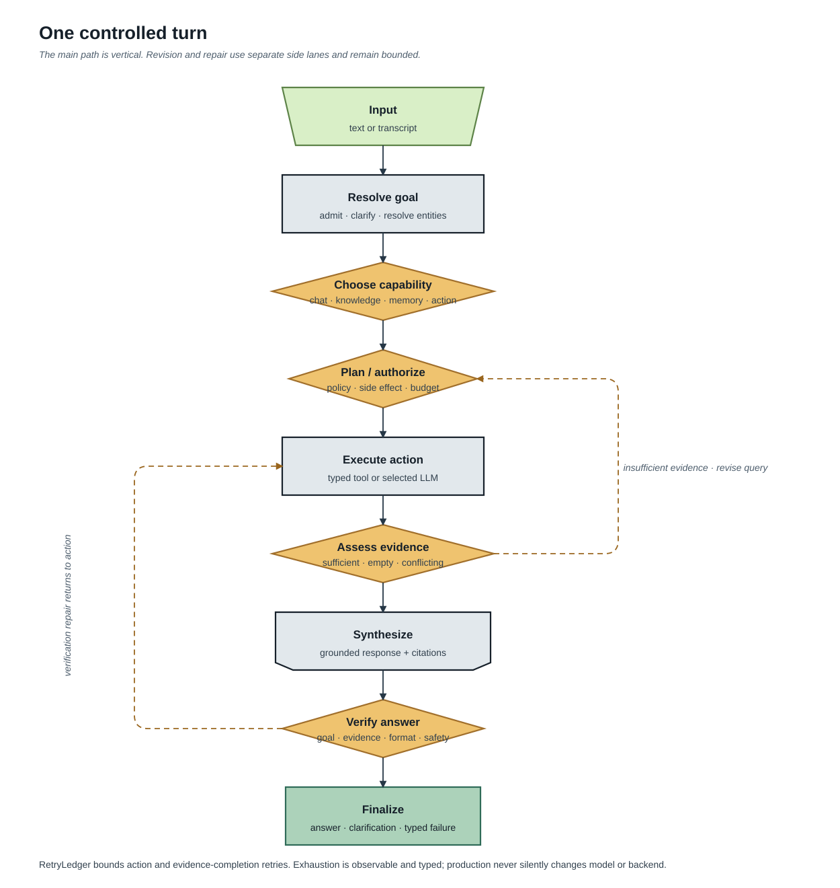

# SoCa system map

This is the canonical map of the current implementation. It describes the
repository at the code revision that owns this document; it is not a future
plan and it does not describe retired runtime paths.

## Product boundary

SoCa is local-first, not local-only. Audio capture, VAD/AEC, ASR, TTS,
knowledge retrieval, memory, indexing and session state run on the machine. The
LLM is local by default. If the user explicitly selects OpenAI, Gemini,
OpenRouter or Groq, the same selected LLM setting is used by chat and voice and
the transcript plus prompt context leave the machine for that provider.

There is no automatic provider, model, router, retrieval-backend or ASR
fallback. Retries are bounded and observable; after exhaustion the runtime
returns a typed failure and exposes the failed readiness state. An operator may
explicitly choose another compatible configuration.


Editable Lucid source: [SoCa system overview](https://lucid.app/lucidchart/af2f189a-cef9-4f2e-9ba0-259eef98487c/view).

## Runtime surfaces and boundaries

```text
User
 ├─ soca ask / chat / voice              CLI presentation
 ├─ soca ui                              Ink + React terminal UI
 └─ microphone / speaker                 audio devices
        │
        ▼
SocaEngine (NDJSON over stdio for the UI)
        │
        ▼
soca/core facade
 ├─ AssistantRuntime                      one text/transcript turn
 ├─ VoicePipeline                          ASR → runtime → TTS
 ├─ controlled workflow                    goal → action → verify → terminal
 ├─ guardrails / repair / streaming        typed safety and delivery events
 └─ runtime/profile builders               one selected configuration
        │
        ├─ ASR: Qwen service or PhoWhisper, selected explicitly
        ├─ LLM: local llama.cpp or selected remote provider
        ├─ TTS: Valtec ONNX
        ├─ knowledge: catalog + sparse/dense index + evidence context
        ├─ memory: core + working + query-selected archive
        └─ tools: knowledge.inspect/search/read and memory.search
```

The app layer depends on the `soca/core` facade. Core owns orchestration and
contracts. Backend packages implement model, index, memory and tool adapters.
The UI consumes protocol events and never owns audio, model weights or private
vault data.

## One request, end to end



1. A text input or ASR transcript is admitted and normalized into a `TurnFrame`.
2. `GoalResolver` creates a typed objective, constraints, required sources and
   resolved entities. It does not use model chain-of-thought as control state.
3. The router cascade chooses a capability: explicit command, semantic
   disposition/source set, or a bounded structured LLM router when configured.
4. A planner/authorization layer creates bounded `PlanStep` actions. The
   `ToolRuntime` validates arguments, side-effect level and guardrails before
   execution.
5. Knowledge or memory observations are reconciled into evidence. If the goal
   is not satisfied and budget remains, the workflow may revise a query and
   execute another typed action. This is a bounded loop, not free-form agentic
   recursion.
6. The LLM receives the selected context and grounding instructions. A final
   verifier checks the goal, evidence state, citations and output guardrails.
7. A valid answer, clarification, abstention or typed failure becomes the
   terminal result. Progress/workflow/retrieval events are emitted separately
   from the terminal answer.

## Module map

| Responsibility | Current source of truth | Public result/state |
| --- | --- | --- |
| CLI entry points | `soca/cli.py` | Click commands and operational diagnostics |
| UI process boundary | `soca/app/engine.py`, `ui/src/protocol.ts` | NDJSON commands/events |
| Text runtime | `soca/app/text_runtime.py` | `TextRuntimeBundle` |
| Voice runtime construction | `soca/core/voice_runtime.py` | `VoiceRuntimeBundle` |
| Voice turn orchestration | `soca/core/pipeline.py` | `PipelineResult`, `StreamingEvent` |
| Text/transcript orchestration | `soca/core/runtime.py` | `RuntimeResult`, `RuntimeTrace` |
| Controlled loop | `soca/core/workflow/` | `WorkflowRun`, typed terminal outcome |
| Capability routing | `soca/core/router_cascade.py`, `semantic_turn_router.py`, `llm_tool_router.py` | `ToolRouterDecision` |
| Safety and repair | `soca/core/guardrails.py`, `repair.py` | guardrail events and Vietnamese follow-up |
| Prompt admission | `soca/core/context_budget.py`, `soca/prompts.py` | prompt manifest and budget error |
| Knowledge catalog | `soca/knowledge/catalog.py` | revisioned tree, headings, tags, links |
| Knowledge retrieval | `soca/knowledge/hybrid_source.py`, `retrievers/`, `indexing/` | hits, evidence decision, citations |
| Memory assembly | `soca/memory/assembler.py`, `context.py`, `retrieved.py` | access plan and bounded prompt blocks |
| Working compaction | `soca/memory/compaction_coordinator.py`, `summary.py` | published summary artifact or typed failure |
| Model selection | `soca/core/profiles.py`, `soca/*/registry.py`, `soca/llm/factory.py` | resolved model/provider configuration |
| Observability | `soca/core/metrics.py`, `soca/core/usage.py`, workflow/events, engine | latency, usage, workflow and readiness events |

## State and storage

| State | Default location | Lifecycle |
| --- | --- | --- |
| Source knowledge | configured vault, normally `./Knowledge/wiki/` | user-owned Markdown |
| Approved core memory | `./Knowledge/memory/core.json` | explicit approval only |
| Archive memory | `./Knowledge/memory/**/*.md` | query-selected; never unbounded in prompt |
| Index catalog | `./Knowledge/.soca/knowledge_index/v2/index.sqlite3` | private, revisioned |
| Dense generation | `./Knowledge/.soca/knowledge_index/v2/generations/` | immutable, verified, GC-managed |
| Summary model | `~/.local/share/soca/models/summary/` | explicit provision; one-job worker |
| LLM settings | `~/.config/soca/llm.json` | non-secret settings, mode `0600` |
| API keys | OS keyring or private `keys.json` | masked; never in Git or NDJSON |
| Session checkpoint | XDG state directory when enabled | optional `local_resumable`, atomic |
| Benchmark raw logs | ignored local result roots | never committed; sanitized evidence only |

## Evidence and failure vocabulary

An empty healthy corpus/result is different from a missing model, stale index,
checksum mismatch, provider failure or invalid tool result. The first can lead
to a grounded abstention; the latter is a visible typed failure. A citation is
created from selected evidence, not inserted into an answer after generation.
The UI renders structured sources separately from answer prose.

## Requirement-to-code-to-doc matrix

| Requirement | Code/test evidence | Canonical documentation |
| --- | --- | --- |
| Remote LLM is explicit and shared by chat/voice | `soca/llm/factory.py`, engine settings tests, provider evidence | [LLM providers](16-llm-providers.md), [runtime reliability](provider-runtime-reliability.md) |
| Goal must be verified before terminal answer | `soca/core/workflow/runner.py`, `tests/test_controlled_workflow.py` | [assistant runtime](05-assistant-runtime.md) |
| Vault structure is navigation metadata, not evidence | `soca/knowledge/catalog.py`, catalog tests | [knowledge and RAG](09-hybrid-rag-memory.md), [retrieval gates](13-retrieval-evidence-gates.md) |
| Dense index is revisioned and fail-closed | `soca/knowledge/indexing/`, lifecycle tests | [index lifecycle](11-index-lifecycle.md) |
| Working/core/archive memory are distinct | `soca/memory/`, session and compaction tests | [memory](09-hybrid-rag-memory.md), [memory diagram](assets/diagrams/memory-lifecycle.svg) |
| UI state comes from protocol events | `soca/app/engine.py`, `ui/src/store.ts`, protocol tests | [UI and engine](07-tui.md) |
| Bench claims require provenance | `BENCHMARKS.md`, `docs/evidence/*.json`, release tests | [evaluation](17-evaluation-and-release.md) |

## Reading order

- Product and boundaries: [overview](01-overview.md), then this map.
- A turn: [assistant runtime](05-assistant-runtime.md) and the controlled-loop
  diagram.
- Voice: [voice pipeline](03-voice-pipeline.md) and [ASR robustness](04-asr-robustness.md).
- Knowledge/memory: [hybrid RAG and memory](09-hybrid-rag-memory.md),
  [retrieval gates](13-retrieval-evidence-gates.md), [index lifecycle](11-index-lifecycle.md).
- Operations: [registries and CLI](08-registries-profiles-cli.md), [providers](16-llm-providers.md),
  [platform gates](platform-audio-release-gates.md).
- Measurements: [evaluation and release](17-evaluation-and-release.md) and
  [`BENCHMARKS.md`](../BENCHMARKS.md).
