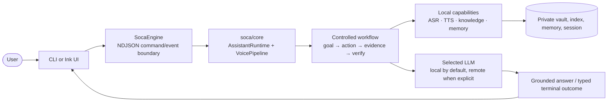

# 01 — Overview

## Product boundary

SoCa is a Vietnamese voice-assistant application with two presentation
surfaces: command-line commands and an Ink/React terminal UI. The product is
**local-first**, not local-only. Audio capture, VAD/AEC, ASR, TTS, knowledge,
memory, indexing and session state are local. The LLM is local by default, but
the user may explicitly select a remote provider; the selected chat and voice
LLM then share that setting.

The voice path is:

```text
microphone → endpoint/VAD → selected ASR → controlled assistant turn
            → selected LLM/tools/knowledge/memory → streaming TTS → speaker
```

The text path removes only the audio edges:

```text
text → controlled assistant turn → text answer + structured evidence/usage
```

The [system map](./00-system-map.md) is the authoritative cross-module view.

## Goals and consequences

| Goal | Current design consequence |
| --- | --- |
| Vietnamese speech that remains usable under noise and ASR uncertainty | VAD/AEC endpointing, selected ASR backend, confidence/de-loop guards and typed repair |
| Natural multi-turn behavior without losing control | goal resolver and bounded controlled workflow before terminal output |
| Accurate private-vault answers | revisioned Markdown catalog, hybrid retrieval, evidence gates and citations |
| Memory without an unbounded prompt dump | working/core/archive layers, compaction and model-aware prompt admission |
| Model experimentation without production ambiguity | registries, named profiles, capability metadata and explicit readiness |
| Scriptable and visible operation | `soca ask/chat/voice/ui` plus NDJSON events rendered by Ink |

## Execution surfaces

| Surface | Entry point | Owns |
| --- | --- | --- |
| One text turn | `soca ask` | build a text runtime and execute one request |
| Text session | `soca chat` | repeated turns and session memory |
| CLI voice | `soca voice` | microphone loop, audio playback and repair presentation |
| Ink UI | `soca ui` | setup, settings, chat/voice interaction and event projection |
| Engine protocol | `soca engine` | NDJSON command/event boundary for the UI |

The UI is not a second assistant implementation. It sends commands to
`SocaEngine`, receives typed progress/retrieval/workflow/model events, and
renders state. See [07 — Terminal UI](./07-tui.md).

## Runtime containers



## Non-negotiable runtime behavior

- A selected production model, provider or retrieval backend does not silently
  change after failure. Bounded retries are visible; exhausted failures are
  typed and exposed in readiness/terminal events.
- A vault catalog can explain what exists and how notes relate. It cannot serve
  as answer evidence; content answers require retrieved or explicitly read
  passages.
- Empty or insufficient evidence is a meaningful terminal state. The LLM is
  instructed to abstain rather than fill the gap from general knowledge.
- Remote use is a data-boundary decision. Transcript and assembled prompt
  context leave the machine only for the provider selected by the user.
- Benchmark, private-vault and raw provider artifacts remain outside Git unless
  sanitized and reproducible.

## Current implementation status

- ✅ CLI, Ink UI and NDJSON engine share the runtime facade.
- ✅ Local and explicit remote LLM settings are shared by chat and voice.
- ✅ Qwen and PhoWhisper ASR profiles are explicit choices; production does not
  auto-fallback between them.
- ✅ Hybrid knowledge retrieval uses a revisioned catalog and dense generation
  lifecycle; the selected production backend is recorded in docs and benchmarks.
- ✅ Working/core/archive memory and model-aware context budgeting are exposed
  through runtime events and slash commands.
- ✅ Controlled workflow records goal, action, evidence and terminal outcome.
- ⚠️ Device-specific audio gates and model qualification remain tied to the
  named hardware/profile evidence in `BENCHMARKS.md`; unsupported combinations
  must remain visible as unsupported rather than inferred ready.
