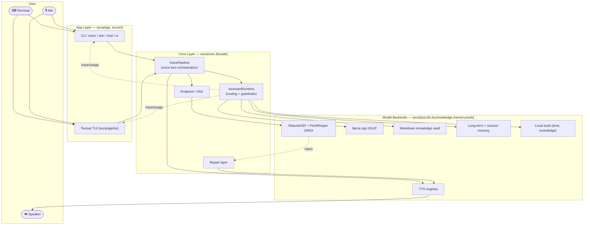

# 01 — Overview

## What SoCa Is

**SoCa (Sơn Ca)** is a Vietnamese voice-assistant toolkit that runs **entirely on
the user's machine**: microphone capture → automatic speech recognition (ASR) →
runtime reasoning/response generation → text-to-speech (TTS) → speaker playback.
There is no cloud component in the main runtime path.

The project is **research-heavy**: model choices are tested through small local
bake-offs before they become a default path. See `BENCHMARKS.md` and `eval/`.

## Goals

| Goal                                                   | Design Consequence                                                                |
| ------------------------------------------------------ | --------------------------------------------------------------------------------- |
| Run offline on a personal machine, currently macOS ARM | Local backends: ONNX Runtime for ASR, llama.cpp for LLM, Torch/ONNX for TTS       |
| Treat Vietnamese as first-class                        | RobustASR for PhoWhisper, BoH artifacts, Vietnamese TTS voices, Vietnamese repair |
| Low latency and a more natural conversational feel     | Token→sentence→TTS streaming, per-sentence guardrails, natural repair follow-ups  |
| Easy model swapping and comparison                     | Registries, runtime profiles, and evaluation harnesses                            |
| Two experiences: scriptable and visual                 | `soca voice/ask/chat` for CLI and `soca ui` for the Textual TUI                   |

## High-Level Container Architecture



## Two Main Execution Paths

1. **Voice loop** (`soca voice`, or TUI voice mode):
   `mic → VAD → RobustASR → AssistantRuntime → TTS → speaker`, repeated
   continuously. Details: [03 — voice-pipeline](./03-voice-pipeline.md).

2. **Text turn** (`soca ask`, `soca chat`, TUI chat mode):
   `text → AssistantRuntime → text/citations`. It uses the same runtime as voice
   but skips ASR and TTS. Details:
   [05 — assistant-runtime](./05-assistant-runtime.md).

## Dependency Boundary

```text
app  ─────────►  core  ─────────►  asr / llm / tts / knowledge / memory / tools
(CLI, TUI)       (facade)          (model backends + utilities)
```

- App code imports from `soca.core` and `soca.app.*`. It does not import
  backends directly.
- `soca/core/__init__.py` is the **public API**: it re-exports what the app
  layer needs.
- Backends know nothing about the app or TUI. They accept plain audio/text input
  and return dataclasses.

Reason: backend/model changes should not force app changes, and app surfaces can
be tested with fake runtimes.

## Current Status

- ✅ Local voice loop runs (`soca voice --profile baseline`).
- ✅ RobustASR: VAD, de-loop, confidence guard, BoH, hallucination heuristics.
- ✅ ASR/LLM/TTS registries, profiles, and resolved runtime config.
- ✅ AssistantRuntime: multi-stage guardrails, tool routing, knowledge+memory,
  citations, trace, and streaming.
- ✅ Textual TUI: status/chat/voice modes, live voice status bar, repair UX.
- ✅ Conversation repair layer: Vietnamese catalog, no-reply, handover.
- 🚧 Deeper eval harnesses for tools/citations/guardrails; ASR recalibration for
  larger models; testing on ARM boards.

See also: [02 — architecture](./02-architecture.md).
