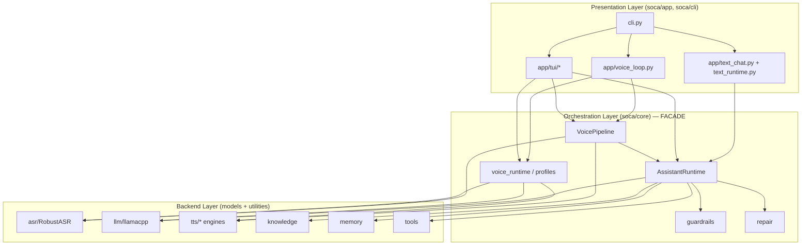
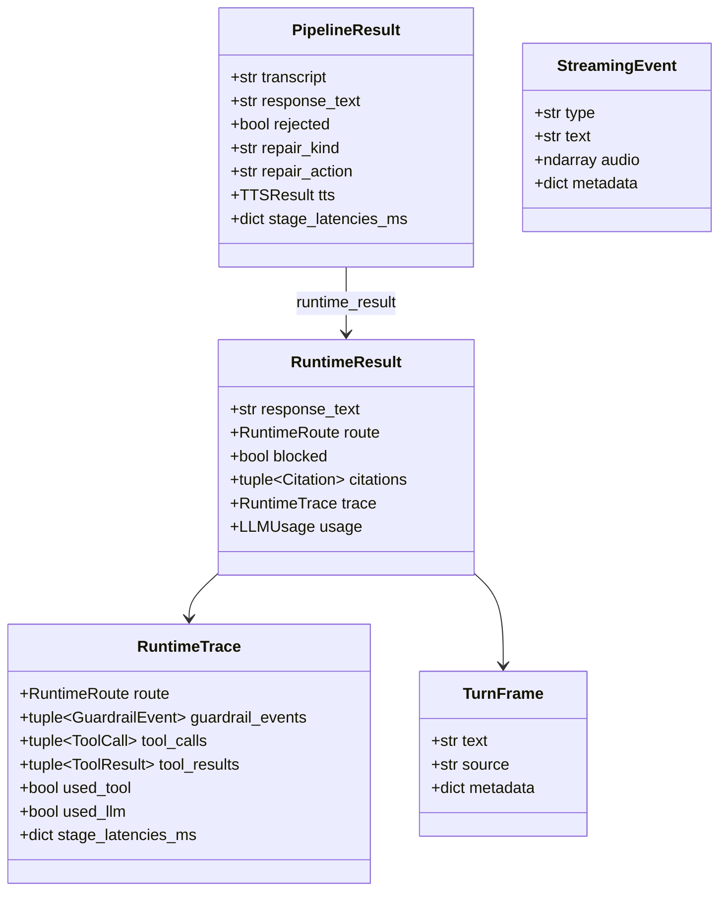

# 02 — Architecture & Code Structure

## Folder Tree

```text
soca/
├── cli.py                  # Click CLI: voice/ask/chat/ui/profiles/...-smoke/...-models
├── core/                   # FACADE — public API and turn orchestration, no heavy models
│   ├── __init__.py         #   re-export everything the app layer needs
│   ├── runtime.py          #   AssistantRuntime: text-turn routing
│   ├── pipeline.py         #   VoicePipeline: voice-turn orchestration
│   ├── voice_runtime.py    #   build_voice_runtime + ResolvedVoiceRuntimeConfig + bundle
│   ├── profiles.py         #   VoiceRuntimeProfile (baseline/quality/edge/...)
│   ├── guardrails.py       #   multi-stage check_* functions + policy
│   ├── repair.py           #   RepairCatalog/Kind/Action + plan_repair/plan_no_reply
│   ├── turn.py             #   TurnFrame, RuntimeResult, RuntimeTrace, RuntimeRoute
│   ├── streaming.py        #   StreamingEvent, pop_ready_sentence
│   ├── text_chunking.py    #   sentence splitting and TTS text normalization
│   ├── endpoint.py         #   record_until_silence (VAD endpointing)
│   ├── audio_out.py        #   AudioSink, SoundDevicePlayer, WavFileSink
│   ├── metrics.py          #   MetricsLogger for per-stage latency
│   └── usage.py            #   LLMUsage / TurnUsage / SessionUsage
├── asr/                    # RobustASR + PhoWhisper ONNX + VAD/deloop/BoH/heuristics
├── llm/                    # llama.cpp runner + registry + memory-aware + output cleaning
├── tts/                    # Engines: valtec/omnivoice/piper/vieneu/f5/mms/... + factory
├── knowledge/              # Markdown vault + retrieval context
├── memory/                 # Long-term (profile.md) + session memory (RAM)
├── tools/                  # ToolRuntime: local_time, knowledge tools
└── app/                    # Presentation layer
    ├── cli ↔ voice_loop.py / text_chat.py / text_runtime.py / console.py / usage_view.py
    └── tui/                # Textual app: app.py, voice.py, widgets.py, voice_view.py, ...
```

Reference LOC: `app ≈ 3.2k`, `core ≈ 3.2k`, `tts ≈ 1.6k`,
`asr ≈ 1.2k`, `llm ≈ 0.7k`.

## Layers & Dependency Direction



**Golden rule:** dependencies only point **downward**. Backends do not import
core; core does not import app. Violating this direction is technical debt.

## Core Abstractions

| Abstraction                   | File                    | Role                                                                                   |
| ----------------------------- | ----------------------- | -------------------------------------------------------------------------------------- |
| `AssistantRuntime`            | `core/runtime.py`       | Brain of one text turn: guardrail→tool→knowledge/memory→LLM, returns `RuntimeResult`   |
| `VoicePipeline`               | `core/pipeline.py`      | Orchestrates one voice turn: ASR→runtime→TTS; supports streaming and non-stream paths  |
| `RobustASR`                   | `asr/robust_asr.py`     | Wraps PhoWhisper with five anti-hallucination layers                                   |
| `RuntimeToolRouter`           | `core/runtime.py`       | Protocol for deterministic tool selection before LLM calls                             |
| `GuardrailPolicy` + `check_*` | `core/guardrails.py`    | Input/retrieval/tool/output safety checks                                              |
| `RepairCatalog`               | `core/repair.py`        | Produces Vietnamese follow-up text when ASR rejects                                    |
| `VoiceRuntimeProfile`         | `core/profiles.py`      | Combines ASR+LLM+TTS into one named config                                             |
| `VoiceRuntimeBundle`          | `core/voice_runtime.py` | Fully constructed components for one profile                                           |
| `AudioSink`                   | `core/audio_out.py`     | Audio output port: real speaker, null sink, or WAV file                                |

## Core Data Models

All of these are `@dataclass(frozen=True)` except runtime state such as
`SessionMemory` and `RepairState`.



- `RuntimeResult` is the output of a **text turn**.
- `PipelineResult` is the output of a non-streaming **voice turn**. The streaming
  path emits a sequence of `StreamingEvent`s:
  `asr → repair? → runtime → llm_token* → sentence* → tts* → audio* → done`.
- `RuntimeStreamEvent` carries streaming events from the runtime; `StreamingEvent`
  is a pipeline-level event that may include audio. The pipeline translates
  `RuntimeStreamEvent` into `StreamingEvent`.

Telemetry details (`LLMUsage/TurnUsage/SessionUsage`) are described in
[05 — assistant-runtime](./05-assistant-runtime.md#usage-telemetry).

## Why `core` Is a Facade

- App surfaces can be tested by **injecting fake runtimes/pipelines**. See
  `tests/test_tui_*` and `tests/test_app_voice_loop.py`; no real model load is
  required.
- Changing a backend, such as adding a TTS engine, should only touch `tts/` and
  the relevant registry, not app code.
- The public surface stays small: the app layer only needs exports from
  `soca.core`.
