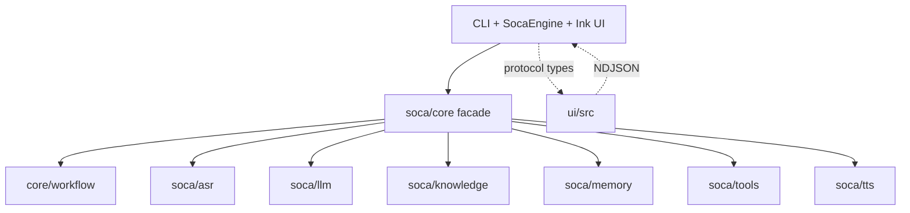

# 02 — Architecture and code structure

This page describes the dependency direction and the ownership of the current
implementation. It intentionally omits generated caches, model weights and
private vault content.

## Repository structure

```text
soca/
├── app/                 # CLI-facing builders, engine protocol, UI-facing events
├── asr/                 # PhoWhisper, Qwen service, VAD, calibration and guards
├── config/              # persisted LLM settings and secret lookup
├── core/                # public facade, turn orchestration and workflow
│   └── workflow/        # goal, plan, action, observation, verification, events
├── knowledge/           # vault, catalog, chunking, sparse/dense index lifecycle
├── llm/                 # local runner, remote OpenAI-compatible providers, catalog
├── memory/              # session, working/core/archive, proposals and compaction
├── tools/               # typed knowledge and memory tool contracts
└── tts/                 # Valtec frontend, ONNX runner and audio preparation
ui/
└── src/                 # Ink/React presentation, protocol, reducer and widgets
eval/                    # reviewed datasets, harnesses and ignored machine results
docs/                    # current architecture, decisions, diagrams and evidence
zplan/                   # active and historical implementation plans
```

## Dependency direction



`core` owns orchestration and public contracts. Backends return typed values and
do not import the UI. Presentation code consumes the facade and event protocol;
it does not reconstruct routing or call a model directly.

## Key entry points

| Area | Entry point | Responsibility |
| --- | --- | --- |
| Text turn | `soca/core/runtime.py:AssistantRuntime` | one guarded/tool/knowledge/memory/LLM turn |
| Voice turn | `soca/core/pipeline.py:VoicePipeline` | ASR → runtime → streaming TTS/playback |
| Runtime assembly | `soca/app/text_runtime.py`, `soca/core/voice_runtime.py` | construct selected components and statuses |
| Controlled loop | `soca/core/workflow/runner.py` | bounded goal/action/observation/verification loop |
| UI process boundary | `soca/app/engine.py:SocaEngine` | commands in, typed NDJSON events out |
| UI state | `ui/src/store.ts` and `ui/src/protocol.ts` | reduce events and render current state |
| Knowledge setup | `soca/core/knowledge_setup.py` | vault/catalog/retriever/tools lifecycle |
| Index lifecycle | `soca/knowledge/indexing/` | scan, plan, build, verify, publish, GC |
| LLM construction | `soca/llm/factory.py` | local/remote selection and typed startup errors |

## Core contracts

| Contract | Location | Meaning |
| --- | --- | --- |
| `RuntimeResult` | `soca/core/turn.py` | final response, route, citations, trace and usage |
| `RuntimeTrace` | `soca/core/turn.py` | guards, tools, evidence, stage timings and model use |
| `PipelineResult` | `soca/core/pipeline.py` | one non-streaming voice result |
| `StreamingEvent` | `soca/core/streaming.py` | ASR, repair, answer, TTS, audio and terminal events |
| `ToolCall` / `ToolResult` | `soca/tools/base.py` | typed action request and receipt |
| `PromptManifest` | `soca/core/context_budget.py` | model window, selected/dropped context and hash |
| `WorkflowEvent` | `soca/core/workflow/events.py` | public progress and terminal provenance |
| `VoiceRuntimeProfile` | `soca/core/profiles.py` | explicit ASR, LLM, TTS and retrieval defaults |

## One turn and state ownership

1. `SocaEngine` accepts a chat or voice command and starts a turn context.
2. `AssistantRuntime` admits the input and resolves a typed goal.
3. The capability/tool router chooses direct chat, knowledge, memory or a
   clarification path. Explicit tool commands are deterministic; natural
   language selection uses the configured capability router and model/tool
   contracts rather than answer text parsing.
4. A tool action produces a receipt. Knowledge receipts become evidence
   passages; memory receipts remain memory provenance.
5. The workflow assesses evidence, may revise a query within its retry budget,
   and only then asks the selected LLM to synthesize.
6. Output validation removes internal labels only at the presentation boundary;
   structured citations and terminal outcome remain available to the UI.

The state stores are deliberately separate:

| State | Owner | Lifetime |
| --- | --- | --- |
| Working/session memory | `soca/memory/session.py` | process/session, with optional checkpoint |
| Approved core memory | `soca/memory/core.py` | private durable store, proposal-gated |
| Archive memory | `soca/memory/retrieved.py` and vault | retrieved on demand |
| Knowledge catalog/index | `soca/knowledge/indexing/` | versioned private vault state |
| Provider settings | `soca/config/llm_settings.py` | user config; keys in secret store |
| Model assets | ASR/LLM/TTS stores | local provisioned artifacts |

## Design constraints

- Required prompt sections cannot be silently dropped; optional sections are
  dropped by the shared budget assembler and listed in the manifest.
- Native or optional index artifacts are verified before loading. Missing
  dependencies are a truthful degraded/unready state, not an automatic backend
  swap.
- Retries, timeouts and model calls are bounded and observable. A production
  failure is not converted into a successful answer by hidden fallback logic.
- Compatibility code is removed after the replacement has passed unit,
  integration and real-flow gates.
