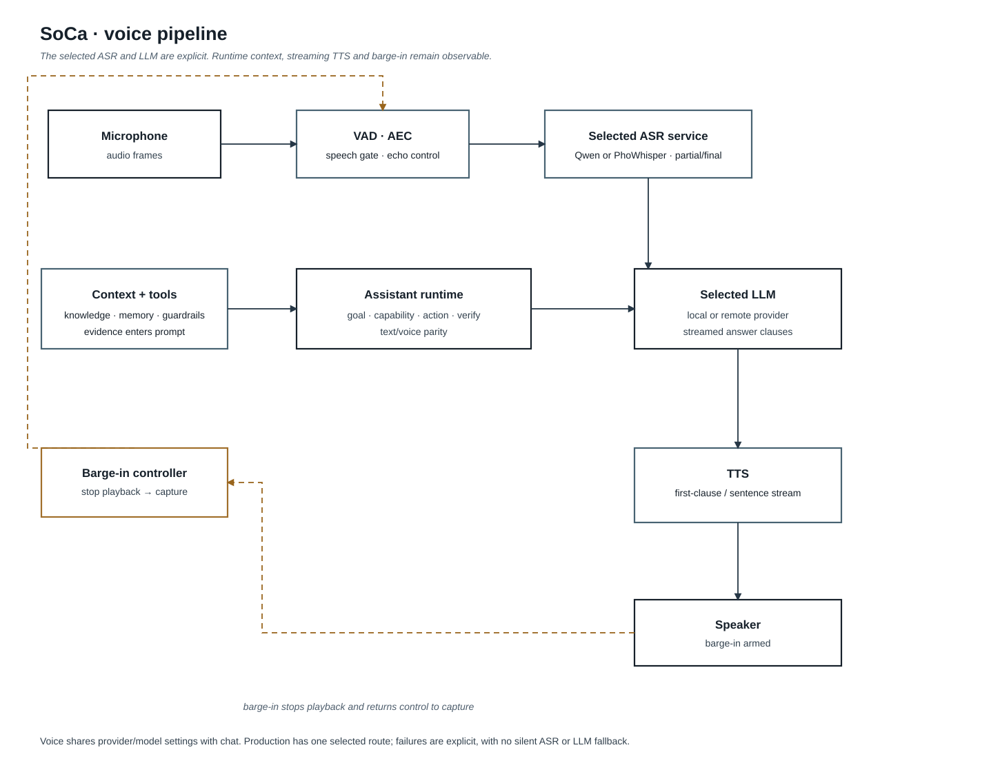
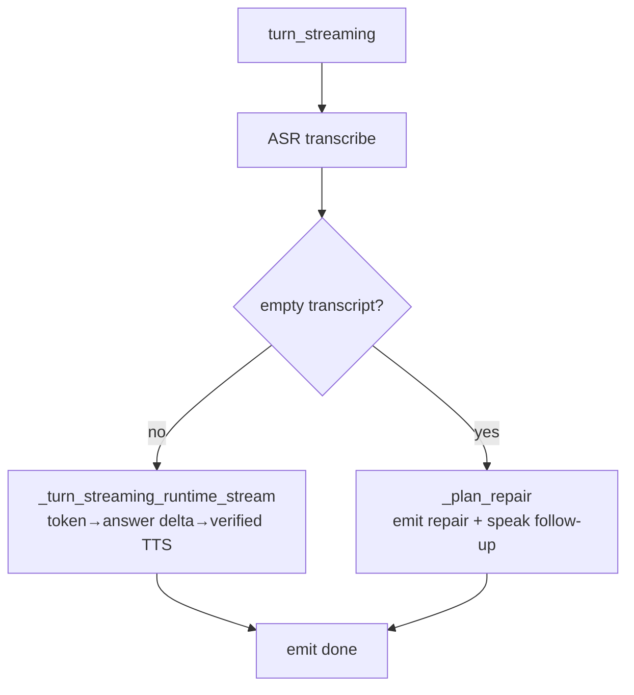
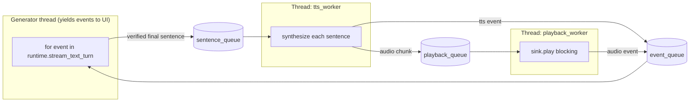
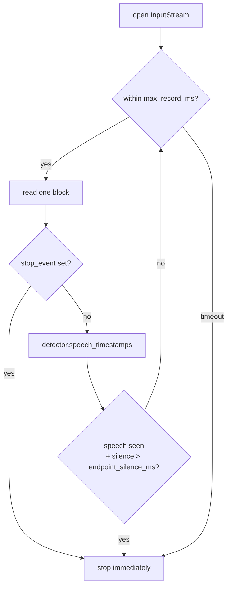
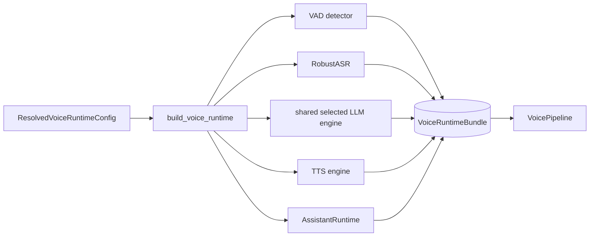
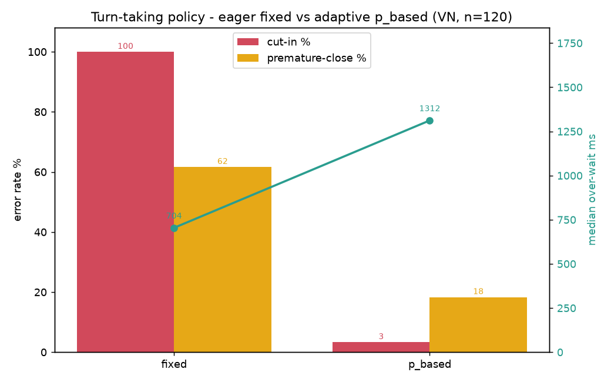

# 03 — Voice Pipeline

This document describes **one spoken turn** through the system: from microphone
to speaker. Main code: `core/endpoint.py`, `core/pipeline.py`,
`core/voice_runtime.py`, `core/audio_out.py`, and, for the Ink UI,
`soca/app/voice_controller.py` plus the event projection in `ui/src/`.



Editable diagram source: [Lucid voice pipeline](https://lucid.app/lucidchart/c962c397-6528-40ef-838a-1a4af0a562b5/view).

## One Voice Turn at a Glance


## VoicePipeline: Two Modes

`VoicePipeline` (`core/pipeline.py`) exposes two entry points:

| Method                                   | Use Case                      | Return Type                   |
| ---------------------------------------- | ----------------------------- | ----------------------------- |
| `turn(audio)`                            | Metrics, non-streaming, tests | `PipelineResult` as one block |
| `turn_streaming(audio, audio_sink, ...)` | Production voice loop         | generator of `StreamingEvent` |

`turn_streaming` chooses its branch based on runtime capabilities:



## Streaming Event Sequence (`StreamingEvent.type`)

```text
asr → [repair]? → runtime → (llm_token | answer_delta | tts | audio)* → done
```

- `asr`: transcript, `rejection_reason`, and backend-provided alternatives when available.
- When ASR provides alternatives, the selected runtime LLM resolves them through the
  typed goal resolver before routing. The canonical transcript and a bounded repair
  status are retained in the frame metadata; uncertain candidates remain unchanged
  instead of being guessed.
- `repair`: only when ASR rejects; contains follow-up text plus
  `repair_kind/action/attempt`.
- `runtime`: route/blocked/citations/usage summary.
- `llm_token`: raw token for live display.
- `sentence`: a UI answer delta. It is marked `delivery=answer_delta` while the
  runtime is still open; the final answer path marks buffered chunks as
  `delivery=final`.
- `tts`: synthesized audio chunk. Factual streamed answers are enqueued only
  after the runtime emits its result; repair speech is marked `delivery=repair`.
- `audio`: playback finished for a chunk, including `playback_latency_ms`.
- `done`: end of turn, with `terminal_status`; interruption is `cancelled`, and
  an ASR repair is `needs_clarification`, never `achieved`.

## Streaming Thread Model

The most subtle part is `_turn_streaming_runtime_stream`, which runs **three
threads**:



The UI can receive answer deltas immediately, but the queue stays empty until
the runtime result is available. This prevents factual audio from being spoken
before the final runtime verification. Once released, the system synthesizes
sentence N+1 while playing sentence N.

> Streaming note: per-sentence guardrails on LLM routes are equivalent to
> full-text checking because `check_final_output` is a stateless substring scan.
> Splitting by sentence remains safe. See
> [05](./05-assistant-runtime.md).

## VAD Endpointing (`record_until_silence`)

`core/endpoint.py` reads microphone blocks and uses VAD (Silero) to decide when
the user has **stopped speaking**, then cuts the turn.



- `endpoint_silence_ms`, default 700 ms, means how much silence counts as the
  **end of the user's utterance**. It is **not** the no-reply timing. See
  [06](./06-conversation-repair.md).
- `stop_event` allows immediate abort when `/stop` is issued or the TUI changes
  mode, instead of waiting for the recording window to end.

## Building the Baseline Runtime (`build_voice_runtime`)

`build_voice_runtime(config)` returns a `VoiceRuntimeBundle` containing the VAD
`detector`, `asr` (`RobustASR`), `llm`, `tts`, `assistant_runtime`, `pipeline`,
and memory/knowledge/guard status. `warm_up_voice_runtime(bundle)` runs ASR, LLM,
and TTS once so the first real turn is not cold.



## CLI Voice Loop vs TUI Voice Mode

|                  | CLI (`soca voice`)             | TUI voice mode (`soca ui voice`)                                     |
| ---------------- | ------------------------------ | -------------------------------------------------------------------- |
| Loop             | `app/voice_loop.py` sync       | `app/tui/voice.py` `VoiceMonitorController` worker thread + Queue    |
| Display          | `console.py` prints each event | Status bar + timeline + inspector. See [07](./07-tui.md)             |
| No-reply ladder  | Per-turn repair + TTS         | Per-turn repair + passive silence call-out                           |
| Repair on reject | `repair` event + TTS           | `repair` event → timeline + TTS                                      |

Both paths call `bundle.pipeline.turn_streaming(...)`, so the **audio pipeline
and selected LLM are the same**. The controller/console only differ in event
presentation and loop control.

Chat and voice also receive the same selected LLM settings and active goal store
from `SocaEngine`. A persisted session uses the same checkpoint namespace for both
surfaces; an in-memory session shares the same store only for the lifetime of that
engine. Changing provider, model, or key while voice is active is rejected rather
than silently rebuilding the running turn.

## Clause Chunking And PCM Join

The current chunking and playback path lowers time-to-first-audio and removes
the click/gap at chunk boundaries. The flow for one streamed turn is:

```text
LLM token buffer -> safe first clause -> per-chunk guardrail -> Valtec ONNX
-> resample to playback session rate -> tail-holding equal-gain cross-fade
-> one persistent device/duplex session -> speaker and identical AEC far reference
```

- **Safe first clause** (`core/text_chunking.py` `split_first_clause`,
  `core/streaming.py` `pop_ready_first_clause`): only the very first spoken chunk may
  split at a comma/semicolon/colon/dash. It uses punctuation look-ahead (requires
  whitespace after the mark), never a word fallback, and never splits inside a code
  span, a markdown link, or a number/time like `1,000` / `12:30`. Later chunks keep the
  full-sentence boundary. Gated by `first_clause_*` on `VoiceRuntimeProfile`.
- **Tail-holding cross-fade** (`core/audio_join.py`): adjacent PCM buffers are joined
  with a raised-cosine **equal-gain** window (default `12 ms`, configurable `8..20 ms`
  via `pcm_crossfade_ms`). Equal-gain satisfies `fade_out + fade_in = 1`, so correlated
  speech does not spike to +3 dB. Chunks shorter than four fade widths are passed through
  with overlap `0` to protect TTFA.
- **Persistent playback session** (`core/audio_out.py` `AudioPlaybackSession`,
  `core/duplex_aec_sink.py` `_DuplexPlaybackSession`): one device/duplex session stays
  open for the whole turn. PCM is resampled to the session rate **before** the join, and
  the duplex sink pads a partial frame only once, in `finish()` — so no zero gap is
  wedged between two chunks, and the speaker and AEC far reference receive identical PCM.

### Latency telemetry (do not conflate the two TTFA numbers)

| Metric                   | Meaning                                                           |
| ------------------------ | ----------------------------------------------------------------- |
| `tts_ready_ttfa_ms`      | First `TTSResult` ready (also mirrored to legacy `ttfa_ms`).      |
| `audible_ttfa_ms`        | First successful `session.write()`, relative to turn start.       |
| `synthesis_slack_ms`     | Per boundary: how much the next chunk beat the playback deadline. |
| `crossfade_ms`           | Actual overlap applied (0 on the non-overlapping fallback).       |
| `crossfade_fallback`     | `none` \| `non_overlapping` \| `direct_sink`.                     |
| `output_underflow_count` | Device/stream underflows for the turn (target `0`).               |

When `synthesis_slack_ms < crossfade_ms` (short chunk, cold cache, CPU contention), the
pump flushes the held tail with a 4 ms fade-out and plays the next chunk with a 4 ms
fade-in **without overlap**, records `crossfade_fallback="non_overlapping"`, and never
inserts silence to hide the miss. The per-turn `done` event carries a `playback` summary
(`crossfade_fallback_count`, `output_underflow_count`, `audible_ttfa_ms`).

A/B waveforms (`hard` / `equal_gain_8ms` / `equal_gain_12ms`) are built from **identical**
synthesized chunks by `eval/eval_valtec_chunk_join.py`; audible TTFA, slack, underflow and
fallback are device metrics and come from `eval/eval_voice_loop.py --playback`, not from
offline WAVs. `BENCHMARKS.md` only accepts numbers once the JSON report, listening CSV and
artifact checksum are saved together.

## Profiles and practical latency notes

- `baseline` is the default profile: PhoWhisper Small, Arcee-VyLinh, and Valtec `NF`.
- `qwen-release` explicitly selects the Qwen3-ASR 0.6B service when its release
  artifact is ready; `qwen-reference` explicitly selects the 1.7B reference
  service. Neither is an automatic fallback for another profile.
- Retired profile names are rejected rather than silently aliased to `baseline`.
- Chunk-join, playback, endpointing and ASR evidence are recorded in
  `BENCHMARKS.md`; a text-only dry run is not an audio-device qualification.

## Measured conversational behavior

The turn-taking and barge-in harnesses replay fixed audio frames rather than
using wall-clock timing. This makes the acoustic decisions reproducible while
the production controller still owns the microphone and speaker streams. The
measured data uses AEC-Challenge real echo pairs, Vietnamese FLEURS speech over
real MIT impulse responses, and Vietnamese endpoint timelines. It is a
benchmark record, not a claim that every device or room behaves identically.

The acoustic tier measured 2.7% false interruption and 94.7% detection on the
300-pair AEC-Challenge sample; the Vietnamese real-RIR synthetic tier measured
2.5% false interruption and 92.5% detection. At the selected 1,800 ms floor, the
adaptive endpoint policy measures 1.7% cut-in, 5.0% premature close, and 1,824 ms
median over-wait. These figures expose the accuracy/latency trade-off; they do not
hide the remaining Vietnamese turn-taking limitation.

`DuplexAecSink` also accepts an optional typed backchannel classifier after the
400 ms sustained VAD window. Production keeps it disabled until a pinned model
passes the reviewed Vietnamese audio gate; missing evidence is not treated as an
`interruption` guess. The disfluency harness separately requires natural
Vietnamese audio and controlled tool receipts for filler, pause, hesitation,
false start, and self-correction. Those private inputs are not yet provisioned,
so read-speech results are not promoted to disfluency evidence.




Detailed result tables, dataset revisions, scripts and limitations are in
[`BENCHMARKS.md`](../BENCHMARKS.md). Diagram provenance is in
[`docs/diagrams.md`](./diagrams.md).
