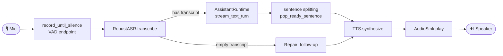
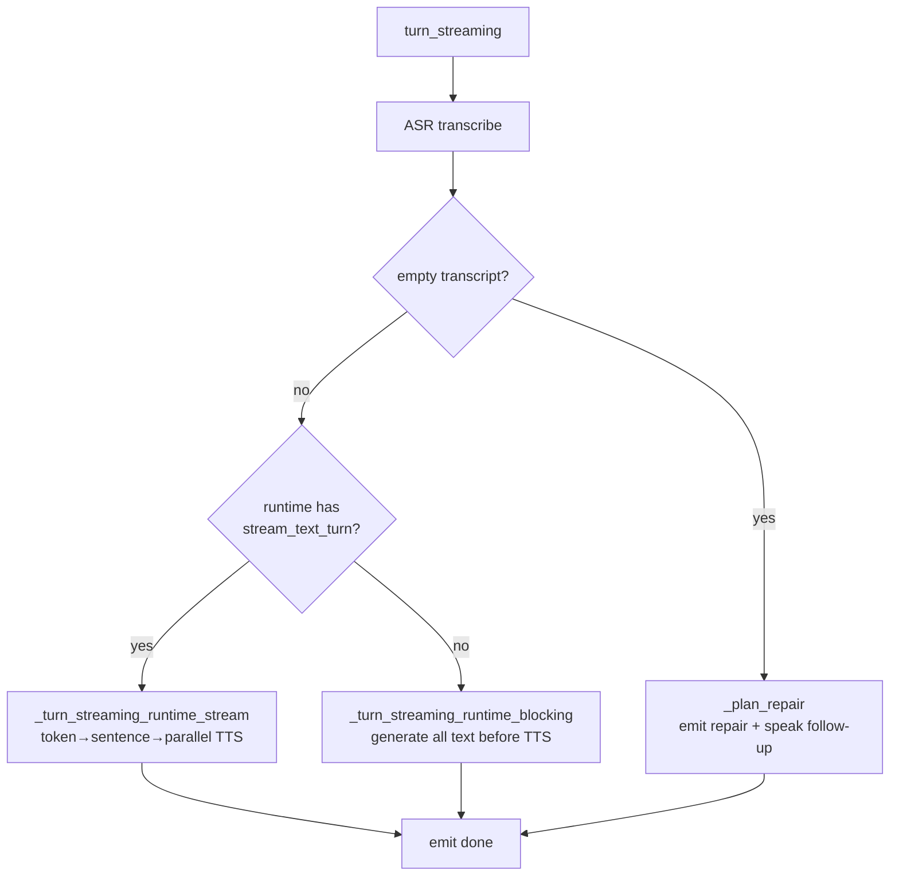
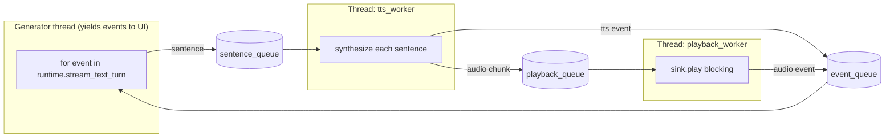
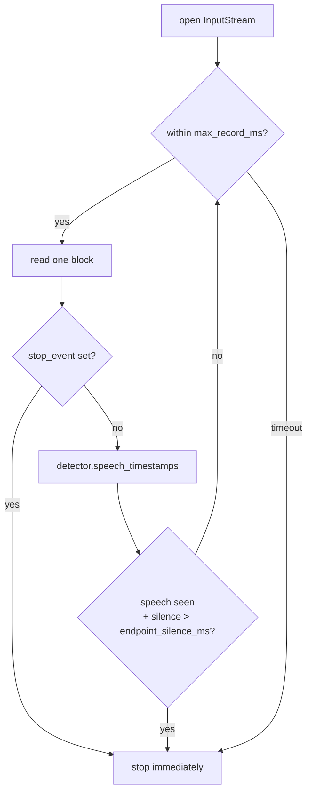
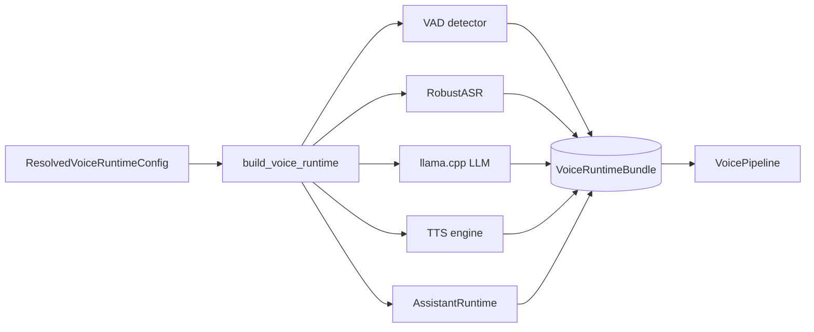

# 03 — Voice Pipeline

This document describes **one spoken turn** through the system: from microphone
to speaker. Main code: `core/endpoint.py`, `core/pipeline.py`,
`core/voice_runtime.py`, `core/audio_out.py`, and, for the TUI,
`app/tui/voice.py`.

## One Voice Turn at a Glance



## VoicePipeline: Two Modes

`VoicePipeline` (`core/pipeline.py`) exposes two entry points:

| Method                                   | Use Case                      | Return Type                   |
| ---------------------------------------- | ----------------------------- | ----------------------------- |
| `turn(audio)`                            | Metrics, non-streaming, tests | `PipelineResult` as one block |
| `turn_streaming(audio, audio_sink, ...)` | Production voice loop         | generator of `StreamingEvent` |

`turn_streaming` chooses its branch based on runtime capabilities:



## Streaming Event Sequence (`StreamingEvent.type`)

```text
asr → [repair]? → runtime → (llm_token | sentence | tts | audio)* → done
```

- `asr`: transcript and `rejection_reason`.
- `repair`: only when ASR rejects; contains follow-up text plus
  `repair_kind/action/attempt`.
- `runtime`: route/blocked/citations/usage summary.
- `llm_token`: raw token for live display.
- `sentence`: a guardrail-checked sentence ready for TTS.
- `tts`: synthesized audio chunk, including `ttfa_ms` for the first chunk.
- `audio`: playback finished for a chunk, including `playback_latency_ms`.
- `done`: end of turn, with rejected/route/stage latency metadata.

## Streaming Thread Model

The most subtle part is `_turn_streaming_runtime_stream`, which runs **three
threads**:



This lets the system **synthesize sentence N+1 while playing sentence N**. The
first sentence can reach the speaker without waiting for the whole answer, which
reduces time-to-first-audio.

> Streaming note: per-sentence guardrails on LLM routes are equivalent to
> full-text checking because `check_final_output` is a stateless substring scan.
> Splitting by sentence remains safe. See
> [05](./05-assistant-runtime.md).

## VAD Endpointing (`record_until_silence`)

`core/endpoint.py` reads microphone blocks and uses VAD (Silero) to decide when
the user has **stopped speaking**, then cuts the turn.



- `endpoint_silence_ms`, default 700 ms, means how much silence counts as the
  **end of the user's utterance**. It is **not** the no-reply timing. See
  [06](./06-conversation-repair.md).
- `stop_event` allows immediate abort when `/stop` is issued or the TUI changes
  mode, instead of waiting for the recording window to end.

## Building the Baseline Runtime (`build_voice_runtime`)

`build_voice_runtime(config)` returns a `VoiceRuntimeBundle` containing the VAD
`detector`, `asr` (`RobustASR`), `llm`, `tts`, `assistant_runtime`, `pipeline`,
and memory/knowledge/guard status. `warm_up_voice_runtime(bundle)` runs ASR, LLM,
and TTS once so the first real turn is not cold.



## CLI Voice Loop vs TUI Voice Mode

|                  | CLI (`soca voice`)             | TUI voice mode (`soca ui voice`)                                     |
| ---------------- | ------------------------------ | -------------------------------------------------------------------- |
| Loop             | `app/voice_loop.py` sync       | `app/tui/voice.py` `VoiceMonitorController` worker thread + Queue    |
| Display          | `console.py` prints each event | Status bar + timeline + inspector. See [07](./07-tui.md)             |
| No-reply ladder  | Not wired yet                  | Yes: passive silence call-out. See [06](./06-conversation-repair.md) |
| Repair on reject | `print_followup` + TTS         | `repair` event → timeline + TTS                                      |

Both paths call `bundle.pipeline.turn_streaming(...)`, so the **audio pipeline is
the same**. Only the presentation layer and loop control differ.

## Practical Latency Notes

- `baseline` is the only public runtime profile: PhoWhisper Small, Arcee-VyLinh, and Valtec `NF`.
- `quality` and `edge` are retired and are rejected rather than silently aliased to `baseline`.
- Phase 5/6 replace Valtec's implementation under the same stable key and record new latency in
  `BENCHMARKS.md`.
