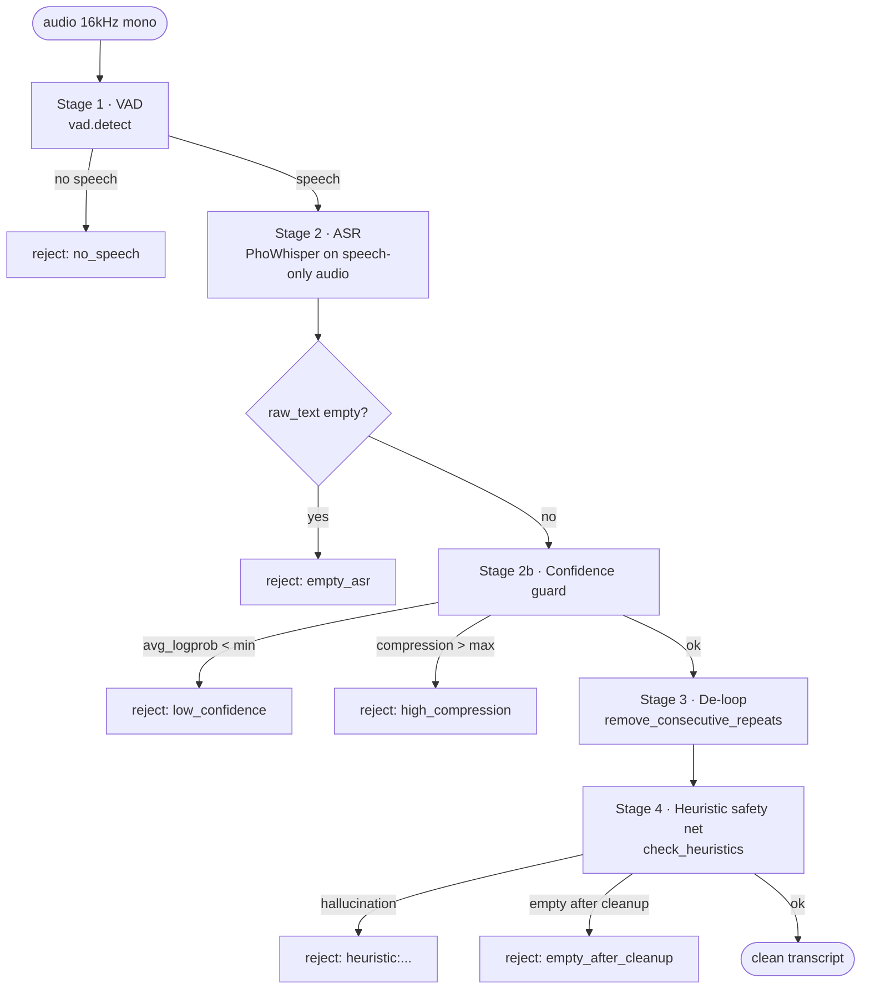
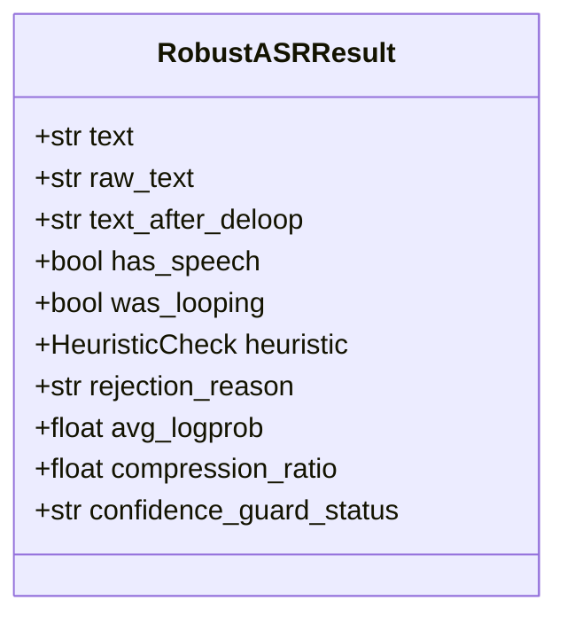
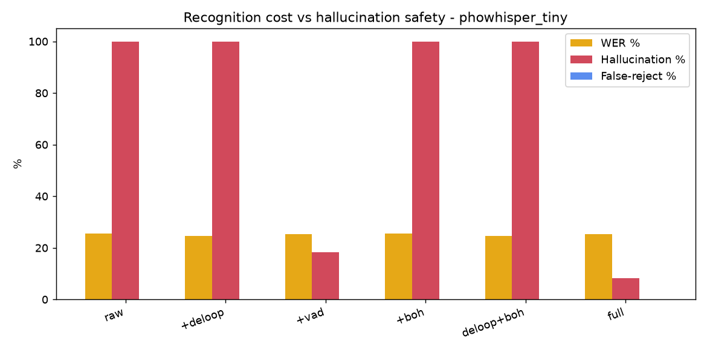
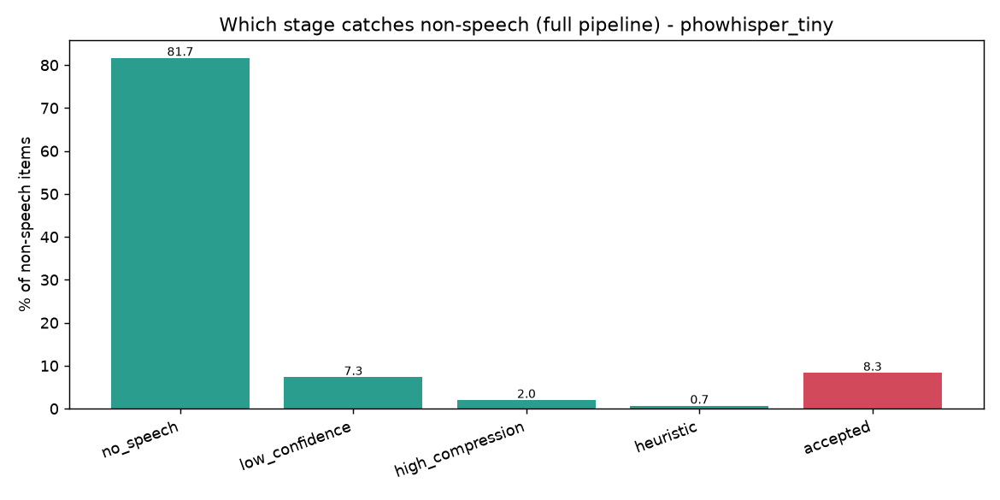
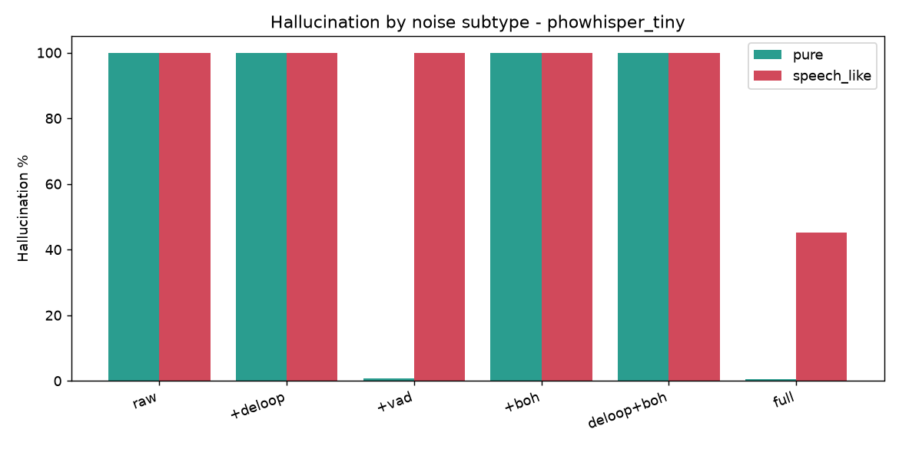
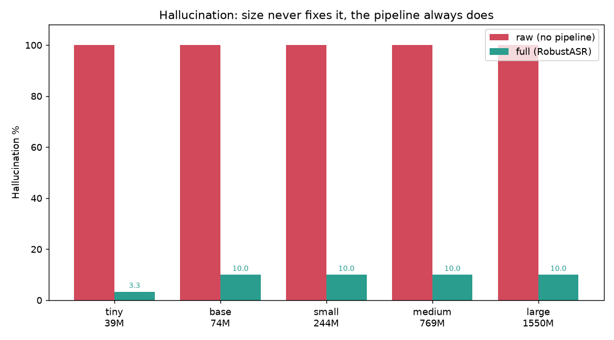

# 04 — ASR Robustness (`RobustASR`)

PhoWhisper, like Whisper-style models in general, can sometimes **hallucinate
text** on silence/noise or **loop indefinitely**. `RobustASR`
(`asr/robust_asr.py`) wraps the selected model with a **four-stage production pipeline** that turns
raw output into a trusted transcript, or rejects cleanly with a clear technical
reason.

## Four-Stage Production Pipeline

## Role of Each Stage

| Stage                     | What It Does                                          | Why It Exists                                                                                 |
| ------------------------- | ----------------------------------------------------- | --------------------------------------------------------------------------------------------- |
| **1 · VAD**               | Detects real speech and trims silence                 | Whisper can hallucinate on silence; trimming also saves compute                               |
| **2 · ASR**               | Runs PhoWhisper on **speech-only** audio              | More accurate and faster than decoding silence-heavy audio                                    |
| **2b · Confidence guard** | Blocks low `avg_logprob` and high `compression_ratio` | These are classic hallucination/loop signals; checks run on raw output for faithful diagnosis |
| **3 · De-loop**           | Removes consecutive repeated spans                    | `"tôi tôi tôi tôi..."` becomes `"tôi"`                                                        |
| **4 · Heuristics**        | Final safety net: chars/sec ratio, abnormal length... | Catches cases that pass the previous stages                                                   |

## Admission order and runtime consequence

The stages are ordered deliberately. A stage may reject a turn, but it never
silently repairs the transcript and sends that repaired text to the assistant:

1. The audio contract is checked before decoding: the runtime supplies the
   selected profile's sample rate and mono channel shape.
2. VAD decides whether there is enough speech to spend ASR compute. A
   `no_speech` result stops here; no ASR model, LLM, knowledge tool or memory
   search is called for that turn.
3. ASR produces `raw_text` and model diagnostics. Empty output becomes a typed
   `empty_asr` rejection.
4. Confidence and compression checks inspect the raw model result. They run
   before de-looping so the trace preserves the signal that caused rejection.
5. De-looping and heuristics clean only an otherwise admissible result. If
   cleanup leaves no text, the result is rejected rather than treated as a
   successful empty answer.

An accepted `text` enters the normal assistant pipeline. A rejected result has
`text == ""` and is handed to the conversation-repair layer; the repair text
is a follow-up prompt, not an ASR transcript. The UI receives both the
technical rejection metadata and the natural Vietnamese repair event. This is
why a bad/noisy audio turn cannot accidentally become a free-chat LLM request.

The production contract is therefore fail-closed at the ASR boundary:

| Result state | Assistant LLM | User-facing behavior |
| --- | --- | --- |
| accepted transcript | may run, subject to routing/evidence | normal turn |
| `no_speech` or `empty_asr` | not called | no-input repair |
| confidence/compression rejection | not called | uncertain-input repair |
| heuristic rejection | not called | repair with technical reason in trace |
| ASR backend/startup failure | not called | typed readiness/runtime failure |

## Result & Trace (`RobustASRResult`)

The result keeps **intermediate text from every stage** for debugging:

- `text` is the final result; it is `""` when rejected.
- `raw_text` is the raw Whisper output.
- `text_after_deloop` exposes the final text-cleaning intermediate stage.

`rejection_reason`, empty when accepted, is a **technical code**, for example:
`no_speech`, `empty_asr`, `low_confidence:-0.90`, `high_compression:3.10`,
`heuristic:<name>`, or `empty_after_cleanup`.

> This code is **not spoken directly to the user**. It is input for the
> **repair layer**, which turns it into natural Vietnamese follow-up text. See
> [06](./06-conversation-repair.md).

## Model-Specific Configuration

- **Confidence guard** is keyed by model. `confidence_guard_status` explains
  whether the calibrated profile is enabled or skipped because the profile is
  missing or mismatched. This prevents applying thresholds to the wrong model.

Calibration is an artifact identity, not a global threshold. The selected ASR
model, calibration revision, audio preprocessing contract and threshold values
must agree before the production profile is ready. A missing or mismatched
calibration is visible as unready; the runtime does not disable the guard or
borrow thresholds from another model. Recalibration is an operator action and
produces a new evidence record before the profile can be promoted.

## Experimental BoH evaluation

The Bag-of-Hallucinations matcher remains available only under
`eval/experimental/asr_boh` and is loaded by `local.eval_table7` for historical
ablation comparisons. It is never auto-loaded by `RobustASR`, the voice runtime,
or runtime status. The ablation output records whether BoH was applied after
the production pipeline so its metrics cannot be mistaken for production
behavior.

The production contract does not rely on a mined phrase list. BoH is useful as
an isolated ablation and remains in evaluation code; it is not auto-loaded by
`RobustASR`, the voice runtime or readiness reporting.

## Measured evidence

The robustness harness uses Vietnamese FLEURS speech and stratified non-speech:
ESC-50/silence/white/pink noise plus speech-like babble made by overlapping
FLEURS voices. The focused tiny run used 200 speech and 300 non-speech items on
an M4 with CoreML/CPU. The full guard reduced hallucination from 100.0% raw to
8.33% while false-reject stayed at 0.00% and WER stayed near 25.22%.

The same focused items across PhoWhisper tiny, base, small, medium and large
showed that WER reached its useful operating point at `small` while real-time
factor continued to rise for larger models. The guard thresholds were tiny-
calibrated in that sweep, so the larger-model column is a qualification probe,
not a universal threshold decision. Full configurations, revisions, raw-log
locations and limitations are retained in `BENCHMARKS.md` and the ignored
evaluation result directories.

## Why Reject Reasons Are Separate from User-Facing Speech

| Layer        | Concern                                                        |
| ------------ | -------------------------------------------------------------- |
| `RobustASR`  | _Why_ the transcript cannot be trusted, technically            |
| Repair layer | _What to say_ to the user, in a natural UX tone                |
| UI/Inspector | Show **both**: developer-facing reason and user-facing message |

This separation means dialogue copy can change without touching ASR, and a new
technical reason only needs to be mapped to a `RepairKind`.

## Related Files

- `asr/vad.py`, `asr/deloop.py`,
  `asr/hallucination_heuristics.py`, `asr/whisper_onnx.py`, `asr/registry.py`.
- Experimental matcher: `eval/experimental/asr_boh/` and `local/eval_table7.py`.
- Threshold calibration: `soca calibrate-asr` / `soca benchmark-asr`. See
  [08](./08-registries-profiles-cli.md).
