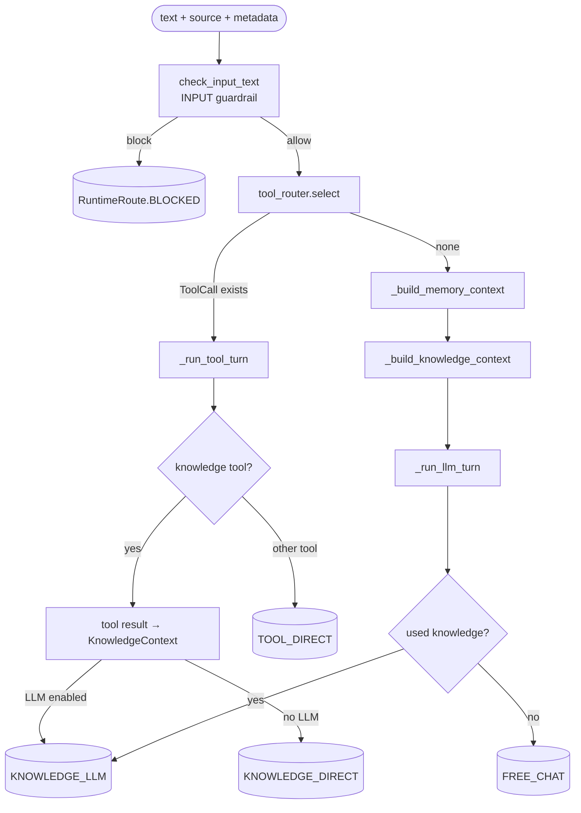
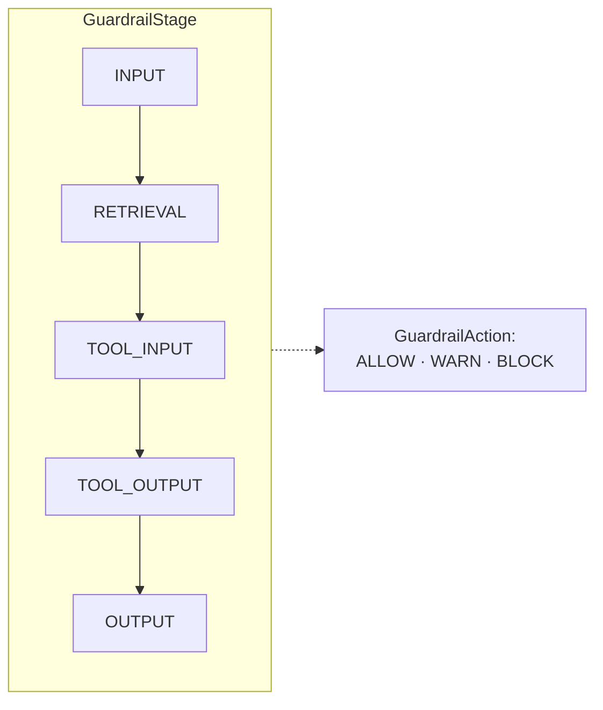
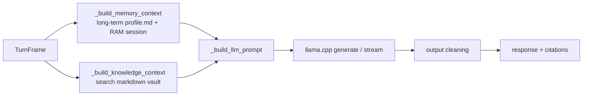
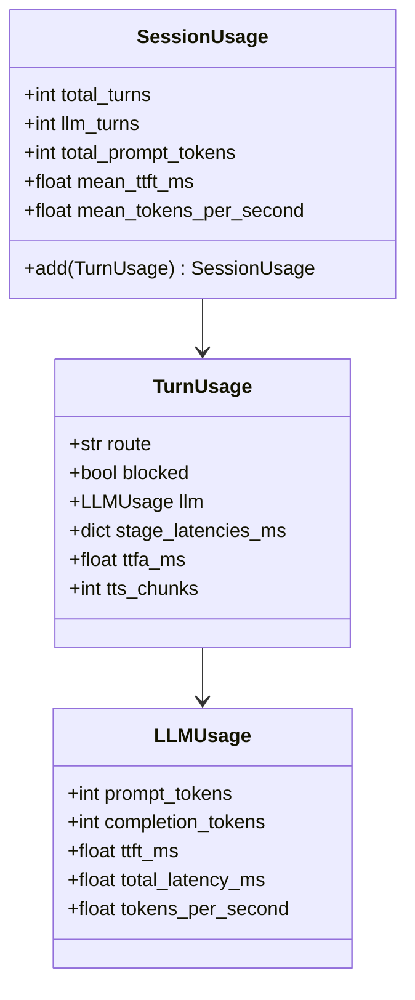

# 05 — Assistant Runtime & Guardrails

`AssistantRuntime` (`core/runtime.py`) is the **brain of one text turn**. The same
runtime serves voice through `VoicePipeline`, text through `soca ask/chat`, and
the TUI chat mode. It does **not** contain ASR or TTS. Its scope is:
guardrails → tools → knowledge/memory → LLM → output.

## Routing One Turn



## Routes (`RuntimeRoute`)

| Route              | When It Happens                                                 | Calls LLM? |
| ------------------ | --------------------------------------------------------------- | ---------- |
| `BLOCKED`          | A guardrail blocks at any stage                                 | No         |
| `TOOL_DIRECT`      | A deterministic tool can answer directly, e.g. `local_time.now` | No         |
| `KNOWLEDGE_DIRECT` | Knowledge tool result is returned because LLM is disabled             | No         |
| `KNOWLEDGE_LLM`    | LLM answers with knowledge context and citations                | Yes        |
| `FREE_CHAT`        | Normal chat answer without knowledge                            | Yes        |

> `LLM_FALLBACK` is the old alias of `FREE_CHAT`, kept for compatibility with
> tests and reports.

## Tool Routing: Deterministic First

`RuntimeToolRouter` (Protocol) and `DefaultRuntimeToolRouter` decide **before the
LLM call** whether the user text matches a local tool, such as asking for time or
searching/reading knowledge notes. Knowledge tools are retrieval steps, not answer
generators: their result is converted to `KnowledgeContext` and passed to the LLM
when one is enabled. If no LLM is available, the raw tool result is returned. Other
read-only tools such as `local_time.now` can still answer directly. Tools also have
side-effect levels and parameter validation.

## Guardrails: Multiple Stages

`core/guardrails.py`. **Stage** means where the check runs; **Action** is the
result.



| Function                    | Stage       | Checks                                                                |
| --------------------------- | ----------- | --------------------------------------------------------------------- |
| `check_input_text`          | INPUT       | Whether the user input violates policy                                |
| `check_knowledge_read_path` | RETRIEVAL   | Whether a knowledge path is safe and cannot path-traverse             |
| `check_untrusted_text`      | RETRIEVAL   | Whether retrieved untrusted content contains dangerous instructions   |
| `check_tool_call`           | TOOL_INPUT  | Whether tool parameters and permissions are valid                     |
| `check_tool_result`         | TOOL_OUTPUT | Whether tool output leaks private or unsafe content                   |
| `check_final_output`        | OUTPUT      | Whether the final answer makes unsupported claims, e.g. realtime data |

`GuardrailEvent` is frozen and records `stage`, `action`, `reason`, and
`message`. All events are stored in `RuntimeTrace.guardrail_events` for the
Inspector.

### Why Streaming Remains Safe

On LLM routes, `check_final_output` is a **stateless substring scan** that catches
unsupported realtime claims. Checking by **sentence** is therefore equivalent to
checking the full text, so the runtime can guard each `sentence` and send it to
TTS immediately without losing safety. This is the key to per-sentence streaming.
See [03](./03-voice-pipeline.md).

## Runtime Streaming (`stream_text_turn`)

The runtime emits `RuntimeStreamEvent`s:

```text
token*  → sentence*  → result
```

- `token`: raw token for live UI display.
- `sentence`: guardrail-checked chunk ready for TTS.
- `result`: full `RuntimeResult` with route, trace, citations, and usage.

LLM routes, including `KNOWLEDGE_LLM`, stream token-by-token. Non-LLM tool,
knowledge-direct, and blocked routes produce fixed text through
`_emit_fixed_result`, chunked into sentences. This keeps pipeline handling uniform
across routes.

`first_sentence_min_chars` lets the first sentence flush earlier than later
sentences so audio reaches the speaker faster.

## Knowledge & Memory in the Prompt



- **Long-term memory**: `memory/profile.md`, read when the vault exists.
- **Session memory**: RAM-only, multi-turn. The TUI uses **shared session
  memory** so voice ↔ chat keep the same context. See [07](./07-tui.md).
- **Knowledge**: Markdown vault. The retrieved passages are inserted into the
  dynamic prompt together with grounding instructions: the LLM may only claim
  facts supported by the passages, must preserve citations such as `[K1] path`,
  and must state that the vault lacks enough information when the context is
  empty or insufficient. No answer text is assembled from snippets in code.

## <a id="usage-telemetry"></a>Usage Telemetry

`core/usage.py` defines frozen dataclasses and does not depend on Rich:



- `ttft_ms` means time-to-first-token for LLM.
- `ttfa_ms` means time-to-first-audio for voice.
- `LLMUsage.from_llm_result`, `TurnUsage.from_runtime_result`, and
  `TurnUsage.from_voice` are duck-typed builders.
- `SessionUsage.add` returns a **new copy** (immutable aggregation). You can view
  this through `soca ... --usage` or `/usage` in the TUI.
