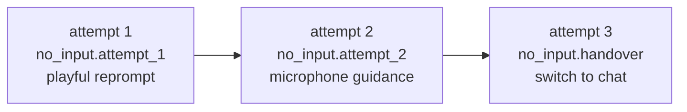
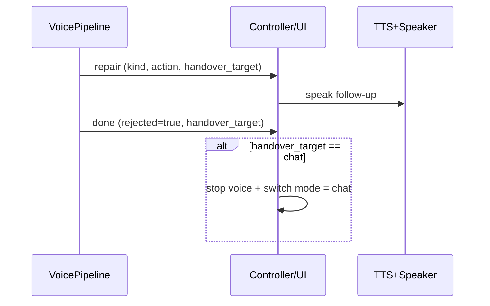

# 06 — Conversation Repair Layer

When ASR cannot produce trusted text, the user does **not** need to hear that
"the turn was rejected." They need SoCa to pull the conversation back on track:
ask again, playfully call out into silence, or hand over to another mode. The
repair layer (`core/repair.py` + `core/repair_prompts.vi.toml`) turns
**technical codes** into **natural Vietnamese follow-up text**, with variants,
randomization, no-repeat selection, and escalation.

The historical design context is preserved in the relevant `zplan/` plan; this
page documents the current implementation and its typed repair events.

## Overview

```mermaid
flowchart LR
    TR[rejection_reason<br/>(no_speech, low_confidence...)] --> KIND[kind_for_reason]
    KIND --> LAD[attempt ladder]
    LAD --> SEL[RepairCatalog.select<br/>random no-repeat]
    SEL --> TXT[Vietnamese follow-up text]
    TXT --> TTS[(spoken through TTS)]
    TXT --> UI[(timeline: Follow-up)]
```

## Categories (`RepairKind`)

| Kind                | Trigger                                             | UX Intent                                    |
| ------------------- | --------------------------------------------------- | -------------------------------------------- |
| `no_input`          | `no_speech`, empty transcript                       | Call out into silence, sometimes playfully   |
| `uncertain_input`   | `low_confidence`, `high_compression`, BoH/heuristic | Heard something but not confidently          |
| `no_match`          | Runtime cannot route the request                    | Ask the user to clarify the goal             |
| `out_of_scope`      | Request is outside the assistant's ability          | State the limit and suggest what can be done |
| `guardrail_blocked` | Guardrail blocks                                    | Safety boundary, low-variance, no joking     |
| `tool_failed`       | Tool error                                          | Report failure and offer a next step         |
| `knowledge_miss`    | Vault has no relevant result                        | Ask for more specific keywords               |
| `tts_failed`        | TTS error                                           | Show text instead                            |
| `session_inactive`  | Long silence                                        | No-reply / sleep / handover                  |

## Catalog (`repair_prompts.vi.toml`)

Each `[kind.slot]` has an `action` and a list of `variants`. The selector uses
**random no-repeat** so it does not reuse the most recent prompt. Tone principles:

- SoCa refers to itself as **"Sơn Ca"** or **"mình"**, and addresses the user as
  **"bạn"**: friendly without being syrupy.
- Vietnamese particles (`nha/nhé/á/nè/hông/ta`) add subtle variation.
- `no_input.attempt_1` can be **playful**, including greeting trends such as
  `moshi moshi`, `annyeong`, `yeoboseyo`, and `alo alo`.
- Repeated failures become **less playful**: attempt 2 guides the microphone;
  later attempts hand over more seriously.
- Guardrail lines stay clear, low-variance, and non-joking.
- Text is spoken by TTS, so catalog validation rejects emoji and Markdown.

## Two Selection Mechanisms

### 1. `plan_repair`: Escalate When the User Tried to Speak

Used when the user appears to have spoken but ASR cannot trust the transcript.
Each call increments `attempt`, escalates the slot, and avoids repeating prompts:



`RepairState` is mutable RAM-only state. It stores `no_input_attempts` and
`recent_prompt_ids`. `reset()` runs after a successful turn.

### 2. Passive Silence: Calling Out When Nothing Is Happening

Important distinction: **passive silence is not the same as no_input**.

- **No input**: there is evidence that the user tried to speak, but the system
  could not get reliable text. This goes through `plan_repair` inside the
  **pipeline**.
- **Passive silence**: VAD sees **no speech at all**. The TUI worker handles it
  directly (`app/voice_controller.py`), skips ASR/LLM to save compute, and periodically
  calls out playfully:

```mermaid
flowchart TD
    REC[record window] --> VAD{VAD sees speech?}
    VAD -->|yes| PIPE[run pipeline normally<br/>reset silence clock]
    VAD -->|no| SIL[silence_ms += window]
    SIL --> LONG{silence &gt;= sleep_voice_at_ms<br/>(~5 minutes)?}
    LONG -->|yes| SLEEP[session_inactive.sleep<br/>+ hand over to chat + stop loop]
    LONG -->|no| DUE{call-out interval due?<br/>about every 20 seconds}
    DUE -->|no| WAIT[keep listening]
    DUE -->|yes| CALL[no_input.attempt_1<br/>alo - moshi moshi - annyeong<br/>cycle no-repeat → speak through TTS]
```

Behavior:

- During pure silence, SoCa **calls out periodically** about every 20 seconds,
  cycling through multiple greetings without immediate repetition.
- Lines like "I did not hear that clearly" or "move closer to the mic" are only
  for speech-that-was-not-understood, not for pure silence.
- After roughly **5 minutes** of full silence, the loop winds down: "I'll pause
  voice for now..." then hands over to chat and stops the voice loop.
- Constants: `_SILENCE_CALLOUT_INTERVAL_MS` for call-out cadence and
  `RepairTimings.sleep_voice_at_ms` for sleep.

### `plan_no_reply`: Pure Policy Ladder

`plan_no_reply(silence_ms, expects_response, attempts_fired, timings)` is the
pure policy ladder from the design: 45 s / 120 s / 300 s. It distinguishes
"SoCa is waiting for a user reply" from "passive silence." It is tested, but the
controller currently uses the simpler playful call-out loop above for voice UX.

## `repair` Event & Handover

The pipeline emits `StreamingEvent(type="repair")` with
`kind/action/attempt/technical_reason/handover_target` **before** sentence/TTS
events. UI handling:

- CLI: `print_followup` prints `Follow-up: <text>` in a warm style, not as a red
  error.
- TUI: `_voice_on_repair` writes `Follow-up` into the timeline. If
  `handover_target=chat`, the UI stops voice and switches to chat after speaking.



## Responsibility Summary

| Situation                             | Detected In                                  | Spoken Line Source             | Mechanism                           |
| ------------------------------------- | -------------------------------------------- | ------------------------------ | ----------------------------------- |
| User spoke but ASR did not understand | `VoicePipeline` (empty/untrusted transcript) | `no_input` / `uncertain_input` | `plan_repair` escalation → handover |
| Complete silence                      | TUI worker (VAD)                             | playful `no_input.attempt_1`   | periodic call-out → sleep           |
| Guardrail blocked                     | `AssistantRuntime`                           | `guardrail_blocked`            | clear boundary, no jokes            |
