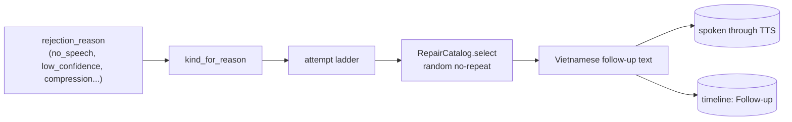
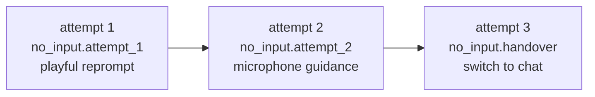
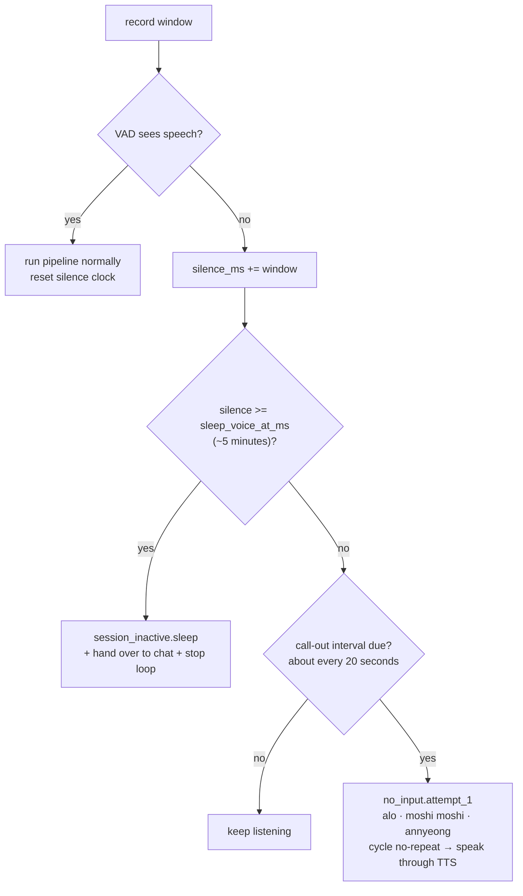
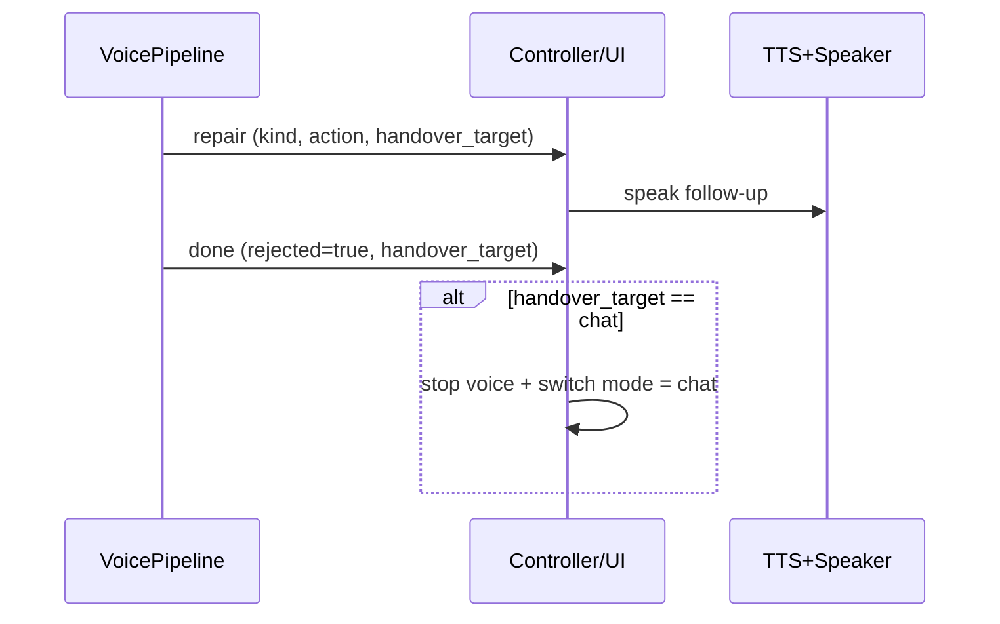

# 06 — Conversation Repair Layer

When ASR cannot produce trusted text, the user does **not** need to hear that
"the turn was rejected." They need SoCa to pull the conversation back on track:
ask again, playfully call out into silence, or hand over to another mode. The
repair layer (`core/repair.py` + `core/repair_prompts.vi.toml`) turns
**technical codes** into **natural Vietnamese follow-up text**, with variants,
randomization, no-repeat selection, and escalation.

There are two producers of repair behavior. `VoicePipeline` handles an audio
turn after ASR has run and returns an empty or rejected transcript. The TUI
voice controller handles a recording window where VAD sees no speech at all.
They share the catalog and user-facing vocabulary, but they do not share the
same event class or compute path.

The historical design context is preserved in the relevant `zplan/` plan; this
page documents the current implementation and its typed repair events.

## Overview



The technical reason remains in metadata for diagnostics; it is never spoken
verbatim. The selected catalog line is the user-facing text. A missing catalog
slot or an invalid catalog is a startup/configuration error, not a request to
invent a repair line dynamically.

## Categories (`RepairKind`)

| Kind                | Trigger                                             | UX Intent                                    |
| ------------------- | --------------------------------------------------- | -------------------------------------------- |
| `no_input`          | `no_speech`, empty transcript                       | Call out into silence, sometimes playfully   |
| `uncertain_input`   | `low_confidence`, `high_compression`, BoH/heuristic | Heard something but not confidently          |
| `no_match`          | Runtime cannot route the request                    | Ask the user to clarify the goal             |
| `out_of_scope`      | Request is outside the assistant's ability          | State the limit and suggest what can be done |
| `guardrail_blocked` | Guardrail blocks                                    | Safety boundary, low-variance, no joking     |
| `tool_failed`       | Tool error                                          | Report failure and offer a next step         |
| `knowledge_miss`    | Vault has no relevant result                        | Ask for more specific keywords               |
| `tts_failed`        | TTS error                                           | Show text instead                            |
| `session_inactive`  | Long silence                                        | No-reply / sleep / handover                  |

## Catalog (`repair_prompts.vi.toml`)

Each `[kind.slot]` has an `action` and a list of `variants`. The selector uses
**random no-repeat** so it does not reuse the most recent prompt. Tone principles:

- SoCa refers to itself as **"Sơn Ca"** or **"mình"**, and addresses the user as
  **"bạn"**: friendly without being syrupy.
- Vietnamese particles (`nha/nhé/á/nè/hông/ta`) add subtle variation.
- `no_input.attempt_1` can be **playful**, including greeting trends such as
  `moshi moshi`, `annyeong`, `yeoboseyo`, and `alo alo`.
- Repeated failures become **less playful**: attempt 2 guides the microphone;
  later attempts hand over more seriously.
- Guardrail lines stay clear, low-variance, and non-joking.
- Text is spoken by TTS, so catalog validation rejects emoji and Markdown.

## Two Selection Mechanisms

### 1. `plan_repair`: Escalate When the User Tried to Speak

Used when the user appears to have spoken but ASR cannot trust the transcript.
Each call increments `attempt`, escalates the slot, and avoids repeating prompts:



`RepairState` is mutable RAM-only state. It stores `no_input_attempts` and
`recent_prompt_ids`. `plan_repair()` increments the attempt count, selects a
fresh prompt when possible, and appends its prompt ID. `reset()` runs after a
successful transcript turn and clears the escalation counter; recent prompt
IDs remain bounded history for no-repeat selection.

### 2. Passive Silence: Calling Out When Nothing Is Happening

Important distinction: **passive silence is not the same as no_input**.

- **No input**: the recording produced an ASR result with no trusted text. This
  goes through `plan_repair` inside the **pipeline**, so ASR has already run and
  the resulting `repair` event includes the ASR technical reason.
- **Passive silence**: VAD sees **no speech at all**. The TUI worker handles it
  directly (`app/voice_controller.py`), skips ASR and LLM to save compute, and
  periodically calls out playfully:



Behavior:

- The first passive-silence check can call out immediately after the first empty
  recording window. Later call-outs are spaced by
  `_SILENCE_CALLOUT_INTERVAL_MS` (20 seconds by default), not by an ASR turn.
  The catalog cycles through multiple greetings without immediate repetition.
- Lines like "I did not hear that clearly" or "move closer to the mic" are only
  for speech-that-was-not-understood, not for pure silence.
- After roughly **5 minutes** of full silence, the loop winds down: "I'll pause
  voice for now..." then hands over to chat and stops the voice loop.
- Constants: `_SILENCE_CALLOUT_INTERVAL_MS` for call-out cadence and
  `RepairTimings.sleep_voice_at_ms` for sleep.

### `plan_no_reply`: Pure Policy Ladder

`plan_no_reply(silence_ms, expects_response, attempts_fired, timings)` is a
pure, unit-tested policy ladder from the design: 45 s / 120 s / 300 s. It
distinguishes "SoCa is waiting for a user reply" from "passive silence." The
current production controller does **not** call this function; it uses
`VoiceMonitorController._handle_passive_silence()` and the 20-second playful
call-out behavior above. This function is retained as an independently tested
policy primitive for a future controller integration, not as evidence that the
45/120-second ladder is active in the TUI.

## Repair events, ordering and handover

### ASR-rejected pipeline turn

`VoicePipeline.turn_streaming()` emits this sequence when ASR produces no
trusted transcript:

```text
asr → repair → sentence* → (tts → playback_started → audio)* → done
```

The `repair` event is a `StreamingEvent` and contains:

| Field | Meaning |
| --- | --- |
| `text` | selected Vietnamese catalog variant |
| `repair_kind` | `no_input` or `uncertain_input` |
| `repair_action` | `reprompt`, `contextual_reprompt` or `handover_to_chat` |
| `repair_attempt` | consecutive failed transcript count |
| `technical_reason` | ASR reason such as `no_speech` or `low_confidence:-0.90` |
| `handover_target` | `chat` only for the handover action, otherwise `null` |

The event is emitted before sentence/TTS events so the UI can label the line as
a follow-up rather than an error. When speech is enabled, each TTS chunk emits
`tts`, then `playback_started`, then its corresponding `audio` event. This
branch never calls the assistant LLM.

### Passive-silence controller turn

`VoiceMonitorController._handle_passive_silence()` does not create a
`StreamingEvent`; it pushes `VoiceMonitorEvent` records directly to the TUI
queue:

```text
repair → tts → playback_started → audio → done
```

Its metadata includes `technical_reason=passive_silence`, `silence_ms`,
`repair_kind`, `repair_action`, `repair_attempt` and `handover_target`. It calls
TTS directly, skips ASR/LLM, and sets `stop_event` after a
`session_inactive.sleep` choice so the controller leaves voice and returns to
chat. A normal call-out ends with `terminal_status=needs_clarification`; the
sleep handover ends with `terminal_status=cancelled`.

UI handling is the same at the presentation level:

- CLI: `print_followup` prints `Follow-up: <text>` in a warm style, not as a red
  error.
- TUI: `_voice_on_repair` writes `Follow-up` into the timeline. If
  `handover_target=chat`, the UI stops voice and switches to chat after speaking.



## Responsibility Summary

| Situation                             | Detected In                                  | Spoken Line Source             | Mechanism                           |
| ------------------------------------- | -------------------------------------------- | ------------------------------ | ----------------------------------- |
| User spoke but ASR did not understand | `VoicePipeline` (empty/untrusted transcript) | `no_input` / `uncertain_input` | `plan_repair` escalation → handover |
| Complete silence                      | TUI worker (VAD)                             | `no_input.attempt_1` / `session_inactive.sleep` | periodic call-out → sleep + chat handover |
| Guardrail blocked                     | `AssistantRuntime`                           | `guardrail_blocked`            | clear boundary, no jokes            |
