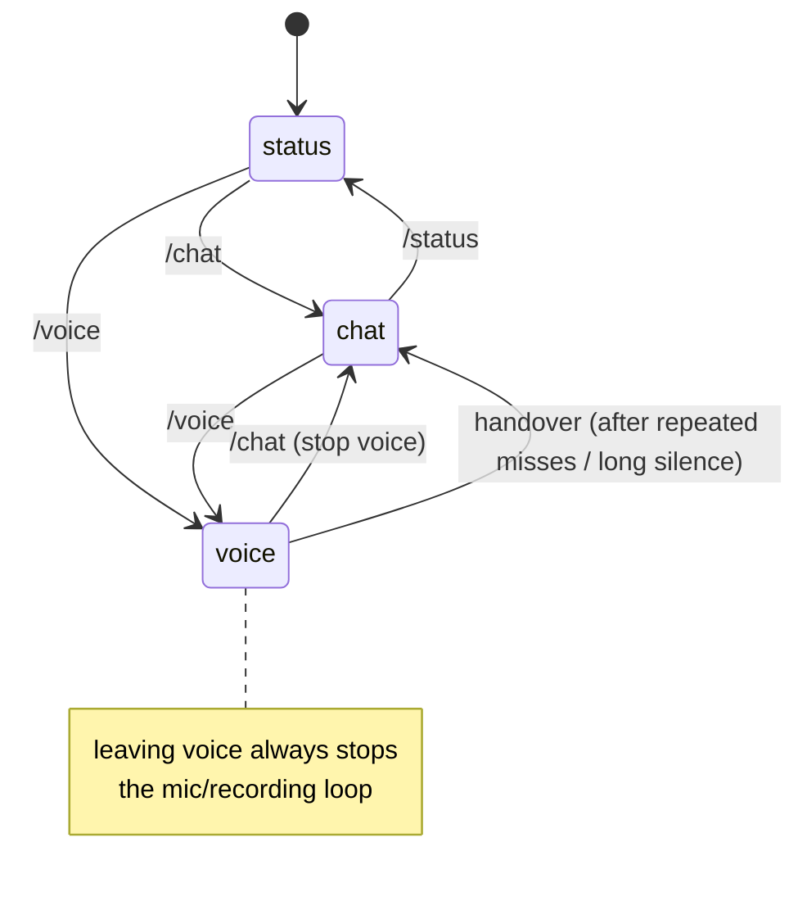
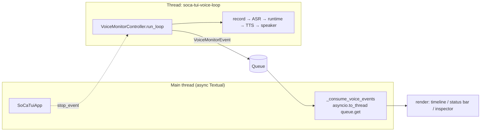

# 07 — TUI (Textual Cockpit)

`soca ui` opens a richer terminal interface built with Textual. The TUI is a
**pure client**: it renders state and calls existing runtime/pipeline builders.
It does **not** own routing, prompts, registries, or guardrail policy. Code lives
in `soca/app/tui/`.

## File Structure

```text
app/tui/
├── app.py        # SoCaTuiApp: compose layout, dispatch events, mode lifecycle
├── voice.py      # VoiceMonitorController: worker thread runs voice loop → Queue
├── voice_view.py # VoiceTurnView immutable snapshot + VoiceStatusBar
├── widgets.py    # Timeline, Inspector, Sidebar, StatusLine, StageRail, Composer, Slash
├── state.py      # TuiState, TuiMode
├── events.py     # TuiStageEvent
├── commands.py   # slash command registry (/chat, /voice, /usage, ...)
├── branding.py   # bird ASCII + wordmark
└── theme.py      # shared calm-dark palette + st() honoring NO_COLOR
```

## Layout

```text
┌ statusline: SoCa  voice·baseline  LLM=...  vault=ok  mem=on  speaking ────────┐
├──────────┬───────────────────────────────────────────────────────────────────┤
│ sidebar  │ stage_rail  (chat)  |  voice_status (voice: state machine + ♪♫)     │
│  Chat    ├──────────────────────────────────┬────────────────────────────────┤
│ ▸Voice   │ timeline (conversation)          │ inspector (route/latency/usage) │
│  Status  │   You ▸ ...                      │  Turn Inspector                 │
│          │   (o> SoCa ▸ ...                 │  route / tools / guardrails     │
│          ├──────────────────────────────────┴────────────────────────────────┤
│          │ slash_commands overlay while typing /                              │
│          │ composer  [ type here... ]                                         │
└──────────┴────────────────────────────────────────────────────────────────────┘
```

- The body is always `timeline | inspector` across all three modes. Voice mode
  only adds the thin `voice_status` band above it; it does not replace the main
  layout.
- `stage_rail` for chat/status and `voice_status` for voice are toggled by
  `_apply_layout`.

## Three Modes



| Mode     | What It Does                        | Builds Runtime?          |
| -------- | ----------------------------------- | ------------------------ |
| `status` | Read-only profile readiness view    | No model load            |
| `chat`   | Sends text into `AssistantRuntime`  | Lazy build on first turn |
| `voice`  | Starts the mic→ASR→runtime→TTS loop | Build in worker thread   |

## Thread Model: Keeping the UI Responsive

Models are synchronous and can be slow; Textual is async. Calling models on the
main thread would freeze the UI. The TUI uses a worker-thread model:



- Worker pushes `VoiceMonitorEvent`s into a `Queue`; the main thread awaits
  `asyncio.to_thread(queue.get)` and renders. **All widget writes happen on the
  main thread**.
- Chat uses `asyncio.to_thread` for `run_text_turn` so the UI stays responsive.
- Leaving voice or running `/stop` sets `stop_event`, which can abort the
  recorder immediately. See [03](./03-voice-pipeline.md).

## Voice Status Bar as a Pure Function of a Snapshot

`VoiceTurnView` is frozen and stores `state/turn_index/elapsed_s/note`. Each event
creates a new copy, and `VoiceStatusBar.render_status` redraws from that snapshot.
Rendering is therefore a **pure function** and testable without a full app.

```text
states: loading ◐  ·  listening ●  ·  processing ●  ·  speaking ●  ·  error ●
speaking → open-beak bird (o> + animated notes ♪♫; loading → spinner ◐◓◑◒
```

A `set_interval(0.4s)` animates the notes while speaking and the spinner while
loading.

## Voice Event → Render Target

| VoiceMonitorEvent              | Render Target                                              |
| ------------------------------ | ---------------------------------------------------------- |
| `loading` / `ready` / `warmup` | Timeline for load progress + `loading` status              |
| `loop_started` / `recording`   | Status bar `listening`                                     |
| `recorded`                     | Status bar `processing`                                    |
| `asr`                          | Timeline `You ▸ <transcript>` + inspector                  |
| `repair`                       | Timeline `Follow-up: ...` and handover metadata if present |
| `llm_token`                    | Inspector live draft/preview                               |
| `runtime`                      | Stored route/meta for the turn                             |
| `tts`                          | Status bar `speaking` with animated notes                  |
| `done`                         | Timeline `(o> SoCa ▸ <reply>` + inspector summary + usage  |
| `error`                        | Timeline error + inspector                                 |

Principle: **conversation goes to timeline; technical details go to inspector;
live state goes to status bar**. Operational logs should not flood the timeline.

## Shared Session Memory

`SoCaTuiApp` creates **one** shared `SessionMemory` and injects it into both the
chat runtime (`runtime_builder(..., session_memory=...)`) and the voice
controller. Mode switches therefore preserve context; `/clear` clears the shared
session.

## Theme & Accessibility

`theme.py` centralizes the calm-dark palette. `st()` returns `""` when `NO_COLOR`
is set, so content styles can be disabled. Spacing and layout are controlled by
`styles.tcss`.

## TUI Tests

`tests/test_tui_*.py` use `App.run_test()` and Pilot with fake runtime, recorder,
and player objects. This tests layout, dispatch, snapshots, and no-reply logic
without loading real models.
