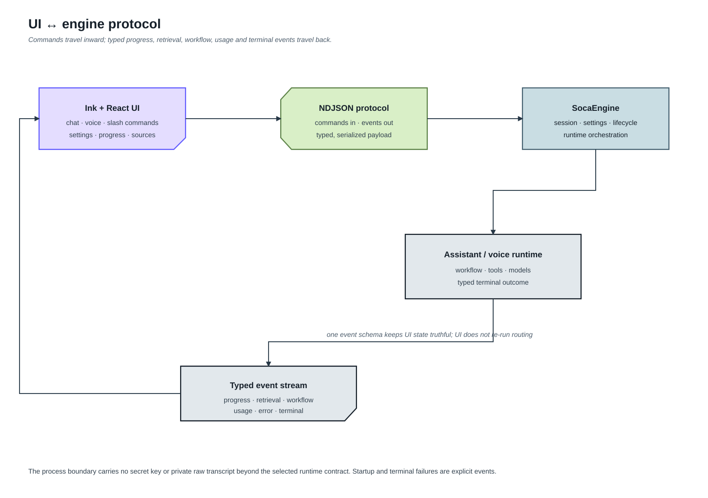

# 07 — Terminal UI (Ink + `soca engine`)

Giao diện terminal của SoCa là app **Ink (TypeScript + React)** ở thư mục `ui/`,
nói chuyện với engine Python qua giao thức **NDJSON trên stdio**:

```
ui/ (Ink)  ── commands (stdin) ──▶  soca engine (Python)
           ◀── event stream (stdout) ──  ASR/LLM/TTS/mic/AEC/barge-in
```

- Audio không bao giờ vượt biên process — mic, DuplexAecSink (barge-in), phát TTS
  đều nằm trong engine; UI chỉ render state.
- Protocol + engine: `soca/app/engine.py` (commands
  `status/context/chat/voice_start/voice_stop/memory/memory_compact/usage/quit`).
- Voice loop controller dùng chung: `soca/app/voice_controller.py` (`VoiceMonitorController`).



Editable diagram source: [Lucid UI protocol](https://lucid.app/lucidchart/133d6a9f-ff1d-4269-b56d-275b8193b689/view).

## Chạy

```bash
cd ui && npm install && npm run build   # một lần
uv run soca ui                          # mở main chat UI
uv run soca ui voice baseline           # vào thẳng voice mode
```

Dev UI: `cd ui && npm run dev`. Override lệnh engine: env `SOCA_ENGINE_CMD`.
Chọn vault cho UI bằng `--vault PATH` hoặc `SOCA_VAULT`; nếu không đặt thì UI
dùng `./Knowledge` tại root repository. Gõ `/settings` để mở cấu hình; UI hiển thị
Knowledge Vault để init trước, sau đó chạy index rõ ràng;
không tự tải model hay đổi backend. Ví dụ với showcase vault đã được làm giàu:
`SOCA_VAULT=eval/fixtures/knowledge_vault uv run soca ui chat`.

Sau khi init, SQLite catalog và vector generations nằm dưới
`Knowledge/.soca/knowledge_index/`, không nằm lẫn trong Markdown. Có thể copy
fixture showcase vào `Knowledge/` trước khi bấm `Index vault` để chạy demo.

## Cấu trúc `ui/src/`

```
theme.ts          design tokens "bình minh" (đồng bộ soca/app/style/palette.py)
protocol.ts       wire types của NDJSON protocol
engine.ts         spawn + đọc/ghi engine child process
store.ts          reducer: engine events → app state
App.tsx           layout chính (Static history + composer + footer)
components/       Logo (bird gradient), Timeline, VoiceStatus, HelpOverlay, Primitives
imeInput.tsx      raw-mode editor with replacement/backspace + grapheme handling
```

> Bản TUI Python cũ đã gỡ sau khi Ink UI đạt parity voice
> (live-test 2026-07-03).

## Slash command và informational view

`ui/src/keymap.ts` là source of truth duy nhất cho command palette và help.
Gõ `/` mở toàn bộ lệnh; nhập tiếp lọc theo prefix; `↑/↓` di chuyển, `Tab` điền
lệnh và `Enter` thực thi. `/inspect` cũ đã bị loại vì engine chưa từng có
implementation tương ứng.

Các lệnh chỉ xem (`/status`, `/context`, `/memory`) không đổi mode và không ghi
output vào timeline. Chúng mở panel trên chat/voice hiện tại;
bắt đầu nhập nội dung mới sẽ đóng panel ngay. `/settings` và `/memory-proposals`
là interaction surface nên vẫn giữ focus cho tới khi người dùng hoàn tất hoặc
đóng.

`/status` hiển thị runtime đang cấu hình/thực thi, không dùng profile tĩnh làm
đại diện cho chat: Chat LLM, voice ASR/LLM/TTS, SmartTurn, VAD, ASR guards,
working-summary worker, archive memory, embedding và các tool router. Model
được khởi tạo lazy sẽ ghi `configured`/`ready`; chỉ worker đã tạo trong process
mới ghi `loaded`. Knowledge index hiển thị riêng sparse/dense generation hiện
tại.

- `/memory` chỉ mô tả working session memory, summary/recent turn và compaction.
- `/compact` mở progress panel và tự poll worker tới trạng thái cuối.
  Khi hoàn tất panel hiển thị token trước/sau; `/compact-show` mở riêng
  working summary đã tạo mà không bung toàn bộ recent conversation. Manual
  compact bỏ qua ngưỡng 15K nhưng yêu cầu ít nhất 5 lượt hoàn chỉnh và luôn giữ
  2 lượt gần nhất; nếu chưa đủ, panel trả `noop` kèm bộ đếm `hiện có X/5`.
  Mỗi artifact bắt buộc có prose continuity summary, kể cả khi không có
  decision/constraint/open item bền vững. Nếu model trả summary rỗng,
  coordinator từ chối publish và giữ nguyên toàn bộ lịch sử cùng summary cũ.
- `/context` gộp hai lát cắt liên quan nhưng không đồng nhất: context hiện đang
  resident (prompt, output reserve, model window và phần query-dependent) và
  usage LLM tích lũy của phiên (prompt/completion token, TTFT, throughput).
- `/usage` được giữ làm alias tương thích cho `/context`, không chiếm một mục
  riêng trong command palette.

Token bar dùng cùng counter bảo thủ `utf8_bytes_div_4` với
`WorkingMemoryPolicy`, hiển thị `current / hard limit` (mặc định 16.384 token).
Vì đây không phải tokenizer riêng của model, UI luôn đánh dấu số bằng `~`.

## Turn progress và timeline

Engine phát `turn_progress` từ stage runtime đang chạy thật; UI không dùng timer
để giả lập tiến độ. Các stage ổn định gồm chuẩn bị, phân tích, định tuyến,
memory, knowledge retrieval, tool, tổng hợp LLM, validation và TTS. Chat và
voice dùng chung event này, còn chi tiết nội bộ nằm trong trường `operation`.
Panel progress đổi accent theo loại công việc và chỉ giữ hàng đợi ngắn cho các
stage đến quá nhanh. Mỗi event có `run_id`, `goal_id` và `sequence`; reducer bỏ
event cũ hoặc event thuộc run cũ thay vì để một lượt xử lý ghi đè lượt mới.
`/workflow` mở inspector của run hiện tại: mặc định là một dòng terminal summary,
có thể mở rộng để xem node, action, public update, answer delta và terminal
outcome. Answer delta chỉ là pending output; timeline chỉ nhận câu trả lời sau
terminal event.

Tin nhắn người dùng giữ layout phẳng hiện tại. Mỗi câu trả lời hoàn chỉnh của
SoCa được đặt trong một khung hairline dùng màu dawn palette đã pha với border
nền. Khi thất bại hoặc bị cancel, progress giữ terminal state và hiển thị lỗi;
chỉ trạng thái `done` mới kết thúc progress bình thường.

Retrieval inspector lấy backend, sparse/dense/fusion score, rejection count và
evidence decision từ runtime trace. Empty retrieval vẫn được phát thành trace
với `columns=[]` và lý do từ evidence gate. Memory trace lấy session stats,
summary worker và compaction coordinator; dữ liệu không có nguồn được biểu diễn
bằng `null`, không thay bằng số không hoặc chip episodic/procedural tĩnh.

`/context` hiển thị prompt manifest, hash, component bị bỏ, output reserve,
observed/provider token và delta nếu provider trả usage thật.

## Vietnamese/IME input boundary

Composer của SoCa chạy trong terminal raw mode. Terminal không đưa cho ứng dụng
các event composition native như browser (`compositionstart/update/end`); tùy
IME/terminal, ứng dụng có thể nhận ký tự đã commit hoặc một edit stream gồm ký
tự, backspace và replacement trong cùng một data chunk. Vì vậy `App.tsx` không
dùng `ink-text-input` nữa mà dùng `imeInput.tsx`:

- input được normalize NFC để chuỗi dựng sẵn và chuỗi tổ hợp hiển thị như nhau;
- cursor/backspace/delete đi theo grapheme cluster, không theo UTF-16 code unit;
- backspace/control/ANSI sequence nằm trong chunk replacement không được chèn
  vào prompt;
- logic này không biết Telex/VNI và không tự dịch tiếng Việt, tránh xung đột với
  IME hệ thống hoặc biến các từ tiếng Anh thành tiếng Việt ngoài ý muốn.

Để xem chính xác terminal/IME đang gửi gì mà không bật log mặc định (đặc biệt
không nên bật khi nhập API key), chạy:

```bash
SOCA_INPUT_DEBUG=1 uv run soca ui chat
```

Log `[soca-input]` đi qua stderr và chỉ nên dùng cho chẩn đoán. Nếu lỗi xuất
hiện cả trong `cat`, shell prompt, Terminal.app/iTerm2 hoặc editor khác thì đó
là lớp input source/IME/terminal của hệ điều hành, không thể sửa bằng code trong
SoCa. Kiểm tra input source Vietnamese Telex/VNI, thử Terminal.app và iTerm2
ngoài SoCa, rồi thử một IME khác; trên macOS vào Keyboard → Text Input → Edit
để chọn lại input source. Khi test Telex, thứ tự đặt dấu không hoàn toàn tương
đương giữa các IME: `ddieefu`, `phast`, `hieejn` đặt dấu trước phụ âm cuối; các
biến thể đặt dấu ở cuối như `ddieeuf`, `phats`, `hieenj` có thể không được IME
đang dùng hỗ trợ.
