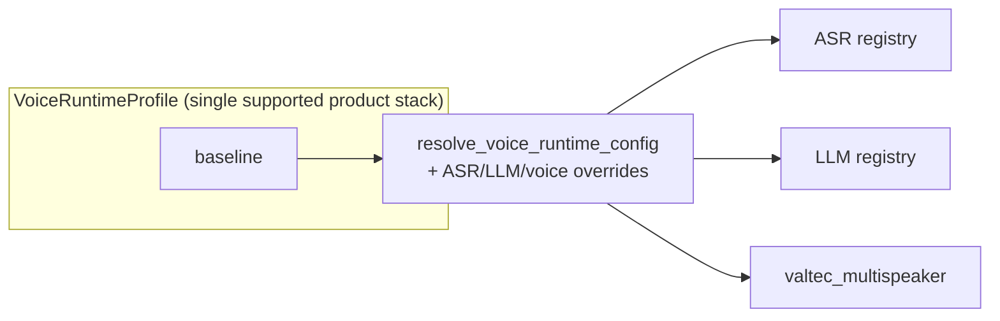

# 08 — Registries, Profiles & CLI

This is the operational layer: declare ASR/LLM models in **registries**, bind the supported stack to
the single **baseline profile**, and resolve explicit diagnostic overrides through the **CLI**.

## Three-Layer Model



## Registries: Metadata Only

| Registry | File              | Example Keys                                                                                                                                                                    |
| -------- | ----------------- | ------------------------------------------------------------------------------------------------------------------------------------------------------------------------------- |
| ASR      | `asr/registry.py` | `phowhisper_tiny` · `phowhisper_base` · `phowhisper_small` · `phowhisper_medium`                                                                                                |
| LLM      | `llm/registry.py` | `phogpt_4b_q4_k_m` · `arcee_vylinh_3b_q4_k_m` · `qwen3_0_6b_q8_0` · `qwen3_4b_q4_k_m` · `vinallama_*` · `dataops_*` · `bkai_llama2_*`                                           |
| TTS      | `tts/config.py` | một cấu hình cố định `VALTEC_TTS_CONFIG` (`valtec_multispeaker`) |

Each entry describes local paths, runtime role, prompt style, license notes, and related metadata.
Registries are metadata only; model weights load when a runtime is built.

## Profiles (`core/profiles.py`)

`VoiceRuntimeProfile` combines ASR + LLM policy, the fixed Valtec TTS key, and generation parameters
such as `max_tokens` and `temperature`. **Default = `baseline`**
(`DEFAULT_VOICE_RUNTIME_PROFILE_KEY`).

| Profile | ASR | LLM | TTS / voice | Mục đích |
|---|---|---|---|---|
| `baseline` | phowhisper_small | arcee_vylinh_3b | valtec_multispeaker / NF | Runtime mặc định duy nhất |

`validate_voice_runtime_profiles()` checks the singleton profile against its registries and enforces
`valtec_multispeaker` plus a known Valtec voice. Retired names such as `quality` and `edge` fail fast.

### Baseline Drives Both Chat and Voice

`soca ui`, `soca ask`, and `soca chat` resolve defaults from `baseline`. `--llm-model` can still be
used for a deliberate diagnostic/eval override without introducing another product profile.

## CLI (`soca/cli.py`)


| Command                                   | Description                                                                                    |
| ----------------------------------------- | ---------------------------------------------------------------------------------------------- |
| `soca voice [profile]`                    | Microphone voice loop. Supports `--no-speak-repairs`, `--press-enter-to-record`, and `--usage` |
| `soca ask <text>`                         | One text turn, with optional trace/usage output                                                |
| `soca chat`                               | Multi-turn text session with session memory                                                    |
| `soca ui [status\|chat\|voice] [profile]` | Textual TUI, requires the `ui` extra                                                           |
| `soca profiles`                           | List profiles without loading models                                                           |
| `soca asr-models` / `llm-models`          | List models and local file status                                                              |
| `soca asr-smoke` / `llm-smoke`            | Smoke-test one model                                                                           |
| `soca benchmark-asr` / `calibrate-asr`    | Benchmark/calibrate ASR thresholds, Table-VII style                                            |

## Optional Dependencies (`pyproject.toml`)

Install only what you need so the environment stays manageable:

| Extra | Purpose |
|---|---|
| `dev` | pytest, ruff, jupyter |
| `eval` | jiwer (WER), datasets, matplotlib |
| `llm` | llama-cpp-python, Metal build when needed |
| `tts` | Valtec dependencies: vinorm, viphoneme, underthesea, torchaudio |

Examples:

```bash
uv sync --extra dev --extra eval --extra tts
uv run soca ui voice baseline
```

## Changing the Supported Stack

1. Benchmark the candidate without adding a second public profile.
2. Update the `baseline` entry only after the candidate passes its quality and latency gates.
3. Run tests that call `validate_voice_runtime_profiles()` and reject retired profile names.
4. Smoke-test with `soca asr-smoke --model ...`, `llm-smoke`, or `soca voice baseline`.
5. Record the decision in `BENCHMARKS.md`.
