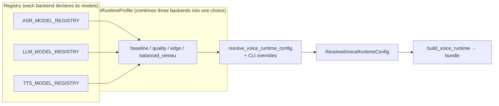

# 08 — Registries, Profiles & CLI

This is the operational layer: declare models in **registries**, combine them
into **profiles**, and select them through the **CLI**.

## Three-Layer Model



## Registries: Metadata Only

| Registry | File              | Example Keys                                                                                                                                                                    |
| -------- | ----------------- | ------------------------------------------------------------------------------------------------------------------------------------------------------------------------------- |
| ASR      | `asr/registry.py` | `phowhisper_tiny` · `phowhisper_base` · `phowhisper_small` · `phowhisper_medium`                                                                                                |
| LLM      | `llm/registry.py` | `phogpt_4b_q4_k_m` · `arcee_vylinh_3b_q4_k_m` · `qwen3_0_6b_q8_0` · `qwen3_4b_q4_k_m` · `vinallama_*` · `dataops_*` · `bkai_llama2_*`                                           |
| TTS      | `tts/registry.py` | `valtec_multispeaker` · `omnivoice` · `piper_vi_vivos_x_low` · `vieneu_v2_turbo/standard` · `mms_tts_vie` · `kani_370m_vie` · `viet_tts_onnx` · `vixtts` · `f5_vi_hynt/zalopay` |

Each entry describes local model paths, role (baseline/candidate/fallback), LLM
prompt style, license notes, and related metadata. Registries are **metadata
only**; real models load when a runtime is built.

## Profiles (`core/profiles.py`)

`VoiceRuntimeProfile` combines ASR + LLM + TTS + generation parameters such as
`max_tokens` and `temperature`. **Default = `baseline`**
(`DEFAULT_VOICE_RUNTIME_PROFILE_KEY`).

| Profile           | ASR              | LLM             | TTS / voice                | Direction                         |
| ----------------- | ---------------- | --------------- | -------------------------- | --------------------------------- |
| `baseline`        | phowhisper_base  | arcee_vylinh_3b | valtec_multispeaker / NF   | **Fast default**, low RTF         |
| `quality`         | phowhisper_small | arcee_vylinh_3b | omnivoice / emgai_dangiu   | Better voice quality, slower CPU  |
| `edge`            | phowhisper_base  | qwen3_0_6b      | piper_vi_vivos_x_low       | Lower RAM fallback                |
| `balanced_vieneu` | phowhisper_base  | arcee_vylinh_3b | vieneu_v2_turbo / XuanVinh | Balanced quality/latency target   |

`validate_voice_runtime_profiles()` checks that every profile points to existing
registry keys. Tests call this so bad keys fail early.

### Profiles Drive Both Chat and Voice

`soca ui`, `soca ask`, and `soca chat` resolve the LLM **from the selected
profile** instead of hardcoding it. `--llm-model` overrides both text and voice.
This keeps profile selection consistent across modes; choosing `baseline` means
the same Vylinh model path is used wherever an LLM is needed.

## CLI (`soca/cli.py`)


| Command                                   | Description                                                                                   |
| ----------------------------------------- | --------------------------------------------------------------------------------------------- |
| `soca voice [profile]`                    | Microphone voice loop. Supports `--no-speak-repairs`, `--press-enter-to-record`, and `--usage` |
| `soca ask <text>`                         | One text turn, with optional trace/usage output                                                |
| `soca chat`                               | Multi-turn text session with session memory                                                    |
| `soca ui [status\|chat\|voice] [profile]` | Textual TUI, requires the `ui` extra                                                           |
| `soca profiles`                           | List profiles without loading models                                                           |
| `soca asr-models` / `llm-models`          | List models and local file status                                                              |
| `soca asr-smoke` / `llm-smoke`            | Smoke-test one model                                                                            |
| `soca benchmark-asr` / `calibrate-asr`    | Benchmark/calibrate ASR thresholds, Table-VII style                                             |

## Optional Dependencies (`pyproject.toml`)

Install only what you need so the environment stays manageable:

| Extra                                                   | Purpose                                                          |
| ------------------------------------------------------- | ---------------------------------------------------------------- |
| `dev`                                                   | pytest, ruff, jupyter                                            |
| `eval`                                                  | jiwer (WER), datasets, matplotlib                                |
| `llm`                                                   | llama-cpp-python, Metal build when needed                        |
| `tts`                                                   | core TTS dependencies: vinorm, viphoneme, underthesea, torchaudio |
| `tts-piper` / `tts-omnivoice` / `tts-vieneu` / `tts-f5` | optional heavier TTS engines                                     |
| `ui`                                                    | Textual, required for `soca ui`                                  |

Examples:

```bash
uv sync --extra dev --extra eval --extra tts
uv run --extra ui soca ui voice baseline
uv run --extra ui --extra tts-omnivoice soca ui voice quality
```

## Adding a New Model

1. Add an entry to the relevant registry (`asr/llm/tts/registry.py`) and place the
   model file under `models/`.
2. Optionally add or update a `VoiceRuntimeProfile` in `core/profiles.py`.
3. Run tests that call `validate_voice_runtime_profiles()`.
4. Smoke-test with `soca asr-smoke --model ...`, `llm-smoke`, or `soca voice`.
5. Run a bake-off and update `BENCHMARKS.md` if the default should change.
