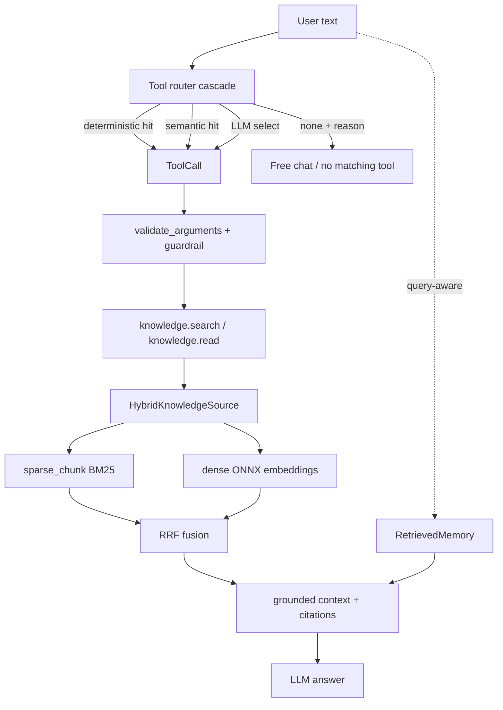
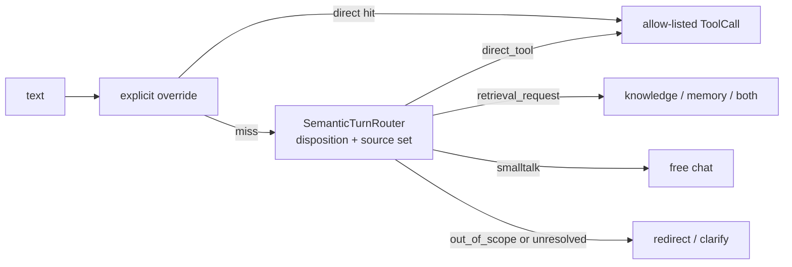

# 09 — Hybrid RAG, Tool Router & Retrieved Memory

This is the **P2 knowledge layer**: how SoCa turns a Markdown vault into grounded
answers. Three cooperating pieces sit behind the `AssistantRuntime` (see
[05 — assistant-runtime](./05-assistant-runtime.md)):

1. **Hybrid retrieval** — sparse (BM25) and dense (ONNX embeddings) fused with
   Reciprocal Rank Fusion, over a transactional v2 vault index.
2. **Capability policy** — deterministic overrides followed by an open-set
   semantic disposition/source decision; retrieval is not an executable tool.
3. **Retrieved memory** — query-aware long-term memory ranked by relevance,
   recency, and importance, with consent-gated episodic capture.

Knowledge and memory reuse the **same retrieval implementation** but stay on
**separate corpora and cache namespaces**, so a `knowledge.search` can never
surface a private memory note.

## One diagram

## Hybrid retrieval

The retriever stack lives in `soca/knowledge/`:

| Concern              | Module                                   |
| -------------------- | ---------------------------------------- |
| Sparse (BM25) chunks | `retrievers/sparse_chunk.py`             |
| Sparse whole-doc     | `retrievers/sparse_document.py`          |
| Dense embeddings     | `retrievers/dense.py` (fastembed / ONNX) |
| Rank fusion          | `retrievers/rrf.py`                      |
| Fusion source        | `hybrid_source.py`                       |
| Cached vault index   | `cached_source.py`, `index/`             |
| Factory + config     | `factory.py` (`build_retrieval_source`)  |

`build_retrieval_source(vault, include_globs, config=RetrievalConfig(mode=...))`
selects `cached_sparse`, `chunk_sparse`, or `hybrid`; the `RetrievalConfig`
default uses the v2 lifecycle. There is no standalone `dense` mode. Sparse
sync is transactional and dense document embedding is an explicit index-build
operation, never part of `search()`/`retrieve()`. A query loads only a READY
generation whose corpus revision and embedding fingerprint match exactly;
otherwise it serves sparse-only and exposes the stale/missing state. Chunks
are line-anchored, so `KnowledgeCitation` carries `line_start`/`line_end` back
to the UI.

The lifecycle/operations details are in
[11 — index lifecycle](./11-index-lifecycle.md).

**RRF** scores a document as `Σ 1/(k + rank)` across the sparse and dense rank
lists (`k=60`). When the embedding model is unavailable the source degrades to
sparse-only — the pre-P2 behavior — so retrieval never hard-fails.

Historical pre-guard numbers on real XQuAD-Vietnamese (1,193 questions) are in
[BENCHMARKS.md → P2.1](../BENCHMARKS.md). The current guarded model comparison,
including the migrated local vault incident regression, is in
[BENCHMARKS.md → P2.1.1](../BENCHMARKS.md).

### Active local knowledge vault

The product runtime now queries the migrated local vault at
`~/KnowledgeVault/wiki/`. It contains two knowledge areas:

- learning notes: Bayes and ONNX Runtime;
- life/project notes: the TTS decision, hybrid RAG architecture, a clearly
  synthetic food ledger, and health safety boundaries.

The synthetic finance note remains explicitly marked as non-personal data. The
health note is a disclaimer-only guardrail. These notes are in the real local
vault and are not committed to the repository.

### Voice capability policy

Chat and voice can construct the same semantic policy from
`eval/prompts/turn_routing_vi.jsonl`; voice now provisions the same local
embedder when semantic routing is enabled.  The old `RetrievalIntentGate` is a
legacy compatibility path, not the target policy.  Semantic voice routing is
still opt-in until its full paired chat/ASR calibration and TTFA gate pass.

## Tool router cascade

The router decides tool use without ever executing a tool itself — the model
only proposes; `ToolRuntime` validates and runs.

| Stage         | Module                         | Notes                                                |
| ------------- | ------------------------------ | ---------------------------------------------------- |
| Config/schema | `core/tool_routing.py`         | Frozen config, robust JSON parser, decision schema   |
| Deterministic | `core/runtime.py`              | Explicit prefixes, scoped read paths, no NL guessing |
| Semantic      | `core/semantic_turn_router.py` | disposition + multi-source examples, threshold/margin |
| LLM           | `core/llm_tool_router.py`      | Prompt JSON or JSON-schema, one repair, fallback     |
| Cascade       | `core/router_cascade.py`       | Short-circuits deterministic → semantic → LLM        |
| Construction  | `core/router_setup.py`         | `build_runtime_tool_router(...)`                     |

Invariants worth remembering:

- **`none` is no longer a policy.** `smalltalk`, `out_of_scope`, and
  `unresolved` have distinct dispositions. OOS never falls through to an answer
  model and cannot execute a direct tool.
- **Text and voice use the same semantic contract.** The LLM router tier is
  intentionally not enabled as a text-only fallback while voice has not passed
  its privacy/latency gate.
- **The executable catalog has four product tools only:** `knowledge.search`,
  `knowledge.read`, `local_time.now`, and `memory.search`. There are no weather,
  device-control, scheduling, or memory-write tools.
- **Safety stays in guardrails.** Prompt injection, path traversal, schema,
  side-effect, and unsupported realtime-claim checks remain guardrail
  responsibilities; they are not capability classifiers.
- **Structured output is an optimization, not a requirement.** Remote uses JSON
  schema with `require_parameters=true`; local `llama.cpp` uses a JSON-schema →
  GBNF grammar. Both fall back to prompted JSON when unavailable.
- Router latency is timed end-to-end into
  `RuntimeTrace.stage_latencies_ms["tool_router"]`.

## Retrieved memory

Long-term memory is a **client of the same retriever**, not a second database.
The stack is in `soca/memory/`:

| Concern              | Module                                      |
| -------------------- | ------------------------------------------- |
| Query-aware retrieval | `retrieved.py` (`RetrievedMemory`)          |
| Search tool          | `tools/memory_tools.py` (`memory.search`)   |
| Ranking signals      | `scoring.py` (relevance/recency/importance) |
| Blob fallback + profile | `longterm.py` (`MarkdownLongTermMemory`)  |
| Profile + episode merge | `composite.py`                            |
| Working-memory summary | `compaction.py`                           |
| Episodic store       | `episodes.py`                               |
| Proposals + approval  | `proposals.py`, `commands.py`              |
| Background reflection | `reflection.py`                            |
| Safe frontmatter parse | `frontmatter.py`                          |
| Setup + wiring       | `core/memory_setup.py`                      |

Archive retrieval is now explicitly requested by the semantic source decision
or `memory:` override; it is not run for ordinary smalltalk/free-chat turns.
`MemoryContextBuilder.build(..., include_archive=False)` contributes only the
always-on bounded working/profile context. Archive snippets become `[M#]`
grounded context only when selected.

Working memory is typed as complete `ConversationTurn`s instead of a flat
message deque. The `working_v1_4k` policy caps target/high/hard prompt tokens at
768/896/1024. It currently degrades to transparent `trim_only`: the dedicated
local summary worker and its model registry exist, but no candidate has passed
the held-out quality-first bake-off, so no extractive/regex summary, remote
fallback, or automatic weight download is used. `/memory compact`, `status`,
and `cancel` share the same coordinator in CLI and UI.

### Human-in-the-loop capture

Durable memory is never written automatically.

- Episodic summaries persist **only** when `episodic_memory_enabled=true` and the
  user has given explicit consent; raw transcripts are never stored.
- `reflection.py` runs in the background and produces **immutable proposals**;
  the LLM cannot approve its own writes.
- Approval/rejection is a deterministic application command
  (`commands.py`) keyed by the exact pending proposal ID — not an LLM-callable
  tool.
- Approved notes land under `<vault>/memory/captured/<uuid>.md` with restrictive
  permissions; `private/`, dot-directories, and symlinks are never indexed.
- `memory.propose_note` may create only a pending proposal. It is a local-state
  tool with human approval still required; it never writes an approved note.

See the memory lifecycle and compaction numbers in
[BENCHMARKS.md → P2.3](../BENCHMARKS.md).

## Corpus isolation

| Corpus    | Include glob     | Cache namespace     |
| --------- | ---------------- | ------------------- |
| Knowledge | `wiki/**/*.md`   | `knowledge/default` |
| Memory    | `memory/**/*.md` | `memory`            |

Wiring happens at exactly two sites — `soca/core/voice_runtime.py` (voice) and
`soca/app/text_runtime.py` (text) — through `knowledge_setup.py`,
`memory_setup.py`, and `router_setup.py`. The runtime, guardrails, and voice
loop are untouched by the knowledge layer.
