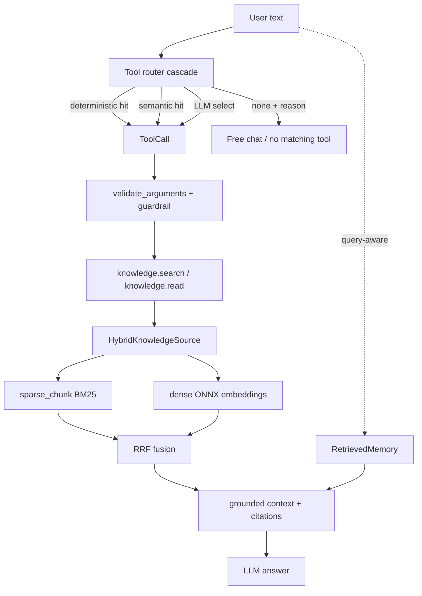
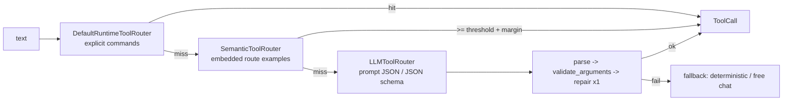

# 09 — Hybrid RAG, Tool Router & Retrieved Memory

This is the **P2 knowledge layer**: how SoCa turns a Markdown vault into grounded
answers. Three cooperating pieces sit behind the `AssistantRuntime` (see
[05 — assistant-runtime](./05-assistant-runtime.md)):

1. **Hybrid retrieval** — sparse (BM25) and dense (ONNX embeddings) fused with
   Reciprocal Rank Fusion, over a cached vault index.
2. **Tool router** — a deterministic → semantic → LLM cascade that decides
   whether a turn calls a tool, always validated before execution.
3. **Retrieved memory** — query-aware long-term memory ranked by relevance,
   recency, and importance, with consent-gated episodic capture.

Knowledge and memory reuse the **same retrieval implementation** but stay on
**separate corpora and cache namespaces**, so a `knowledge.search` can never
surface a private memory note.

## One diagram



## Hybrid retrieval

The retriever stack lives in `soca/knowledge/`:

| Concern              | Module                                   |
| -------------------- | ---------------------------------------- |
| Sparse (BM25) chunks | `retrievers/sparse_chunk.py`             |
| Sparse whole-doc     | `retrievers/sparse_document.py`          |
| Dense embeddings     | `retrievers/dense.py` (fastembed / ONNX) |
| Rank fusion          | `retrievers/rrf.py`                      |
| Fusion source        | `hybrid_source.py`                       |
| Cached vault index   | `cached_source.py`, `index/`             |
| Factory + config     | `factory.py` (`build_retrieval_source`)  |

`build_retrieval_source(vault, include_globs, config=RetrievalConfig(mode=...))`
selects a variant: `cached_sparse`, `chunk_sparse`, `dense`, or `hybrid`. The
vault index is built once and reused across queries (invalidated on file
mtime/size change), which removes the re-read-every-query cost of the naive
Markdown vault reader. Chunks are line-anchored, so `KnowledgeCitation` carries
`line_start`/`line_end` back to the UI.

**RRF** scores a document as `Σ 1/(k + rank)` across the sparse and dense rank
lists (`k=60`). When the embedding model is unavailable the source degrades to
sparse-only — the pre-P2 behavior — so retrieval never hard-fails.

Measured numbers on real XQuAD-Vietnamese (1,193 questions) are in
[BENCHMARKS.md → P2.1](../BENCHMARKS.md): hybrid reaches Recall@5 0.994 vs 0.979
for BM25 alone, at ~4 ms extra p95.

### Assistant-like demo corpus

The broad `real_rag_vault` benchmark is useful for retrieval metrics, but it is
not a personal assistant demo. The reproducible demo corpus lives at
`eval/fixtures/knowledge_demo_vault` and is built with:

```bash
uv run python scripts/seed_demo_knowledge.py --fixture
```

It has two explicit slices and eight grounded queries in
`eval/prompts/knowledge_demo_vi.jsonl`:

- `learning_notes`: a Bayes study note and an ONNX Runtime engineering note;
- `life_vault`: the Valtec TTS decision, project RAG notes, a clearly synthetic
  food-budget ledger, and a health safety-boundary note.

The finance note is marked synthetic and the health note is a disclaimer-only
guardrail. Neither is treated as private user data. The old
`eval/fixtures/knowledge_vault` is intentionally retained as a minimal unit-test
fixture so regression tests do not depend on the larger demo corpus.

### Voice gating

Retrieval in the voice loop is gated by `knowledge/intent_gate.py`
(`RetrievalIntentGate`). Modes: `off`, `intent` (default), `always`. `intent`
reuses the turn's own query embedding and only retrieves when the max cosine
similarity clears a threshold — nearly free, and safe because guardrails run
per-sentence on the LLM route (see
[streaming architecture](./03-voice-pipeline.md)).

## Tool router cascade

The router decides tool use without ever executing a tool itself — the model
only proposes; `ToolRuntime` validates and runs.



| Stage         | Module                         | Notes                                                |
| ------------- | ------------------------------ | ---------------------------------------------------- |
| Config/schema | `core/tool_routing.py`         | Frozen config, robust JSON parser, decision schema   |
| Deterministic | `core/runtime.py`              | Explicit prefixes, scoped read paths, no NL guessing |
| Semantic      | `core/semantic_tool_router.py` | Route examples + explicit `none`, threshold/margin   |
| LLM           | `core/llm_tool_router.py`      | Prompt JSON or JSON-schema, one repair, fallback     |
| Cascade       | `core/router_cascade.py`       | Short-circuits deterministic → semantic → LLM        |
| Construction  | `core/router_setup.py`         | `build_runtime_tool_router(...)`                     |

Invariants worth remembering:

- **The router never kills a turn.** Parse failure, invalid schema, unknown
  tool, timeout, rate-limit, and provider errors all degrade to
  deterministic/free-chat. Only construction-time config errors fail fast.
- **Text uses the cascade by default.** Semantic is enabled with the checked-in
  Vietnamese examples and degrades to Tier 0 when its embedding model is absent;
  voice keeps semantic/LLM routing off until a paired TTFA gate (≤10%) is met.
- **The executable catalog has five product tools only:**
  `knowledge.search`, `knowledge.read`, `local_time.now`, `memory.search`, and
  `memory.propose_note`. There are no weather, device-control, or scheduling
  tools. Requests for those capabilities remain ordinary free chat and cannot
  trigger a fake tool call.
- **Safety stays in guardrails.** Prompt injection, path traversal, schema,
  side-effect, and unsupported realtime-claim checks remain guardrail
  responsibilities; they are not capability classifiers.
- **Structured output is an optimization, not a requirement.** Remote uses JSON
  schema with `require_parameters=true`; local `llama.cpp` uses a JSON-schema →
  GBNF grammar. Both fall back to prompted JSON when unavailable.
- Router latency is timed end-to-end into
  `RuntimeTrace.stage_latencies_ms["tool_router"]`.

## Retrieved memory

Long-term memory is a **client of the same retriever**, not a second database.
The stack is in `soca/memory/`:

| Concern                 | Module                                      |
| ----------------------- | ------------------------------------------- |
| Query-aware retrieval   | `retrieved.py` (`RetrievedMemory`)          |
| Search tool             | `tools/memory_tools.py` (`memory.search`)   |
| Ranking signals         | `scoring.py` (relevance/recency/importance) |
| Blob fallback + profile | `longterm.py` (`MarkdownLongTermMemory`)    |
| Profile + episode merge | `composite.py`                              |
| Working-memory summary  | `compaction.py`                             |
| Episodic store          | `episodes.py`                               |
| Proposals + approval    | `proposals.py`, `commands.py`               |
| Background reflection   | `reflection.py`                             |
| Safe frontmatter parse  | `frontmatter.py`                            |
| Setup + wiring          | `core/memory_setup.py`                      |

Instead of dumping the whole `profile.md` into every prompt,
`RetrievedMemory.retrieve_profile(query)` retrieves the top-k relevant chunks and
ranks them by a normalized blend of **relevance**, **recency** (time decay), and
**importance**. Each score component is kept in the trace for debugging. The
old blob behavior is still reachable (`memory_mode=blob` →
`MarkdownLongTermMemory`) and a golden test asserts core-only ≡ blob for
compatibility.

Working memory is bounded: recent turns stay verbatim while older turns are
compacted off the hot path (extractive by default; any LLM summary runs in the
background, never mid-turn while TTFA is pending).

### Human-in-the-loop capture

Durable memory is never written automatically.

- Episodic summaries persist **only** when `episodic_memory_enabled=true` and the
  user has given explicit consent; raw transcripts are never stored.
- `reflection.py` runs in the background and produces **immutable proposals**;
  the LLM cannot approve its own writes.
- Approval/rejection is a deterministic application command
  (`commands.py`) keyed by the exact pending proposal ID — not an LLM-callable
  tool.
- Approved notes land under `<vault>/memory/captured/<uuid>.md` with restrictive
  permissions; `private/`, dot-directories, and symlinks are never indexed.
- `memory.propose_note` may create only a pending proposal. It is a local-state
  tool with human approval still required; it never writes an approved note.

See the memory lifecycle and compaction numbers in
[BENCHMARKS.md → P2.3](../BENCHMARKS.md).

## Corpus isolation

| Corpus    | Include glob     | Cache namespace     |
| --------- | ---------------- | ------------------- |
| Knowledge | `wiki/**/*.md`   | `knowledge/default` |
| Memory    | `memory/**/*.md` | `memory`            |

Wiring happens at exactly two sites — `soca/core/voice_runtime.py` (voice) and
`soca/app/text_runtime.py` (text) — through `knowledge_setup.py`,
`memory_setup.py`, and `router_setup.py`. The runtime, guardrails, and voice
loop are untouched by the knowledge layer.
