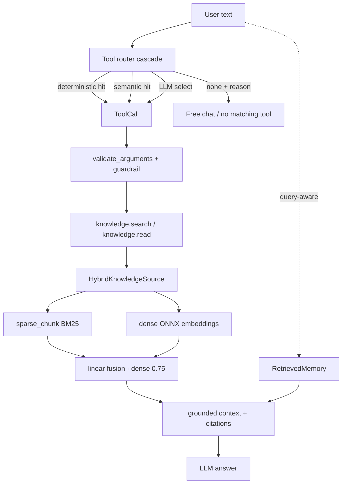
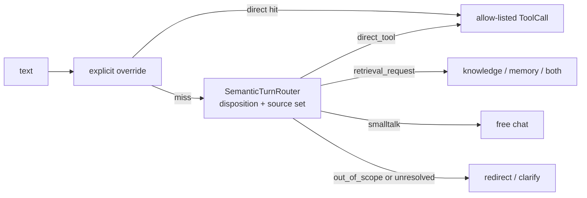

# Hybrid RAG, Tool Router & Retrieved Memory

This is the knowledge layer: how SoCa turns a Markdown vault into grounded
answers. Three cooperating pieces sit behind the `AssistantRuntime` (see
[05 — assistant-runtime](./05-assistant-runtime.md)):

1. **Hybrid retrieval** — sparse BM25 and dense embeddings fused by the
   benchmarked linear profile, over a transactional v2 vault index.
2. **Capability policy** — deterministic overrides followed by an open-set
   semantic disposition/source decision; retrieval is not an executable tool.
3. **Retrieved memory** — query-aware long-term memory ranked by relevance,
   recency, and importance. Episodic capture remains evaluator-only.

Knowledge and memory reuse the **same retrieval implementation** but stay on
**separate corpora and cache namespaces**, so a `knowledge.search` can never
surface a private memory note.

## One diagram

## Hybrid retrieval

The retriever stack lives in `soca/knowledge/`:

| Concern | Module |
| --- | --- |
| Production BM25 | `retrievers/bm25.py` |
| Production dense | `retrievers/dense.py` (`VietnameseEmbeddingV2Model`) |
| Linear fusion | `retrievers/linear.py` |
| Exact vector top-k | `indexing/vector.py` |
| Fusion source | `hybrid_source.py` |
| Transactional lifecycle | `indexing/` |
| Factory + config | `factory.py` (`build_retrieval_source`) |

`build_retrieval_source(vault, include_globs, config=RetrievalConfig(mode=...))`
selects the explicit benchmark/evaluation profile `cached_sparse`, the sparse
diagnostic profile `chunk_sparse`, or production `hybrid`. Production defaults
to lifecycle v2/schema v3, BM25 plus `AITeamVN/Vietnamese_Embedding_v2`, and
linear fusion with dense weight `0.75`.
There is no standalone production dense mode. Sparse sync is transactional and
`search()`/`retrieve()` never embeds documents. A query loads only the active
READY generation whose corpus revision and complete embedding fingerprint
match exactly. Missing, stale, failed or corrupt dense state raises visibly;
production never silently serves sparse-only. Chunks are line-anchored, so
`KnowledgeCitation` carries `line_start`/`line_end` back to the UI.

The lifecycle/operations details are in
[11 — index lifecycle](./11-index-lifecycle.md).

Production min-max normalizes sparse and dense candidate scores independently,
then computes `0.25 × sparse + 0.75 × dense`. RRF, FastEmbed, BGE-M3,
rerankers and ANN backends remain benchmark/research variants only.

Historical and current numbers on real Vietnamese retrieval corpora are in
[BENCHMARKS.md → Knowledge retrieval](../BENCHMARKS.md#6-knowledge-retrieval).

### Active local knowledge vault

The product runtime queries the configured private vault, not a repository demo
fixture. The vault path, corpus revision, document/chunk counts and dense index
readiness are exposed by `/status`; private note contents and index payloads are
never committed to the repository. Demo fixtures remain smoke/evaluation data
and are not release evidence.

### Voice capability policy

Chat and voice construct the same semantic policy from
`eval/prompts/turn_routing_vi.jsonl` and use the same local route embedder.
The old ASR-only `RetrievalIntentGate` and `voice_knowledge_mode` path have
been removed. A transcript is routed once, regardless of whether it came from
text or ASR; retrieval then selects Knowledge/Memory and the runtime performs
the same evidence and answer policy. When semantic routing is explicitly
enabled, its pinned local embedder is a readiness dependency: if it is missing
or invalid, construction fails and the surface is not ready. It does not
silently fall back to deterministic routing. The semantic router remains
disable-able with the shared `--no-semantic-router` flag for diagnostics. A
disabled router is an explicit diagnostic configuration, not a production
fallback.

## Tool router cascade

The router decides tool use without ever executing a tool itself — the model
only proposes; `ToolRuntime` validates and runs.

| Stage         | Module                         | Notes                                                |
| ------------- | ------------------------------ | ---------------------------------------------------- |
| Config/schema | `core/tool_routing.py`         | Frozen config, robust JSON parser, decision schema   |
| Deterministic | `core/runtime.py`              | Explicit prefixes, scoped read paths, no NL guessing |
| Semantic      | `core/semantic_turn_router.py` | disposition + multi-source examples, threshold/margin |
| LLM           | `core/llm_tool_router.py`      | Prompt JSON or JSON-schema, one typed repair         |
| Cascade       | `core/router_cascade.py`       | Short-circuits deterministic → semantic → LLM        |
| Construction  | `core/router_setup.py`         | `build_runtime_tool_router(...)`                     |

Invariants worth remembering:

- **`none` is no longer a policy.** `smalltalk`, `out_of_scope`, and
  `unresolved` have distinct dispositions. OOS never falls through to an answer
  model and cannot execute a direct tool.
- **Text and voice use the same semantic contract.** The optional LLM-router
  tier remains independently gated off for voice; semantic capability routing
  itself is not ASR-specific.
- **The executable catalog has four product tools only:** `knowledge.inspect`,
  `knowledge.search`, `knowledge.read`, and `memory.search`. There are no
  realtime, weather, device-control, scheduling, or memory-write tools.
- **Safety stays in guardrails.** Prompt injection, path traversal, schema,
  side-effect, and unsupported realtime-claim checks remain guardrail
  responsibilities; they are not capability classifiers.
- **Structured output is an explicit provider capability.** Remote uses JSON
  schema with `require_parameters=true`; local `llama.cpp` uses a JSON-schema →
  GBNF grammar. An unavailable requested structured-output mode is reported as
  a typed routing failure; the runtime does not silently change response mode.
- Router latency is timed end-to-end into
  `RuntimeTrace.stage_latencies_ms["tool_router"]`.

## Retrieved memory

Long-term memory is a **client of the same retriever**, not a second database.
The stack is in `soca/memory/`:

| Concern              | Module                                      |
| -------------------- | ------------------------------------------- |
| Query-aware retrieval | `retrieved.py` (`RetrievedMemory`)          |
| Search tool          | `tools/memory_tools.py` (`memory.search`)   |
| Ranking signals      | `scoring.py` (relevance/recency/importance) |
| Approved always-on memory | `core.py` (`CoreMemoryStore`) |
| Deferred episodic evaluator | `eval/experimental/memory_lifecycle.py` |
| Working-memory summary | `compaction_coordinator.py`               |
| Proposals + approval  | `proposals.py`, `commands.py`              |
| Background reflection | not wired in production                   |
| Safe frontmatter parse | `frontmatter.py`                          |
| Setup + wiring       | `core/memory_setup.py`                      |

Archive retrieval is now explicitly requested by the semantic source decision
or `memory:` override; it is not run for ordinary smalltalk/free-chat turns.
`MemoryContextBuilder.build(..., include_archive=False)` contributes only the
always-on bounded working/core context. Archive snippets become `[M#]`
grounded context only when selected. Production setup uses `memory/core.json`
for explicitly approved core items and Markdown notes under `memory/` for
retrieved archive evidence. There is no unbounded always-on archive payload.

`MemoryAccessPlan` records core/working inclusion, archive mode (`none` or
`semantic`), archive query, and reason. The production runtime provisions
semantic archive retrieval only; episodic capture remains an evaluator-only
research surface outside the production memory package.
`PromptContextAssembler` combines already-selected blocks and never searches a
corpus, so archive access remains visible in the runtime policy.

Working memory is typed as complete `ConversationTurn`s instead of a flat
message deque. The production `working_v2_16k` policy uses
target/high/hard limits of 12,000/15,000/16,384 tokens. At the high watermark,
chat and voice start `Qwen3-4B-Instruct-2507 Q4_K_M` in an isolated local
process, publish its typed artifact with generation CAS, then unload it.
The summary artifact and decoder output budget are both 2,048 tokens; the model
is instructed to shorten the structured JSON before reaching the hard decoder
cap, with one in-process repair pass if the first candidate is invalid.
Summary context is allocated dynamically from 4K to 32K. A missing or invalid
private weight is an explicit unavailable state: background-summary mode keeps
the source turns and does not silently trim or switch models. `trim_only` is
available only when the caller explicitly selects the no-LLM policy; there is
no extractive/regex summary, remote summary fallback, or automatic runtime
download. `/compact`,
`status`, and `cancel` share the same coordinator in CLI and UI.

Session state is `ram_only` by default. Explicit `local_resumable` mode uses
`SessionCheckpointStore` under the XDG state directory with atomic writes,
private `0700/0600` permissions, schema-versioned wrapper payloads, legacy
working-checkpoint reads, and a revision guard. It also enables a separate
private goal checkpoint for the controlled workflow: the active typed goal and
the last terminal run identity/status survive restart. Neither checkpoint
contains API keys, retrieved snippets, core values, tool results, or vectors.
Corrupt or unknown-schema goal state is surfaced as an error; it is never
silently reset. `clear` deletes the working checkpoint; goal cancellation
clears the active goal while retaining the last run record for diagnostics.

### Human-in-the-loop capture

Durable memory is never written automatically.

- Episodic capture is not wired into the production chat/voice runtime. Any
  future episodic writer must require explicit consent and never store raw
  transcripts; the current code keeps only the typed research primitives.
- Proposal and approval primitives (`proposals.py`, `commands.py`) are retained
  for an explicitly provisioned future capture workflow; no production chat or
  voice runtime currently creates a proposal or writes durable memory.
- If a pending proposal is provisioned externally, approval/rejection is a
  deterministic application command keyed by its exact ID — never an
  LLM-callable tool.
- Approved notes land under `<vault>/memory/captured/<uuid>.md` with restrictive
  permissions; `private/`, dot-directories, and symlinks are never indexed.

See the memory lifecycle and compaction numbers in
[BENCHMARKS.md → Working-memory summarization](../BENCHMARKS.md#7-working-memory-summarization).

## Corpus isolation

| Corpus    | Include glob     | Cache namespace     |
| --------- | ---------------- | ------------------- |
| Knowledge | `wiki/**/*.md`   | `knowledge/default` |
| Memory    | `memory/**/*.md` | `memory`            |

Wiring happens at exactly two sites — `soca/core/voice_runtime.py` (voice) and
`soca/app/text_runtime.py` (text) — through `knowledge_setup.py`,
`memory_setup.py`, and `router_setup.py`. The runtime, guardrails, and voice
loop are untouched by the knowledge layer.
