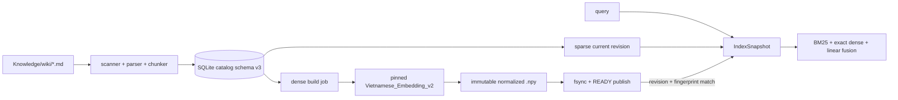

# 11 — Transactional Knowledge Index Lifecycle

The production retrieval path uses `soca/knowledge/indexing/`. It separates
source-of-truth notes, sparse catalog state, dense vectors, and derived search
backends so a query never performs document embedding itself.

## Runtime flow



The catalog is stored below the active vault at `Knowledge/.soca/knowledge_index/`
(or the configured `index_home`):

```text
v2/index.sqlite3
v2/generations/<corpus-prefix>/vectors-<generation-id>.npy
```

SQLite contains corpus/file/chunk metadata, revisions, job leases, active/previous
generation pointers, generation metadata and row-to-chunk mappings. It does not
use a vector extension. The normalized `float32` `.npy` matrix is the canonical
vector artifact. Production searches it with deterministic exact NumPy top-k.
FAISS/HNSW are evaluation-only and are not runtime fallbacks.

## State and triggers

Sparse sync handles add/edit/delete/rename in one transaction. A changed note
increments the sparse revision. The watcher reconciles the change and publishes
a matching dense generation. A request never combines sparse revision N with a
dense generation for another revision: absent, stale, failed or corrupt dense
state raises instead of silently switching to sparse.

Document embedding is triggered by:

```bash
uv run soca knowledge index build --dense --verify-content
```

It is also triggered by the production watcher at startup and after a detected
vault change. The command and watcher are offline and fail clearly if the
pinned model is not already installed. Provisioning is explicit:

```bash
uv run soca knowledge model status
uv run soca knowledge model install aiteamvn-v2
uv run soca knowledge model verify aiteamvn-v2
```

No search, chat, voice or status path downloads weights. The installer pins the
Hugging Face revision plus SHA-256 of `model.safetensors` and `tokenizer.json`.
The production model lives at:

```text
~/.local/share/soca/models/knowledge/aiteamvn_v2/
```

The watcher is a latency optimization, not the correctness source. Every
reconcile scans authoritative Markdown metadata, and `--verify-content`
additionally hashes every source file.

## Identity and safety

The corpus identity hashes resolved vault path, corpus kind (`knowledge` or `memory`), include/exclude policy and policy version. Embedding reuse hashes the full embedding fingerprint plus exact passage input, not path or line number. Therefore a rename or line shift can reuse a vector, while changing the model revision, prefix, tokenizer, dimension or normalization forces a rebuild.

Document encoding runs in batches of 32 and heartbeats its lease after every
batch. Unchanged passage hashes reuse vectors across edits, line shifts and
renames. Publish is crash-safe: write a temporary `.npy`, flush and `fsync`,
atomically rename and sync the parent directory, validate
shape/dtype/finite/non-zero norm/checksum, then swap the active pointer in a
short SQLite transaction. The former active generation becomes the explicit
previous rollback target. A failed build never replaces it, but production also
never serves that old generation against a newer corpus revision.

The chunker fingerprint is persisted with the corpus. Changing its algorithm,
target size, overlap or heading policy forces authoritative rechunking even
when Markdown files did not change. Schema-v3 production uses
`chunker-v2/section-heading-content-v2`: heading-only parent sections are not
indexed, while an oversized first content line stays attached to its heading.
The context selector retrieves a pool four times the final evidence limit and
keeps at most one best chunk per document. This prevents duplicate chunks from
one note consuming every citation slot.

All index directories are mode `0700` and files are mode `0600` on POSIX.
Paths are relative to the vault, Markdown-only, and symlinks/dot/private paths
are excluded by the vault reader. `verify` checks SQLite integrity, foreign
keys, pointers, permissions, checksums, row counts, matrix shape and vector
validity without network access. A checksum is cached in-process only while
device, inode, size, mtime and ctime remain unchanged. `gc` is a dry-run unless
`--apply` is supplied; active/previous generations are protected and other
artifacts have a seven-day grace period.

## Commands and diagnosis

```bash
uv run soca knowledge index status
uv run soca knowledge index inspect
uv run soca knowledge index migrate
uv run soca knowledge index build --sparse-only
uv run soca knowledge index build --dense
uv run soca knowledge index rebuild
uv run soca knowledge index verify
uv run soca knowledge index rollback
uv run soca knowledge index watch
uv run soca knowledge index gc
uv run soca knowledge index gc --apply
```

Important states:

- `sparse_state=ready`, `dense_state=ready`: hybrid may run;
- `dense_state=absent|stale|building|failed`: production retrieval fails visibly;
- `dense_state=model_missing`: provision the declared model explicitly;
- empty corpus: a valid empty result, not a backend failure;
- `verify` errors: inspect, rebuild, or deliberately rollback; do not hand-edit
  cache files.

The v1 JSON manifest remains a migration hint only. `index migrate` imports its
sparse information non-destructively, revalidates the vault and writes the
SQLite catalog. Schema v2 upgrades in-place to schema v3 by reconstructing the
active generation pointer from the newest compatible READY generation. Old v1
dense vectors are never trusted when their fingerprint is incomplete.

`index rollback` is an operator action, not an automatic fallback. It swaps to
the previous generation only when revision and source digest still match the
current corpus. Any production model, fusion weight or vector-backend change
requires a new benchmark and decision record.
