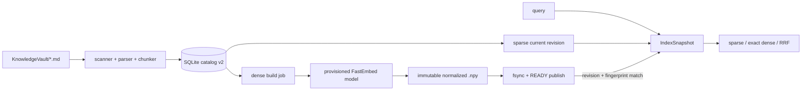

# 11 — Transactional Knowledge Index Lifecycle

The production retrieval path uses `soca/knowledge/indexing/`. It separates source-of-truth notes, sparse catalog state, dense vectors, and derived search backends so editing a note cannot make a query wait for model inference.

## Runtime flow



The catalog is stored below `~/.config/soca/knowledge_index/v2/` (or the configured `index_home`):

```text
v2/index.sqlite3
v2/generations/<corpus-prefix>/vectors-<generation-id>.npy
```

SQLite contains corpus/file/chunk metadata, revisions, job leases, generation metadata and row-to-chunk mappings. It does not use a vector extension. The normalized `float32` `.npy` matrix is the canonical vector artifact; FAISS or another backend can later be rebuilt from that matrix without re-embedding.

## State and triggers

Sparse sync handles add/edit/delete/rename in one transaction. A changed note increments the sparse revision. The next query can see the sparse update immediately, while dense is `stale` until an explicit build or background worker publishes a matching generation.

Document embedding is triggered by:

```bash
uv run soca knowledge index build --dense
```

The command is offline and fails clearly if the model is not already installed. Provisioning is explicit:

```bash
uv run soca knowledge model status
uv run soca knowledge model install fastembed-e5-small
uv run soca knowledge model verify fastembed-e5-small
```

Runtime `status`, `search`, voice, and chat never download model weights and never call `embed_documents`. A watcher may reconcile changes and hand work to a worker, but watcher events are not the correctness source; startup/reconcile sync remains authoritative.

## Identity and safety

The corpus identity hashes resolved vault path, corpus kind (`knowledge` or `memory`), include/exclude policy and policy version. Embedding reuse hashes the full embedding fingerprint plus exact passage input, not path or line number. Therefore a rename or line shift can reuse a vector, while changing the model revision, prefix, tokenizer, dimension or normalization forces a rebuild.

Publish is crash-safe: write temporary `.npy`, flush and `fsync`, atomically rename and sync the parent directory, validate shape/dtype/finite/non-zero norm/checksum, then publish READY in a short SQLite transaction. A failed build does not replace the previous generation; a stale generation is never combined with a newer sparse revision.

All index directories/files are private on POSIX. Paths are relative to the vault, markdown-only, and symlinks/dot/private paths are excluded by the vault reader. `verify` checks SQLite integrity and generation file presence without network access. `gc` is a dry-run unless `--apply` is supplied.

## Commands and diagnosis

```bash
uv run soca knowledge index status
uv run soca knowledge index build --sparse-only
uv run soca knowledge index build --dense
uv run soca knowledge index verify
uv run soca knowledge index gc
uv run soca knowledge index gc --apply
```

Important states:

- `sparse_state=ready`, `dense_state=ready`: hybrid may run;
- `dense_state=absent|stale|building|failed`: sparse-only fallback;
- `dense_state=model_missing`: provision the declared model explicitly;
- `verify` errors: do not hand-edit cache files; rebuild or run dry-run GC.

The v1 JSON manifest remains a migration hint only. The first v2 sync imports it non-destructively, revalidates the vault, and writes SQLite v2. v1 dense vectors are not trusted when their fingerprint is incomplete.
