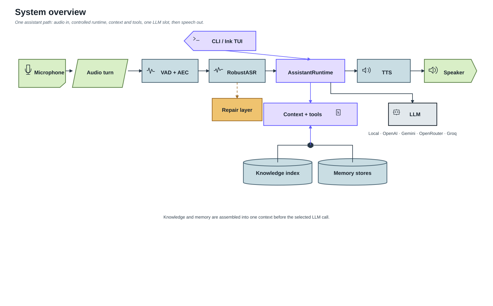

# SoCa system documentation

SoCa (Sơn Ca) is a local-first Vietnamese voice assistant. Audio capture,
endpointing, ASR, TTS, knowledge retrieval, memory, indexing and session state
run on the machine. The LLM is local by default; the user can explicitly select
OpenAI, Gemini, OpenRouter or Groq for both chat and voice. That selection sends
the transcript and assembled prompt context to the chosen provider.

These pages describe the implementation in `soca/` and `ui/`, not a future
plan. Plans and historical experiments stay in `zplan/`; measured benchmark
results stay in [`BENCHMARKS.md`](../BENCHMARKS.md). The canonical current-state
map is [00-system-map](./00-system-map.md).

## Start here

1. [System map](./00-system-map.md) — product boundary, one-turn loop, state,
   evidence and module ownership.
2. [Overview](./01-overview.md) — goals and execution surfaces.
3. [Architecture](./02-architecture.md) — dependency direction and key types.
4. [Assistant runtime](./05-assistant-runtime.md) — routing, tools, memory,
   knowledge, LLM and verification.
5. [Voice pipeline](./03-voice-pipeline.md) — ASR, controlled turn, streaming,
   TTS, playback and barge-in.

## Documentation map

| Document | Scope |
| --- | --- |
| [00-system-map](./00-system-map.md) | Canonical system map and requirement-to-code matrix |
| [01-overview](./01-overview.md) | Product boundary, goals and execution paths |
| [02-architecture](./02-architecture.md) | Packages, dependency direction and data models |
| [03-voice-pipeline](./03-voice-pipeline.md) | Voice turn, ASR, streaming, TTS and playback |
| [04-asr-robustness](./04-asr-robustness.md) | Production ASR gates and measured robustness |
| [05-assistant-runtime](./05-assistant-runtime.md) | Controlled workflow, routing, evidence and output |
| [06-conversation-repair](./06-conversation-repair.md) | ASR/runtime repair and handover behavior |
| [07-tui](./07-tui.md) | Ink UI, NDJSON protocol, slash commands and progress |
| [08-registries-profiles-cli](./08-registries-profiles-cli.md) | Registries, profiles, CLI and optional dependencies |
| [09-hybrid-rag-memory](./09-hybrid-rag-memory.md) | Retrieval, catalog, memory and prompt grounding |
| [10-vietnamese-rag-model-selection](./10-vietnamese-rag-model-selection.md) | Embedding, fusion, reranker and vector-backend decisions |
| [11-index-lifecycle](./11-index-lifecycle.md) | Revisioned SQLite/dense index lifecycle and operations |
| [12-local-summary-model-selection](./12-local-summary-model-selection.md) | Summary model evaluation and compaction lifecycle |
| [13-retrieval-evidence-gates](./13-retrieval-evidence-gates.md) | Relevance, empty evidence, citation and release gates |
| [14-model-aware-context-budget](./14-model-aware-context-budget.md) | Prompt admission, output reserve and context manifests |
| [15-capability-router](./15-capability-router.md) | Capability selection and typed tool routing |
| [16-llm-providers](./16-llm-providers.md) | Local/remote settings, key boundary and model capabilities |
| [17-evaluation-and-release](./17-evaluation-and-release.md) | Evidence hierarchy, trajectory matrix and release status |
| [18-engine-protocol](./18-engine-protocol.md) | NDJSON command/event contract every external UI depends on |
| [Architecture diagrams](./diagrams.md) | Reviewed SVGs and editable Lucid sources |

## Design principles

- **Local-first, explicit remote boundary.** No provider is selected silently;
  retries are bounded and exhausted failures are typed and visible.
- **One orchestration facade.** App surfaces call `soca/core`; model backends
  do not know about the UI.
- **Goal and evidence before fluent text.** A turn can execute tools, revise a
  query or ask for clarification before it is finalized.
- **Corpus-derived retrieval policy.** Knowledge answers come from retrieved
  evidence; catalog structure helps navigation but cannot substitute for note
  content.
- **Explicit memory layers.** Working context, approved core memory and
  on-demand archive memory have different admission rules.
- **Typed provenance.** Tool receipts, evidence, citations, usage and terminal
  outcomes are recorded separately from the user-facing prose.
- **No long-lived legacy path.** Once a replacement is validated and wired,
  the superseded production path is removed instead of hidden behind a flag.

## Documentation completeness contract

An implementation page is considered current only when it answers all of the
following questions for the revision that owns the page:

| Required question | What the page must identify |
| --- | --- |
| What is in scope? | Production responsibility, boundary and explicit non-goals |
| How does data/control move? | Main flow, participating modules and state transitions |
| What is the contract? | Public types, event/tool fields, inputs, outputs and invariants |
| What happens when it fails? | Readiness states, typed errors, retry/timeout policy and operator action |
| How is it operated? | Provisioning, commands, persistence, migration or recovery steps |
| What proves it? | Tests, real-flow or benchmark evidence, data/model revision and known gaps |

The numbered subsystem pages satisfy this contract at their own scope. The
system map cross-links the code and tests; benchmark-heavy decisions keep raw
measurements in `BENCHMARKS.md` or ignored local result roots. ADRs are
intentionally shorter: they record one decision, evidence, consequences and
rollback boundary, while the numbered page carries the operational detail.
If a page cannot prove a required item, it must label that item `deferred`,
`blocked` or `unsupported` rather than implying that the behavior exists.

## Reading paths

- New contributor: 00 → 01 → 02 → 05 → 03.
- Retrieval/RAG: 09 → 10 → 11 → 13 → 17.
- Memory and prompt budget: 09 → 12 → 14.
- Provider or model work: 08 → 16 → 17.
- UI or voice work: 07 → 03 → 06.

## Diagram provenance

The static SVGs are repository artifacts reviewed against editable Lucid
documents. The register records each Lucid source, the question answered by the
diagram and the review checklist. The diagrams intentionally use a small set of
shapes and one reading direction so that dependencies and control flow remain
legible at README width.
