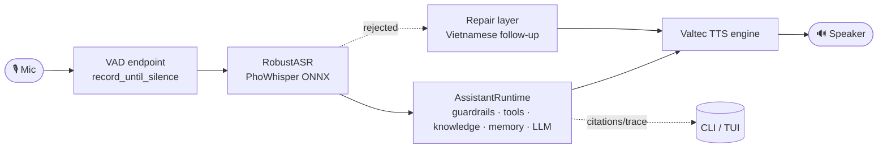

# SoCa — System Design Docs

System design documentation for **SoCa / Sơn Ca**, a Vietnamese voice assistant
that runs **fully on-device** with an offline-first architecture. Each file owns
one area of the system. Conventions: prose is in English, code and identifiers
stay in English, Mermaid is preferred for diagrams, and ASCII is used where a
folder tree or TUI layout is easier to read that way.

> These docs describe the **current implementation** in `soca/`. Phase plans live
> in `zplan/`; benchmark results live in `BENCHMARKS.md`.

## Documentation Map

| #   | File                                                          | Content                                                      |
| --- | ------------------------------------------------------------- | ------------------------------------------------------------ |
| —   | [README.md](./README.md)                                      | Table of contents and quick system overview (this file)      |
| 01  | [overview.md](./01-overview.md)                               | Vision, goals, and high-level container architecture         |
| 02  | [architecture.md](./02-architecture.md)                       | Package layers, dependency graph, and core data models       |
| 03  | [voice-pipeline.md](./03-voice-pipeline.md)                   | End-to-end voice loop, streaming, and threading model        |
| 04  | [asr-robustness.md](./04-asr-robustness.md)                   | RobustASR, the 5-stage anti-hallucination pipeline           |
| 05  | [assistant-runtime.md](./05-assistant-runtime.md)             | Turn routing, guardrails, knowledge/memory, LLM, telemetry   |
| 06  | [conversation-repair.md](./06-conversation-repair.md)         | Repair layer: catalog, no-reply ladder, follow-up, handover  |
| 07  | [tui.md](./07-tui.md)                                         | TUI architecture, modes, threading, and event flow           |
| 08  | [registries-profiles-cli.md](./08-registries-profiles-cli.md) | ASR/LLM/TTS registries, runtime profiles, CLI, optional deps |
| 09  | [hybrid-rag-memory.md](./09-hybrid-rag-memory.md)             | Hybrid RAG retrieval, tool router cascade, retrieved memory  |
| 10  | [vietnamese-rag-model-selection.md](./10-vietnamese-rag-model-selection.md) | Vietnamese embedding, reranker, and vector-backend evidence |
| 11  | [index-lifecycle.md](./11-index-lifecycle.md)                 | Transactional sparse/dense index lifecycle and operations    |

## SoCa in One Diagram

## Design Principles

- **Offline-first**: no cloud calls in the main path; every model runs locally
  through ONNX, llama.cpp, Torch, or a local runtime.
- **`soca/core` is the facade**: app surfaces (CLI/TUI) depend on `soca.core`,
  not directly on model backends.
- **Immutable data**: turn results are frozen dataclasses (`RuntimeResult`,
  `PipelineResult`, `StreamingEvent`, and related types); updates create copies.
- **Registry + profile**: models are declared in registries; a profile combines
  ASR, LLM, and TTS into one named runtime choice.
- **Streaming end to end**: LLM tokens become sentences, while TTS runs in
  parallel to reduce time-to-first-audio.
- **Separate technical reasons from user-facing speech**: ASR rejects and
  guardrail blocks pass through the **repair layer** to produce natural
  Vietnamese follow-ups.

## Reading Path

- **New to the project** → 01 → 02 → 03.
- **Understanding why ASR is "robust"** → 04.
- **Understanding why a turn routed a certain way** → 05.
- **Understanding UX for missed speech and silence** → 06.
- **Working on the TUI** → 07.
- **Adding a model, profile, or CLI command** → 08.
