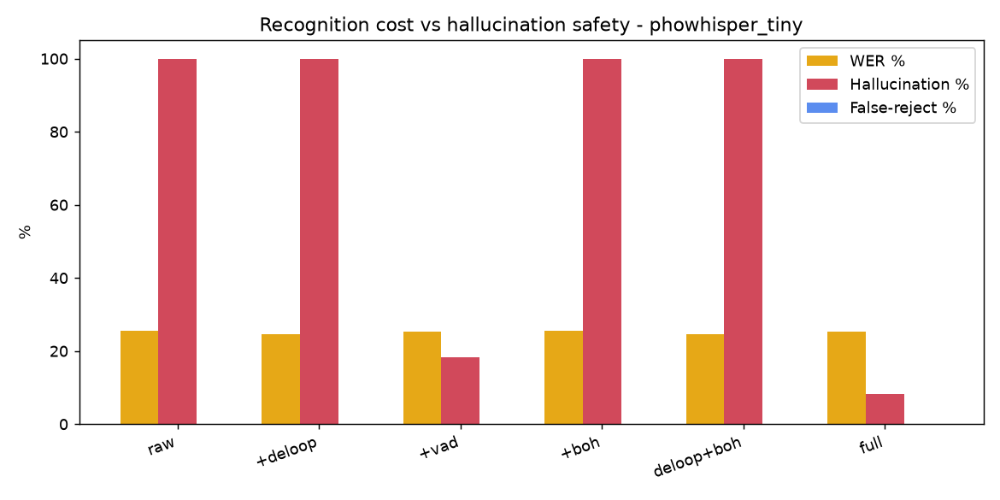
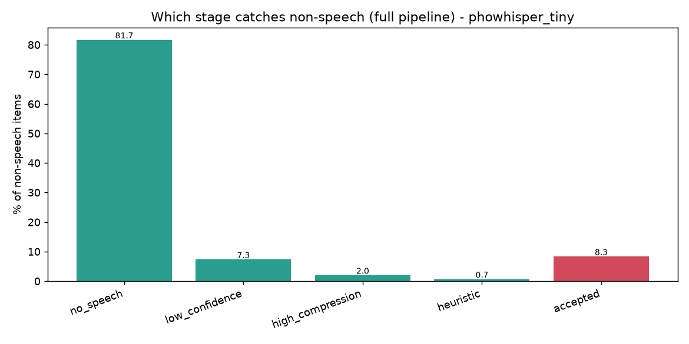
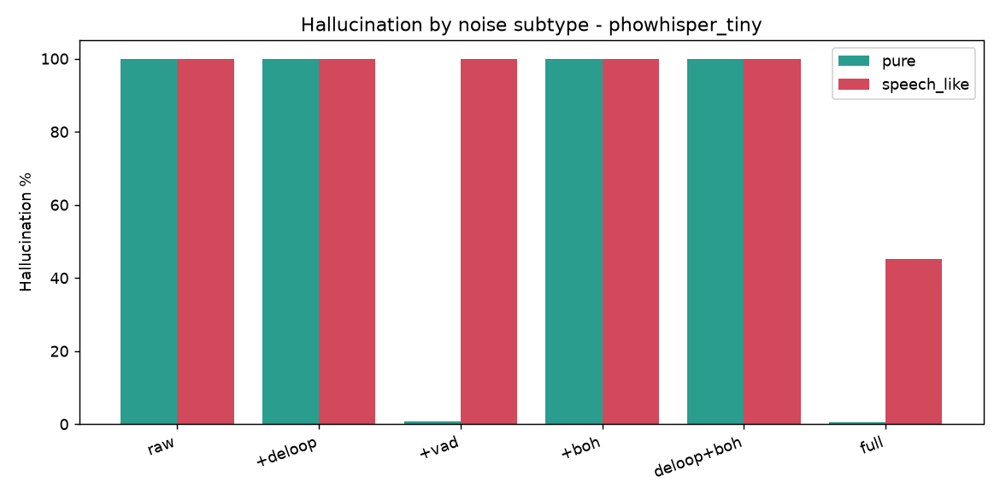
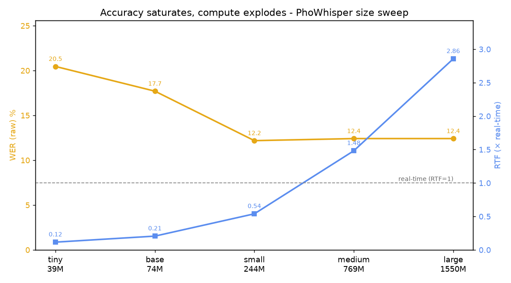

# Vietnamese ASR Robustness - replicating Table VII for PhoWhisper

> Research note (P1.1). Narrative English; numbers are read from real benchmark runs
> (`local/eval_table7.py` → `eval/robustness_metrics.py`), not estimated.
> Status: **complete - tiny ablation (§4-§5) + full 5-size PhoWhisper sweep (§6).**

## 1. Problem

Whisper-family models hallucinate on non-speech: fed silence, noise, or babble they
emit fluent but fabricated text. For a voice assistant that is a safety bug - the
system "hears" commands nobody said. Vietnamese PhoWhisper inherits this. Barański et
al. (ICASSP 2025) quantify the mitigations in their Table VII; this note replicates
that ablation for Vietnamese PhoWhisper and measures each stage's contribution and cost.

## 2. Method - RobustASR, five stages

`soca/asr/robust_asr.py` wraps PhoWhisper with five mitigation stages, each a separate
gate so the ablation can isolate them:

1. **VAD** (Silero) - reject audio with no speech.
2. **Confidence guard** - reject when `avg_logprob` is too low or the compression ratio
   too high (a research-backed choice: `avg_logprob`, not `no_speech_prob`, which is
   unreliable on fine-tuned models).
3. **De-loop** - collapse consecutive-token repetition (a classic hallucination shape).
4. **BoH** (Bag-of-Hallucinations) - Aho-Corasick match against a mined phrase list.
5. **Heuristic safety net** - length/ratio checks on the surviving text.

## 3. Setup

- **Speech**: FLEURS `vi_vn` (200 utterances), ground-truth transcripts → WER/CER.
- **Non-speech**: 300 items (247 `pure` + 53 `speech_like`), **stratified by subtype**:
  - `pure` - ESC-50 (human-voice categories excluded) + synthetic silence/white/pink.
  - `speech_like` - **babble** synthesised by overlapping 3-6 FLEURS voices at low RMS,
    some reversed (`local/collect_noise.py::mix_babble`). This is the crucial addition:
    pure noise is rejected by VAD at the gate, so only speech-like noise that _leaks
    past VAD_ can reveal what the later stages actually catch.
- **Model**: PhoWhisper-tiny (ONNX, greedy, no KV-cache) - matches the paper's "tiny".
  All five sizes (tiny→large) are swept in §6.
- **Configs (6)**: `raw / deloop / vad / boh / deloop_boh / vad_deloop_boh(full)`.
- **Metrics** (`eval/robustness_metrics.py`): WER/CER on accepted speech, hallucination
  rate on non-speech, **false-reject rate** on speech, and a **per-stage breakdown** of
  which gate caught each non-speech item.

## 4. Results - tiny ablation

PhoWhisper-tiny (39 M, ONNX greedy), 200 speech / 300 non-speech, CoreML+CPU on M4.

| Config     | WER % | CER % | Halluc % | False-rej % | Lat p50 ms | Lat p95 ms |
| ---------- | ----: | ----: | -------: | ----------: | ---------: | ---------: |
| raw        | 25.45 | 12.52 |   100.00 |        0.00 |        704 |       2867 |
| +deloop    | 24.62 | 12.03 |   100.00 |        0.00 |        666 |       2800 |
| +vad       | 25.22 | 12.40 |    18.33 |        0.00 |        344 |       2116 |
| +boh       | 25.45 | 12.52 |   100.00 |        0.00 |        670 |       2828 |
| deloop+boh | 24.62 | 12.03 |   100.00 |        0.00 |        674 |       2661 |
| **full**   | 25.22 | 12.40 | **8.33** |        0.00 |        312 |       2013 |

**Stage contribution** - which gate caught each of the 300 non-speech items (full pipeline):

| Stage             | Caught | % of noise |
| ----------------- | -----: | ---------: |
| no_speech (VAD)   |    245 |       81.7 |
| low_confidence    |     22 |        7.3 |
| high_compression  |      6 |        2.0 |
| heuristic         |      2 |        0.7 |
| accepted (leaked) |     25 |        8.3 |

catch-rate = **91.7%**, false-reject = **0.00%**.

## 5. Reading the results

- **VAD does the coarse work on pure noise**: pure-subtype hallucination drops from 100%
  to **0.8%** (VAD-only) and **0.4%** (full) - but that only proves "VAD works", nothing
  about the later stages.
- **De-loop and BoH, in isolation, catch nothing here**: `+deloop`, `+boh`, and
  `deloop+boh` all sit at **100%** hallucination - identical to raw. De-loop finds no
  runaway repetition to collapse, and the 56-phrase mined BoH list never intersects
  tiny's hallucination vocabulary on this set (0 of 300 caught, even inside the full
  pipeline - there is no `empty_after_boh` row in the stage breakdown). An honest null
  result: on this data the real second line of defence is the confidence guard, not BoH.
- **The confidence guard earns its keep on speech-like babble**: `speech_like` leaks
  fully past VAD (**100%** at VAD-only), and `avg_logprob` + compression-ratio gates pull
  it down to **45.3%** (full) - overall hallucination **18.33% → 8.33%**. Of the 55 items
  VAD passes, the guard + heuristic reject 30 (22 low-confidence, 6 high-compression, 2
  heuristic). This is the contribution the earlier pure-only noise set could not show.
- **False-reject costs nothing at these thresholds**: WER is essentially flat
  (raw **25.45%** → full **25.22%**) and false-reject is **0.00%** across every config -
  the guards trim no true speech here. The safety gain is free on this eval; the honest
  caveat is that a harder speech set (noisy field audio) would eventually surface the
  precision/recall trade the guards buy.

## 6. Robustness × model size - full PhoWhisper sweep

All five PhoWhisper sizes on the **same focused basis** (15 speech + 30 noise, `raw` +
`full`, seed 42 → identical items across models). RTF = mean processing time ÷ mean clip
duration (~8.5 s); values are per-item so they do not depend on _n_.

| Model             | Params | WER % (raw) | CER % (raw) | Halluc % (raw) | Halluc % (full) |  RTF |
| ----------------- | -----: | ----------: | ----------: | -------------: | --------------: | ---: |
| PhoWhisper-tiny   |   39 M |       20.46 |        9.44 |          100.0 |         **3.3** | 0.12 |
| PhoWhisper-base   |   74 M |       17.70 |        8.83 |          100.0 |            10.0 | 0.21 |
| PhoWhisper-small  |  244 M |   **12.18** |        5.43 |          100.0 |            10.0 | 0.54 |
| PhoWhisper-medium |  769 M |       12.41 |        5.63 |          100.0 |            10.0 | 1.48 |
| PhoWhisper-large  | 1.55 B |       12.41 |        5.48 |          100.0 |            10.0 | 2.86 |

Three findings, all sharper than a "bigger is better" prior:

- **Raw hallucination is 100% at _every_ size.** The flat red line is the headline:
  scaling from 39 M to 1.55 B does not teach the model to refuse non-speech. Hallucination
  is orthogonal to acoustic capacity; only the RobustASR pipeline closes it (full column
  drops to 3-10%, on VAD + the confidence guard).
- **WER saturates at `small`, but RTF keeps climbing.** Accuracy falls 20.5% → 12.2% by
  `small` (244 M) and then flattens - `medium` and `large` add **zero** accuracy while RTF
  goes 0.54 → 1.48 → 2.86. So the two useful operating points are **`tiny`** (RTF 0.12,
  the latency pick) and **`small`** (RTF 0.54, the last size under real-time and already at
  large's accuracy). `medium`/`large` are strictly dominated on-device.
- **Bigger models hallucinate _more confidently_.** All five leak the same 3 `speech_like`
  clips past VAD, but `tiny`'s confidence guard rejects 2 of them (full = 3.3%) while
  `base`+ reject 0 (full = 10.0%). Larger models emit higher-confidence fabrications, so
  the `avg_logprob` gate catches fewer - a small-_n_ (3-item) observation here, but it
  matches the 200/300 tiny run where the guard was clearly active, and the confidence-
  filtering literature (§7). It also argues the thresholds should be **recalibrated per
  size** rather than reused from tiny.

Caveat: confidence thresholds are tiny-calibrated and reused as-is on every size (see
Limitations); n = 15/30 is a probe, so the `full` column (3 leaks) is noisy - the 200/300
tiny run (§4) is the reliable read on the pipeline's steady-state behaviour.

## 7. Anchors

- Barański et al., _Mitigating Whisper hallucinations_, ICASSP 2025 - Table VII pattern.
- _Listen Like a Teacher_ (2025) - confidence/consistency-based hallucination filtering.

## 8. Limitations

- **Thresholds are tiny-calibrated**; every size in the sweep reuses them, though §6
  suggests larger models need higher `avg_logprob` cutoffs (they hallucinate more
  confidently).
- **Babble is synthetic** (overlapped FLEURS), not recorded crowd noise / MUSAN - cheap
  and reproducible, but a real MUSAN `speech`/`music` set would strengthen the claim.
- **Scale**: 200 speech / 300 noise - enough for the pattern, not a leaderboard number.
- Single decoder strategy (greedy, no KV-cache); beam search may hallucinate differently.
