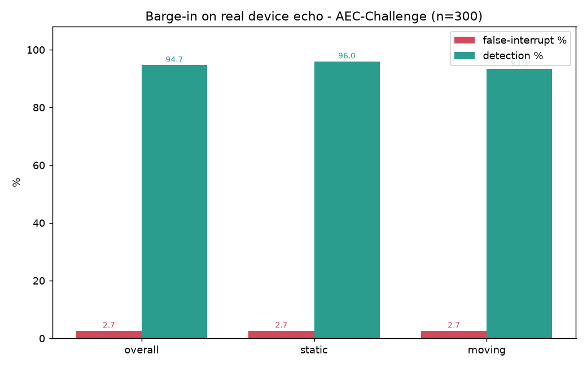
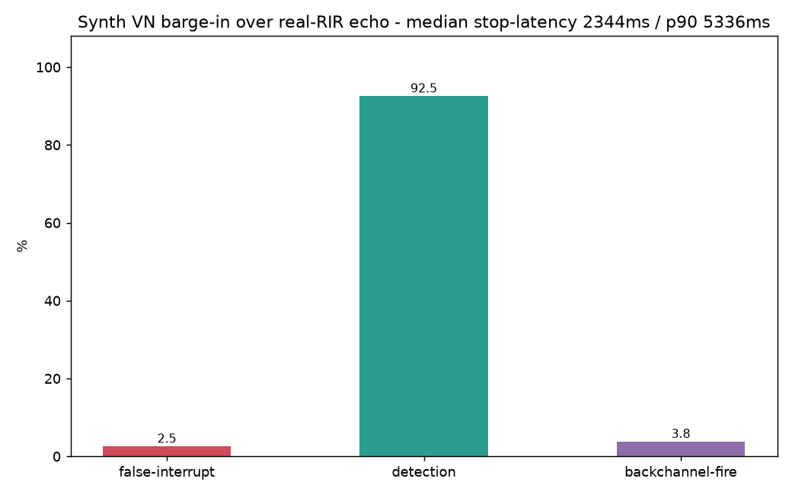

# Vietnamese Conversational Robustness - barge-in and turn-taking

> Research note (P3.1). Narrative English; numbers are read from real benchmark runs
> (`eval/eval_conversation.py`, `eval/eval_barge_in_synth.py`, `eval/eval_turn_taking.py`
> → `eval/conversation_metrics.py`), not estimated.
> Status: **complete - Tier 1 barge-in (real AEC-Challenge + synth RIR) + Tier 2 turn-taking.**

## 1. Problem

A full-duplex voice assistant has to make two real-time decisions that a
turn-based one never does: **when to stop talking because the user cut in**
(barge-in) and **when the user has finished their turn** (endpointing). SoCa
already ships both - a duplex AEC sink that detects barge-in inline
(`soca/core/duplex_aec_sink.py`) and an adaptive endpoint driven by Smart-Turn
(`soca/core/endpoint.py`) - but neither had a single measured number. This note
turns them into a reproducible benchmark, phrased in the vocabulary of
Full-Duplex-Bench (FDB) so the numbers sit next to the literature.

## 2. Method - frame-stepped offline replay, two tiers

The live decisions are welded to sounddevice streams (mic `read`, speaker
`write`), so they cannot be measured reproducibly while they own hardware. The
core method is to lift **only the decision arithmetic** out of those loops and
drive it from supplied `(far, near)` buffers, with the one rule that makes it a
benchmark: **time is the frame index, not the wall clock** (frame `i` is audio
`[i·block_ms, (i+1)·block_ms)`). A run is then fully determined by its inputs and
independent of the machine. The echo canceller and VAD are injected, so the
deciders (`eval/barge_in_replay.py`) are unit-tested without WebRTC or Silero,
then fed the _production_ components for the real runs.

Two tiers, because SoCa is a cascaded on-device system, not a single model:

- **Tier 1 - acoustic front-end** (AEC + VAD barge-in). Gold standard =
  Microsoft **AEC-Challenge** real double-talk/echo. FDB deliberately does _not_
  test this layer (it synthesizes same-channel interruptions).
- **Tier 2 - turn-taking behaviour** (endpoint floor control). Gold standard =
  FDB _method_ (Takeover Rate, stop/response latency), but its data is English,
  so Vietnamese turns are synthesized - exactly as FDB itself does, citing the
  scarcity of public turn-taking corpora.

## 3. Setup

- **Tier 1 real**: AEC-Challenge `real/` split, 16 kHz, paired
  `<id>_<scenario>_mic.flac` (near) + `_lpb.flac` (far). 13,626 pairs discovered;
  a balanced 150/condition sample (seed 42). `farend_singletalk` = echo only
  (must not interrupt); `doubletalk` = speaker + user (should interrupt).
- **Tier 1 synth**: FLEURS `vi_vn` for both the assistant (`far`) and the
  Vietnamese barge-in (`user`) - content is irrelevant to an energy/echo
  front-end, so no TTS is needed - with echo built from **real MIT impulse
  responses** (`near = alpha·(far * RIR) + user(t - onset)`). A known onset makes
  **latency** (`fire - onset`) measurable, which the real corpus cannot give. 80
  utterances × {echo_only, barge_in, backchannel}. RIRs are the MIT IR Survey
  (270 real measurements at ~1.5 m, CC-BY) at 16 kHz - real RIRs are preferred
  over synthetic per the BUT ReverbDB finding.
- **Tier 2**: FLEURS utterances shaped into `clean` (utterance + trailing
  silence) and `mid_pause` (a within-turn 800 ms gap) timelines with a known
  turn end; 60 utterances × both. Policies compared: `fixed` (constant 700 ms)
  vs `p_based` (floor 1000 + span·P from Smart-Turn v3.2, ceil 3000).
- **Metrics** (`eval/conversation_metrics.py`): false-interrupt / detection
  (Tier 1), stop-latency + backchannel-fire (Tier 1 synth), cut-in /
  premature-close / over-wait (Tier 2).

## 4. Results - Tier 1 barge-in

**Real device echo** (AEC-Challenge, 300 pairs):

| Condition     | false-interrupt | detection |
| ------------- | --------------: | --------: |
| overall       |            2.7% |     94.7% |
| static device |            2.7% |     96.0% |
| moving device |            2.7% |     93.3% |

**Synthetic VN barge-in over real-RIR echo** (240 scenarios, onset 1000 ms,
alpha 0.5):

| Metric                |   Value |
| --------------------- | ------: |
| false-interrupt rate  |    2.5% |
| detection rate        |   92.5% |
| backchannel fire rate |    3.8% |
| median stop-latency   | 2344 ms |
| p90 stop-latency      | 5336 ms |

The synthetic tier **cross-validates the real one**: false-interrupt 2.5% vs
2.7% and detection 92.5% vs 94.7% on entirely different audio (FLEURS + MIT RIR
vs recorded devices). That agreement is itself the strongest evidence that the
RIR synthesis is realistic, and that barge-in survives real device echo - it
false-triggers on pure echo only ~2.7% of the time while catching ~94% of real
double-talk.

## 5. Results - Tier 2 turn-taking

Endpoint policy on Vietnamese turns (120 scenarios, 800 ms within-turn pause):

| Policy      | cut-in rate | premature-close | median over-wait |
| ----------- | ----------: | --------------: | ---------------: |
| fixed       |      100.0% |           61.7% |           704 ms |
| **p_based** |    **3.3%** |       **18.3%** |          1312 ms |

The adaptive policy is the clear win: Smart-Turn holding the floor drops cut-in
from **100% to 3.3%** and premature-close from **61.7% to 18.3%** - a 30x and
3.4x reduction in cutting the user off - at the cost of ~608 ms more patience on
clean ends (704 -> 1312 ms). This is the accuracy/latency trade-off FDB frames
with TOR vs response-latency, measured here for Vietnamese.

## 6. Reading the results

- **Barge-in works on real echo, and the synthesis is faithful.** The two Tier 1
  runs agree to within ~2 pp on both axes despite sharing no audio - the AEC +
  VAD front-end is language-agnostic (energy, not words), so the English
  AEC-Challenge and Vietnamese synth land in the same place.
- **Adaptive endpointing is worth its latency.** Cutting the user off is the
  worse failure for a conversation, and `p_based` nearly eliminates it (cut-in
  100% -> 3.3%). The 608 ms extra wait is the honest price.
- **Smart-Turn is trained on English, and it shows.** `p_based` still closes
  18.3% of Vietnamese turns early - the model sometimes predicts "done" inside a
  Vietnamese sentence. This is the single clearest argument for a
  Vietnamese-specific turn model (future work), not a reason to distrust the
  number.
- **The 400 ms sustained gate already filters short backchannels - barely.** A
  400 ms "uh/vâng" fires only 3.8% of the time, because the gate needs 416 ms
  (13 x 32 ms frames) of sustained speech. That is a deterministic knife-edge: a
  500 ms backchannel would leak. The honest reading is that barge-in has _no_
  backchannel model; it survives here only because acknowledgements happen to be
  shorter than the gate. A backchannel classifier is the real fix.
- **Barge-in latency is gated by the sustained floor and grows with echo.**
  Median stop-latency is 2344 ms: a 400 ms sustained floor, plus the time
  Silero (threshold 0.7) needs to accumulate a continuous run through the
  micro-pauses of read speech, plus extra delay under stronger echo (double-talk
  AEC suppresses the near-end). It is faithful to the production configuration,
  not a flattering number - a lower threshold or shorter sustained window would
  trade latency for false-interrupts.

## 7. Anchors

- Lin et al., _Full-Duplex-Bench_ v1.0/v1.5 (arXiv 2503.04721 / 2507.23159) -
  method, TOR / stop-latency / response-latency, synthesized interruptions.
- Cutler et al., _ICASSP AEC-Challenge_ 2021-23 (arXiv 2309.12553) - real
  double-talk / echo, the echo-synthesis recipe.
- Traer & McDermott, _MIT IR Survey_ (PNAS 2016); Szoke et al., _BUT ReverbDB_
  (arXiv 1811.06795) - real RIRs, "a few real beat many synthetic".

## 8. Limitations

- **Latency is dominated by the sustained gate + read-speech VAD interaction**,
  not a pure front-end reaction time; it is a system number, and read speech
  (FLEURS) has more intra-word micro-pauses than a real short barge-in command.
- **Backchannel is a synthetic 400 ms head of a FLEURS clip**, not recorded
  "vâng/dạ"; the fire-rate is a boundary observation, not a corpus result.
- **Turn-taking uses English-trained Smart-Turn** on synthesized Vietnamese
  turns - no free Vietnamese two-channel turn-taking corpus exists.
- **Tier 1 synth echo uses one alpha (0.5) and MIT RIRs only**; a full SER curve
  and OpenSLR simulated RIRs would strengthen the acoustic claim.
- Scale is a benchmark probe (300 real pairs / 240 + 120 synth), enough for the
  pattern, not a leaderboard number.
